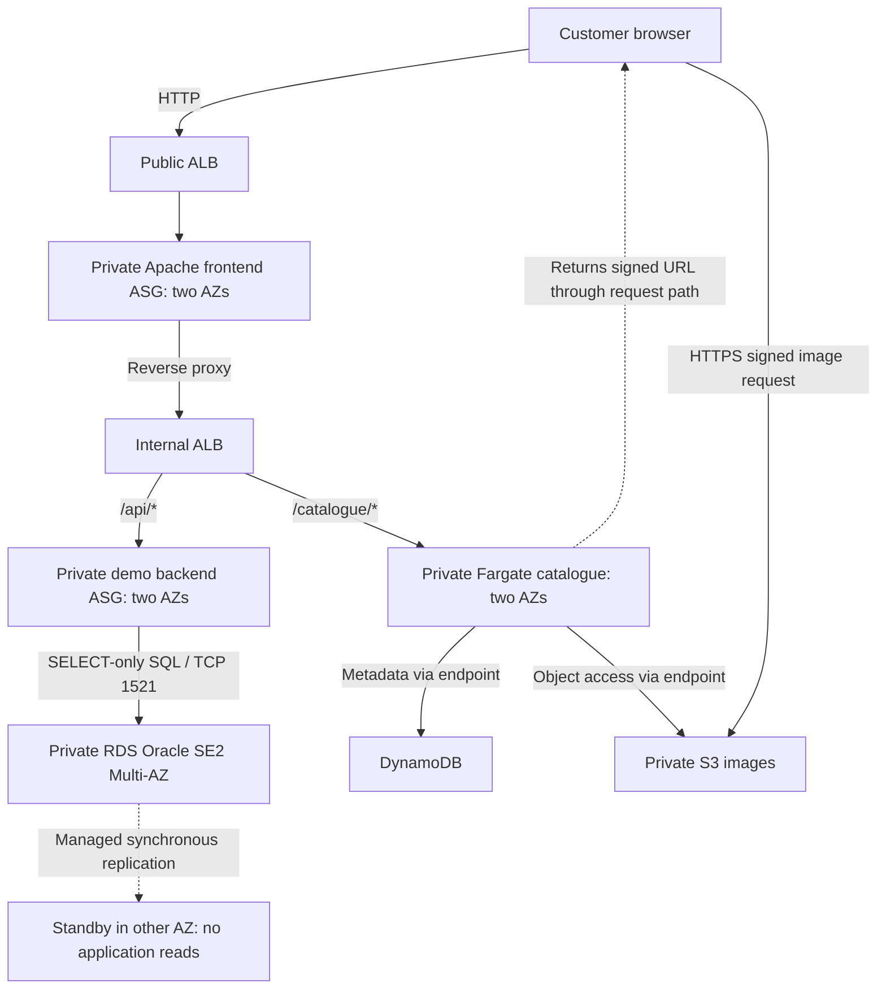

# INFOSYS 735 Group Project 2 — Presentation and Slide Content

This is the group's authoring guide for creating a stakeholder pitch in PowerPoint, Canva or another presentation tool. The business context comes from [AnyGroupLLC_case_study.md](AnyGroupLLC_case_study.md), and the presentation requirements come from [instructions.md](instructions.md). The operational instructions are in [IaC_Deployment_and_Usage_Instructions.md](IaC_Deployment_and_Usage_Instructions.md).

The slides target the highest marking bands in [instructions.md](instructions.md): an integrated additional feature, substantive assessment of **four Well-Architected pillars**, functioning basic and additional infrastructure, and a clear client pitch. The potential five bonus marks are discretionary. A polished deck cannot replace working infrastructure and an accurate AWS Console demonstration.

Use the **copy-ready content** on the slides. Put the **speaker notes** in presenter notes. Use the **visual and console instructions** to create graphics and prepare the recording. Detailed tables belong in appendices; do not paste every paragraph onto the slide. Replace member names and any remaining placeholders before submission. The managed-service implementation has been tested in Learners Lab: `evidence_new/` records real SQL integration, RDS failover and frontend scale-out on 7 October 2026. The user confirmed the current code works on 8 October 2026. Use Section 4 for the exact measured claims and evidence boundaries. Show the latest labelled storefront in the recording; do not transfer older dummy-DB results to it.

## 1. Presentation strategy and timing

### Client recommendation

Recommend an **AWS website platform for AnyGroupLLC's New Zealand expansion**, with availability across AZs, demand-based capacity, private application/data tiers, global product-image delivery and repeatable operations. Include a **Product Catalogue microservice** as the selected additional feature: use the Strangler Fig pattern to give catalogue requests an independent service while retaining the Apache/.NET/Oracle application path. Introduce this through a staged rollout, with production readiness checked before customer launch.

Pitch the whole website solution and explain why the catalogue feature belongs in it. The CTO receives a practical microservices adoption approach, the IT manager receives repeatable operations, the CISO receives layered protection, and the CFO receives a production expenditure model. ERP, inventory forecasting, store security systems and personalisation are outside the demonstrated website scope. Do not imply that the catalogue prototype solves the CFO's stock-expiry forecasting request.

The client story is: **business goals → complete cloud proposal and integrated catalogue feature → architecture and rationale → AWS Console configuration → working customer journey → reliability and cost decisions → recommended rollout**.

### Audience and evidence framing

Address the CTO, CFO, CISO and IT manager as decision-makers trying to improve their business. Lead with availability during promotions, protection of customer data, global image access, manageable operations and accountable spending. Explain each service through the problem it addresses; avoid a catalogue of AWS product names without a reason for choosing them.

Keep the main narration about AnyGroupLLC's needs and the proposed solution. The assessment still requires existing-design alignment, areas for improvement and design updates: explain these as business/design decisions, such as replacing image-server capacity dependence with object storage or making releases reproducible. Include the verified GP1 comparison and complete principle assessment in submitted appendix slides prepared from [Rubric_and_Assessment_Checklist.md](Rubric_and_Assessment_Checklist.md). The spoken story does not need a “GP1 to GP2” frame.

Distinguish **production recommendation**, **implemented prototype** and **measured observation**. The prototype supports selected design decisions; it does not demonstrate the forecast production capacity, a real Oracle migration or payment compliance. Give material limitations beside the relevant claim without turning the presentation into a test-report walkthrough.

Use four pillars: **Operational Excellence, Reliability, Security and Cost Optimisation**. Cost Optimisation directly addresses the CFO's production concerns. Performance Efficiency is a credible alternative or fifth pillar if the group adds a full assessment and meaningful service-selection/performance evidence. Sustainability is a lower priority for this pitch because the case provides less direct support for sustainability goals or impact measures. Extra pillar labels alone do not strengthen the assessment.

For assessment requirements and the complete four-pillar check, use [Rubric_and_Assessment_Checklist.md](Rubric_and_Assessment_Checklist.md).

**Required order:** Show basic and additional component configuration in the AWS Management Console **before** demonstrating the additional services. Slides 5–8 show configuration: CloudFormation and CloudWatch/SNS; network/compute/load balancing/scaling; SGs/NACLs/S3; then RDS/Secrets Manager and ECR/ECS/DynamoDB. Slide 9 demonstrates the working catalogue feature. Slide 10 revisits monitoring and scaling to explain reliability behaviour. CloudShell results and screenshots support the console demonstration. They do not replace it.

### Architecture diagram as the presentation's anchor

Show the final solution diagram prominently on **Slide 3 for two minutes**. Walk through the customer request path, the retained application, the integrated catalogue feature and the design decisions supporting all four pillars. Explain the areas being improved and the corresponding updates while pointing to the affected components. The diagram and its WAF explanation belong in the main recorded presentation; the appendix provides the detailed assessment.

Use the Task 1 architecture slide as the basis for this final diagram, updating it to match the proposal and clearly identifying production recommendations. Show the actual prototype diagram on Slide 4 before opening the console. Reuse the same diagram or a readable cropped view on Slides 5–11 to orient viewers to the component being demonstrated and the pillar it supports. Keep component names, colours and request arrows consistent across slides and console narration.

### Main deck timing and speaking allocation

Target **14:00**, leaving **1:00 inside the 15-minute limit** for loading, handoffs and minor delays. These are allocations, not measured rehearsal results. The plan assumes four members, as in the current guide; replace Member 1–4 with names. If the actual roster differs, divide demo portions so everyone speaks without extending the total.

| Slide | Title | Duration including demo | Recording interval | Speaker |
|---|---|---:|---|---|
| 1 | AWS website proposal for New Zealand growth | 0:20 | 0:00–0:20 | Member 1 |
| 2 | Business priorities and the proposed response | 0:40 | 0:20–1:00 | Member 1 |
| 3 | Website architecture with an independent catalogue | 2:00 | 1:00–3:00 | Member 1 |
| 4 | Implemented website prototype | 0:30 | 3:00–3:30 | Member 2 |
| 5 | Repeatable operations for the IT team | 1:00 | 3:30–4:30 | Member 2 |
| 6 | Two AZs separate public entry from private tiers | 2:10 | 4:30–6:40 | Member 2 |
| 7 | Layered protection for the website and its data | 1:10 | 6:40–7:50 | Member 3 |
| 8 | Managed Oracle and independent catalogue configuration | 1:40 | 7:50–9:30 | Member 3 |
| 9 | Legacy services and the additional catalogue feature | 1:20 | 9:30–10:50 | Member 3 |
| 10 | Tested database recovery and frontend scale-out | 1:30 | 10:50–12:20 | Member 4 |
| 11 | Control production expenditure as demand changes | 1:00 | 12:20–13:20 | Member 4 |
| 12 | Approve the cloud direction and staged rollout | 0:40 | 13:20–14:00 | Member 4 |
| **Total** | **Slides, navigation, narration and handoffs** | **14:00** | **0:00–14:00** | **All four** |

Member 1: 3:00; Member 2: 3:40; Member 3: 4:10; Member 4: 3:10. Slides 3–4 reserve **2:30 for architecture**, with the main diagram receiving a full two minutes. Slides 5–10 reserve **8:50 for console configuration, the functioning website and operational evidence**. Keep the console visible for most of that block to satisfy the brief's emphasis on implementation.

**Timing rules:** Cue tables include narration and navigation. Speaker notes provide wording to use during those cues, not extra time. Preload the pages. Show one configuration fact per view and explain its business purpose while pointing to it; do not read every console row or every paragraph of notes.

**Rehearsal gates:** finish configuration by **9:30**, the website by **10:50**, reliability by **12:20** and the closing by **14:00**. If a console page takes more than ten seconds to load, use its prepared dated screenshot. If late, omit optional direct SQL and repeated metadata; preserve the main diagram, required configuration, working legacy/catalogue journey, observed failover/scale-out and four pillars. Start the closing no later than **14:00** and finish before **15:00**. Do not use the buffer for another experiment.

## 2. Slide-by-slide authoring content

### Slide 1 — AWS website proposal for New Zealand growth

**Speaker / duration:** Member 1, 0:20. **Purpose:** State the recommendation and client outcome immediately.

**Copy-ready content**

> **AWS website proposal for New Zealand growth**
>
> AnyGroupLLC New Zealand cloud proposal
>
> A scalable website platform with layered protection, global image delivery and repeatable operations.
>
> An independent Product Catalogue service introduces microservices through a staged rollout.
>
> INFOSYS 735 Group Project 2 · [GROUP NAME] · [MEMBER NAMES]

**Visual:** A simple website/customer image with a short solution line: Website platform + Independent catalogue. Keep the title slide minimal and use the same distinct colour for the catalogue throughout the deck.

**Speaker notes**

> We recommend an AWS website platform for your New Zealand expansion, with resilient capacity, protected data and manageable operations. An independent catalogue introduces microservices. We will explain the architecture, demonstrate the prototype and recommend a staged rollout.

**Transition:** “The proposal responds to four stakeholder needs.”

### Slide 2 — Business priorities and the proposed response

**Speaker / duration:** Member 1, 0:40. **Purpose:** Establish the business problem and link the whole proposal to the four stakeholders.

**Copy-ready content**

| Stakeholder need | Proposed response | Pillar |
|---|---|---|
| IT manager: reduce firefighting for a 15-person team | Automated provisioning, observable services and reversible releases | Operational Excellence |
| CTO: support launch and promotional demand | AZ-distributed services, health-based recovery and demand-based capacity | Reliability |
| CISO: withstand attacks and protect valuable data | Edge protection, private tiers, controlled access and security response | Security |
| CFO: manage uncertain demand and OPEX versus CAPEX | Usage-based capacity, cost ownership and comparable production cost scenarios | Cost Optimisation |

Footer: **Additional feature: independent Product Catalogue service. Image storage: replace dependence on a nearly full 5 TB server with S3 and proposed global delivery.**

**Visual:** A flat four-row stakeholder table with readable text. Highlight the catalogue feature and image-capacity problem in the footer; avoid a coursework timeline.

**Speaker notes**

> You expect about 500,000 visits per day, with higher demand during promotions. Your website needs to remain accessible, your data needs protection after previous attacks, and your 15-person team needs less routine infrastructure work. Your image server is also approaching its 5 TB capacity. Our proposal addresses these needs together: a resilient website platform, object storage with global delivery, controlled operations and accountable expenditure. The catalogue service gives the CTO a concrete way to adopt microservices.

**Business facts:** The case forecasts around 500,000 visits/day with higher demand during promotions. Treat that as a sizing requirement for later production testing, not throughput demonstrated by the lab. Source: [case study](AnyGroupLLC_case_study.md).

### Slide 3 — Website architecture with an independent catalogue

**Speaker / duration:** Member 1, 2:00. **Purpose:** Use the main architecture diagram to explain the whole proposal, the integrated catalogue feature, four-pillar alignment and the areas improved by the design updates.

**Copy-ready content**

- CloudFront and proposed edge protection provide global delivery and a protected entry point.
- Load balancers and private Apache/.NET tiers distribute traffic across two AZs; propose managed Oracle availability.
- `/catalogue/*` routes to an independently deployed Fargate service; other application requests retain their existing path.
- Private S3 stores images; CloudFormation, monitoring and role-based administration support operations.

Footer: **Production recommendation. Components beyond the lab are proposed, not deployed by the lab templates.**

**Visual specification:** Make the production diagram in Section 3.1 the dominant content of the slide, using most of the canvas. Use the copy-ready bullets as short labels or presenter notes rather than a large text block beside a small diagram. Trace the customer request through edge delivery, public entry, private website/app tiers and the database. Highlight the catalogue branch and private S3 image delivery. Label production recommendations separately from demonstrated components. Use four concise pillar callouts attached to the relevant components; retain the full diagram as context when highlighting an area.

**Diagram walkthrough, two minutes**

| Time within Slide 3 | What to point to | What to explain |
|---|---|---|
| 0:00–0:20 | Customer → CloudFront/edge → public ALB | Website entry, global delivery and protection against the attacks described in the case |
| 0:20–0:45 | Two AZs, private web/app tiers and proposed Oracle availability | The whole website request path, tier separation and the continuity design |
| 0:45–1:10 | Catalogue route, Fargate, data boundary and S3 image delivery | How the additional feature integrates; independent releases and replacement of fixed image-server capacity dependence |
| 1:10–1:50 | Four pillar callouts and operational plane | Specific alignment and improvements using the table below; relate each decision to a stakeholder benefit |
| 1:50–2:00 | Production/prototype legend | What is proposed versus demonstrated; hand over to the actual prototype diagram |

**Pillar callouts and design updates to explain on the diagram**

| Pillar | Point to | Area addressed and design response |
|---|---|---|
| Operational Excellence | CloudFormation, monitoring and catalogue release boundary | Address manual operating effort and release coupling with reproducible configuration, observable services, owned procedures and small reversible changes |
| Reliability | Two AZs, load balancers, scaling and proposed database availability | Address failure exposure and changing demand with distributed capacity, health-based recovery, tested scaling and database recovery objectives |
| Security | Edge protection, private tiers, controlled roles and encrypted data paths | Address previous attacks and valuable-data exposure with layered access controls, TLS, auditing and an incident-response plan |
| Cost Optimisation | Elastic compute, managed storage/services and cost ownership | Address peak-capacity purchasing and opaque expenditure with demand-based capacity and attributed production costs, while preserving the resilience/security baseline |

These are areas the proposal addresses, not automatically proven omissions in the original GP1 design. Identify retained alignment and confirmed updates from the Task 1 assessment, and verify any historical comparison before labelling it an improvement over the original proposal.

**Speaker notes**

> Follow the customer request from CloudFront and the protected entry point to the public load balancer. Traffic reaches private web and application tiers across two AZs, with managed Oracle availability proposed for the retained application. The highlighted catalogue route reaches a separate Fargate service. It supplies product metadata and image references while other application requests retain their existing path. S3 replaces dependence on the nearly full image server, with CloudFront proposed for global delivery.
>
> The diagram also explains our four design priorities. For Operational Excellence, CloudFormation and monitoring make configuration reproducible and service behaviour visible, while the catalogue has an independent release boundary. For Reliability, AZ distribution, health checks and demand-based capacity support continuity; the prototype has tested database recovery and frontend scale-out, while production recovery and promotional capacity still require validation. For Security, edge protection, private tiers and controlled encrypted access address attack and data-exposure risks. For Cost Optimisation, capacity follows demand and costs have an owner, preserving the availability and security baseline.
>
> These decisions address image capacity, operational effort, continuity and expenditure together. The production controls shown are recommendations; next we will show which parts the prototype implements and demonstrate them in the console.

**Narration rule:** Explain the request path, feature integration and four pillar callouts during the recording. Detailed principle tables and verified original-design comparisons support this explanation in the submitted appendix. Do not leave the architecture rationale or improvement explanation only for questions or appendix reading.

**Transition:** “We have implemented a prototype of the website tiers and catalogue integration; we will now show its configuration.”

### Slide 4 — Implemented website prototype

**Speaker / duration:** Member 2, 0:30. **Purpose:** Make the actual implemented scope clear before opening the console.

**Copy-ready content**

- `us-east-1`: one VPC, six subnets and two AZs.
- Four EC2 at baseline: two frontend and two backend; two AZ-local NAT gateways.
- Public ALB → private Apache frontend → internal ALB → legacy API or catalogue.
- Private Multi-AZ Oracle RDS; two Fargate tasks; DynamoDB metadata; private S3 images.

Footer: **Synthetic data and a Python backend represent the retained application. HTTP/shared LabRole and private SQL without added transport encryption remain limits; Oracle migration and production readiness are not established.**

**Visual specification:** Use the actual prototype diagram in Section 3. Label the backend “Python demo API; real Oracle queries” and the database “RDS Oracle SE2 Multi-AZ; synchronous standby; no standby reads”. Show a NAT gateway in each public AZ and local application outbound routes. Frontend/backend/catalogue share the private app subnets in each AZ; do not invent dedicated subnets for each tier.

**Speaker notes**

> This is the implemented request path: four EC2 instances, two load balancers and two catalogue tasks across two AZs, with local NAT gateways and private Multi-AZ Oracle. Python represents the retained .NET application and reads real synthetic records. The catalogue has separate metadata and image storage. Production migration, payment compliance and sizing remain acceptance work.

**Transition:** “We first show how that infrastructure is provisioned and operated.”

### Slide 5 — Repeatable operations for the IT team

**Speaker / duration:** Member 2, 1:00 including console. **Purpose:** Explain Operational Excellence and show provisioning/monitoring configuration before the functional demo.

**Copy-ready content**

> **Operational Excellence**
>
> - Provision the platform through four connected CloudFormation stacks.
> - Observe service behaviour; assign an operations owner and alert responder.
> - Use identifiable releases, small reversible changes and a shared runbook.
> - Test failures, review results and refine procedures.
> - Managed NAT, Oracle and catalogue services reduce host administration; application/security responsibilities remain.

Evidence footer: **7 Oct 2026: network/core/observability CREATE_COMPLETE; catalogue UPDATE_COMPLETE with a pinned running image. Current changed-code release/reversal and delivered email are not in the saved evidence.**

**Visual:** Highlight the provisioning/operations plane of the architecture. Keep the console as the main recorded view.

**Timed console cues — 1:00 total**

| Offset | Show | Say / prove |
|---|---|---|
| 0:00–0:15 | CloudFormation → four project stacks/statuses | Network, website/database, monitoring and catalogue are managed together |
| 0:15–0:30 | Core Outputs and catalogue Parameters/Resources, preselected | One dependency: the image bucket or internal listener comes from core; the digest identifies the image |
| 0:30–0:45 | CloudWatch → project alarms and catalogue log group | Health, capacity, RDS CPU/storage and errors are observable; name the proposed response owner |
| 0:45–0:55 | SNS → operations topic and confirmed subscription | Alarm actions reach an operator channel; confirmation does not prove delivery |
| 0:55–1:00 | Diagram / transition | Automation and tested procedures support the small IT team |

**Speaker notes, spoken during the cues**

> Your team needs repeatable operations and a clear response path. These stacks define dependencies and expose outputs; startup signals check provisioning and image digests identify what is running. CloudWatch and SNS support observability, with the IT manager as the proposed operations owner. We use a runbook, small reversible changes and failure tests, then review results to improve procedures. Managed services reduce host administration, while application and security work remains. Current release/reversal and delivered-alert claims still need evidence.

**Principle coverage:** Ownership, observability, operations as code, small reversible changes, procedure refinement, anticipated failure, learning and managed services. Expand the full assessment in submitted appendix slides from [the separate rubric checklist](Rubric_and_Assessment_Checklist.md#appendix-a--full-four-pillar-assessment-for-submitted-slides).

**Demo limit:** Do not deploy stacks, publish an image or run a release during recording. Configured reversibility is not a completed changed-code or automatic-rollback test.

**Transition:** “We will locate the deployed tiers and their network paths.”

### Slide 6 — Two AZs separate public entry from private tiers

**Speaker / duration:** Member 2, 2:10 including console. **Purpose:** Show the functioning basic network, EC2 tiers, load balancing and scaling configuration.

**Copy-ready content**

| Layer | Implemented design |
|---|---|
| Network | One VPC; six public/app/DB subnets in `us-east-1a` and `us-east-1b` |
| Entry | Public ALB → private Apache frontend → internal ALB |
| Private routing | `/api/*` → backend; `/catalogue/*` → independent catalogue |
| Capacity | Frontend ASG 2–4; backend ASG fixed at 2 |
| Outbound | Two AZ-local NAT gateways; S3/DynamoDB gateway endpoints |

Footer: **Four EC2 at baseline; six during recorded scale-out. RDS configuration follows on Slide 8.**

**Visual:** Highlight two AZs and the numbered request path on the prototype diagram. Frontend/backend/tasks share the private-app subnets; do not invent dedicated subnets for each tier.

**Timed console cues — 2:10 total**

| Offset | Prepared console view | What must be visible |
|---|---|---|
| 0:00–0:25 | VPC → resource map/subnets | CIDR `10.0.0.0/16`, six subnet names and both AZs |
| 0:25–0:55 | Route tables / NAT gateways | Public default route to IGW; app default routes to each same-AZ NAT; two available gateways; endpoint routes; DB table has no Internet default route |
| 0:55–1:15 | EC2 → filtered project instances | Frontend/backend roles, AZs, running state and private addresses. State the actual count; it can be six after load |
| 1:15–1:45 | Load balancers / target groups / internal listener | Internet-facing versus internal scheme; healthy frontend/backend targets; priorities 50 `/catalogue/*` and 100 `/api/*` |
| 1:45–2:05 | Frontend ASG → configuration / automatic scaling | Min 2, max 4, current desired count, both AZs and request-count target 50 |
| 2:05–2:10 | Diagram / speaker handoff | Relate private tiers and local outbound paths to continuity and controlled access |

**Speaker notes, spoken during the cues**

> Customer traffic enters the public load balancer and reaches private Apache instances. Their reverse proxy sends API and catalogue requests through the internal load balancer. The tiers span two AZs, and each private application subnet uses its local NAT. Endpoints serve S3 and DynamoDB; database subnets have no Internet default route. The frontend can grow from two to four, while backend capacity stays at two. Later Activity evidence shows that frontend growth occurred.

**Prepare:** Filter by `Project=INFOSYS735-GP2`, identify route-table subnet associations and select the listener/ASG views. Capture a readable app-subnet → NAT → AZ comparison as fallback.

**Demo limit:** Do not change routes or desired capacity manually. SG/NACL/S3 follows on Slide 7; RDS/catalogue configuration on Slide 8.

### Slide 7 — Layered protection for the website and its data

**Speaker / duration:** Member 3, 1:10 including console. **Purpose:** Address attacks and data protection through deployed controls and clear production recommendations.

**Copy-ready content**

> **Security**
>
> - Isolate private tiers with source-based rules and controlled administration.
> - Protect data with encrypted storage, private images, managed credentials and SELECT-only SQL access.
> - Define controls as code and retain operational evidence.
> - Complete production edge/TLS protection, scoped identities, audit and incident exercises.

Evidence footer: **7 Oct 2026: private EC2/RDS, encrypted storage, signed image success and unsigned HTTP 403. HTTP, shared LabRole and private Oracle TCP without added transport encryption remain limits.**

**Visual:** Highlight tier boundaries and the backend-only DB rule. Mark CloudFront/WAF/audit as production proposals. Label frontend → DB “blocked by configured SG; negative-test evidence pending” unless new evidence exists.

**Timed console cues — 1:10 total**

| Offset | Show | Explain |
|---|---|---|
| 0:00–0:30 | SG inbound rules, preselected | Public ALB → frontend TCP 80; internal ALB → backend TCP 8080; backend SG → DB TCP 1521, no public DB ingress |
| 0:30–0:42 | NACL associations/rules | Subnet controls exist; these NACLs are broad and SGs enforce fine-grained tier access |
| 0:42–1:00 | S3 Permissions/Properties/Objects, preloaded | Public-access blocks, encryption, deny-insecure-transport and three image keys; use the saved unsigned HTTP 403 result |
| 1:00–1:10 | Diagram / production controls | Shared-identity and transport limits; edge protection, audit and incident response are proposed |

**Speaker notes, spoken during the cues**

> Your previous attacks call for layered protection and traceability. Private tiers and source-based security groups restrict access; the database admits only the backend. Storage is encrypted and images are private. Credentials are managed and the SQL user can only read. Controls are in templates, with managed administration. Production still needs scoped identities, TLS, audit, edge filtering and incident exercises. Signed links provide temporary bearer access; they do not authenticate customers or establish PCI compliance.

**Principle coverage:** Identity, traceability, layered protection, security as code, data protection, reduced direct access and incident preparation span the architecture, this slide and Slide 8. Keep the full assessment in the appendix.

**Demo limit:** Never reveal secret values, full signed URL query strings or personal subscription addresses. Demonstrate allowed SQL on Slide 9; claim a tested forbidden path only after capturing it.

### Slide 8 — Managed Oracle and independent catalogue configuration

**Speaker / duration:** Member 3, 1:40 including console. **Purpose:** Show more than one integrated additional component and its rationale before functional demonstrations.

**Copy-ready content**

| Component | Function / client value |
|---|---|
| CloudFormation | Reproducible provisioning and dependency control |
| RDS Oracle Multi-AZ + Secrets Manager | Persisted retained-app data, managed standby and credentials |
| ECR + ECS/Fargate | Identifiable catalogue image and independent deployment |
| DynamoDB | Service-owned prototype catalogue metadata |
| Private S3 | Images beyond dependence on a fixed-capacity image server |

Footer: **Product Catalogue is the selected additional business feature. Managed Oracle strengthens the retained data tier.**

**Visual:** Highlight backend → Oracle and catalogue → DynamoDB/S3. Distinguish ECR provisioning from customer request arrows.

**Timed console cues — 1:40 total**

| Offset | Show | What to point out |
|---|---|---|
| 0:00–0:30 | RDS → `anygroup-gp2-rds-oracle` → details | Oracle SE2, License Included, `db.t3.small`, 20 GiB encrypted gp2, Multi-AZ Yes, different primary/secondary AZs, publicly accessible No, subnet group and one-day backup retention |
| 0:30–0:40 | Secrets Manager → metadata views | Managed master secret and separate `anygroup-gp2/backend-db` application secret; no embedded passwords |
| 0:40–0:50 | ECR repository | Immutable `v1` tag/digest; this run has one image, not a code-release/reversal test |
| 0:50–1:15 | ECS service / tasks / task definition | Desired/running 2, completed rollout, private placement in both AZs, X86_64 and digest-pinned image; serving target health |
| 1:15–1:35 | DynamoDB → Explore items | `product_id` key, P1001–P1003, `image_key` values matching the S3 objects shown earlier |
| 1:35–1:40 | Listener/diagram highlight | `/catalogue/*` reaches the independent service; configuration is now complete |

**Speaker notes, spoken during the cues**

> Oracle matches the retained database technology. RDS maintains a synchronous standby in another AZ; it cannot serve reads directly, and failover briefly interrupts access. The backend uses a SELECT-only user. Fargate deploys the catalogue independently, with an immutable ECR digest identifying the image. DynamoDB supplies metadata and S3 stores images. This gives the CTO a concrete microservices boundary. Production data ownership, synchronisation, licensing and sizing still need validation.

**Prepare:** Select the important RDS fields and both secret metadata views. The primary AZ can change after another failover; show its actual current value. Use target health as the serving check; container health can be UNKNOWN where no container health check is configured.

**Demo limit:** No reboot, restore, password retrieval, image build or data edits. Oracle does not use the Aurora console query editor. The optional direct-SQL demonstration follows on Slide 9 after all configuration. [AWS query editor scope](https://docs.aws.amazon.com/AmazonRDS/latest/AuroraUserGuide/query-editor.html).

### Slide 9 — Legacy services and the additional catalogue feature

**Speaker / duration:** Member 3, 1:20 including the working demo. **Purpose:** Show the whole customer-facing prototype after basic/additional configuration.

**Copy-ready content**

- **Legacy system:** account and order records read from Oracle RDS.
- **Additional feature:** independent product catalogue with images and search.
- One website integrates both paths through the internal load balancer.
- Recorded smoke checks passed for SQL, products/images and target health.

Footer: **Synthetic data; browser cart counter only. Real .NET migration, checkout and payments are outside the prototype.**

**Visual:** The actual website, large enough to read both labels. Keep it dominant rather than shrinking it beside a large explanatory table.

**Timed functional demo — 1:20 total**

| Offset | Show / action | Required observation and narration |
|---|---|---|
| 0:00–0:20 | ALB storefront → Legacy system; click Refresh account & orders | ORD-1001 Processing, ORD-1002 Ready; Demo Customer Active; API-backed data |
| 0:20–0:40 | Additional feature → Product catalogue; search `Apples`, then clear | Three products/images; search isolates Fresh Apples; `/catalogue/*` is an independent service |
| 0:40–0:50 | Prepared `/api/db` and `/catalogue/products/P1001` views | SQL access/seed count and product metadata confirm the two paths; avoid opening every health URL |
| 0:50–1:10 | Backend Session Manager terminal, optional | Prepared SELECT queries and actual Oracle order/customer rows |
| 1:10–1:20 | Prepared smoke result / version | Three recorded smoke PASS runs; show the latest user-confirmed labelled page in the recording |

**Speaker notes, spoken during the cues**

> The legacy section reads persisted account and order records from Oracle. The additional feature supplies products and images through the independent catalogue. Search narrows the product list while both paths stay part of one website. The SQL view shows stored records, and smoke results confirm catalogue and image access. Data is synthetic and the cart is a counter; production checkout and application migration need their own implementation and acceptance tests.

**Direct SQL:** Prepare the backend Session Manager view and read-only command in Section 5.3 before recording. If slow or behind schedule, omit this optional 20-second sub-demo and show `/api/orders` and `/api/account` with the already-shown RDS configuration. Do not spend the segment installing clients or finding credentials.

**Demo limit:** No seed edits, checkout claims, public database access, standby queries or displayed signed URL query strings. The labels identify prototype retained/additional services; they do not establish real .NET migration.

### Slide 10 — Tested database recovery and frontend scale-out

**Speaker / duration:** Member 4, 1:30 including console and dated evidence. **Purpose:** Explain Reliability using actual recovery/data preservation and demand-driven instance creation.

**Copy-ready content**

> **Reliability**
>
> - Distribute application capacity across two AZs with local outbound paths.
> - Recover through managed standby promotion while retaining the endpoint and records.
> - Add frontend capacity when measured demand exceeds the scaling target.
> - Automate changes and test recovery/restore against agreed objectives.

**Evidence strip — 7 Oct 2026**

| Test | Observed result |
|---|---|
| RDS failover | Primary b→a; stable endpoint and preserved orders; 45 failed requests; approximately 61-second sampled interruption |
| Frontend scale-out | Alarm changed desired 2→4; two successful launches and four healthy targets |
| HTTP load | 2,400/2,400 HTTP 200 over 479.81 s; approximately 5 requests/s |

Footer: **One deliberate DB failover and a small HTML-endpoint load. Scale-in, complete EC2 recovery and backup restore are not established by these files.**

**Visual:** RDS before/after AZ beside the interruption timeline; ASG Activity beside two→four healthy-target counts. Use readable tables/charts or console views; detailed JSON is preparation material.

**Timed evidence demo — 1:30 total**

| Offset | Show | Explain / prove |
|---|---|---|
| 0:00–0:30 | RDS Events plus before/after AZ and summary | Primary switched, endpoint remained, harness verified preserved orders. Requests failed temporarily; no zero-downtime claim |
| 0:30–1:00 | ASG Activity and captured capacity/target views | Target-tracking alarm at 04:49:29 UTC changed desired 2→4; two launches succeeded; four targets healthy; not a manual desired change |
| 1:00–1:15 | Saved `load.json` / CloudWatch scaling view | 2,400 HTTP 200 over eight minutes; HTML requests only, not the full browser workload or production capacity |
| 1:15–1:25 | Recorded 5xx alarm and SNS action | Failover errors caused a metric-driven alarm; subscription confirmed, delivered email not saved |
| 1:25–1:30 | Acceptance / Finance transition | Agree production recovery/capacity objectives and test scale-in, restore and full recovery |

**Speaker notes, spoken during the cues**

> RDS promoted its standby in the other AZ, kept its endpoint and preserved orders. The probe observed about a minute of interruption and 45 failures, followed by successful SQL requests. Under load, target tracking grew frontend capacity from two to four; both new instances became healthy and all 2,400 HTML requests succeeded. These support continuity and demand-based capacity. Production requires agreed recovery objectives, realistic peak tests, backup restore and complete application recovery validation.

**Interpretation:** Approximately 61 seconds is first failed response → first successful response, not the whole reboot duration, guaranteed RTO or SLA. The test confirmed completion about 183 seconds after its trigger. AWS documents temporary failover interruption and reconnection. [AWS failover behaviour](https://docs.aws.amazon.com/AmazonRDS/latest/UserGuide/Concepts.MultiAZ.Failover.html).

**Frontend boundary:** Its separate probe had 283/292 successes, seven 502s and two connection errors. No post-test replacement/restored-capacity capture means complete EC2 recovery is unverified. Keep that result in notes or an evidence appendix; do not describe it as uninterrupted availability.

**Demo limit:** Do not run load, reboot RDS, terminate EC2 or wait for scale-in in the recording. Explain the completed experiment and show current configuration where available.

### Slide 11 — Control production expenditure as demand changes

**Speaker / duration:** Member 4, 1:00 including the production cost comparison or method. **Purpose:** Address the CFO's OPEX/CAPEX and uncertain-demand concerns through a defensible production expenditure model.

**Copy-ready content**

> **Cost Optimisation**
>
> - Financial ownership: agree a workload owner, budget, alerts and monthly review with Finance.
> - Consumption model: scale for promotions and scale in afterwards, preserving the availability baseline.
> - Business efficiency: track cost per successful catalogue request alongside latency and errors.
> - Operational effort: compare managed services with self-managed options, including maintenance and training.
> - Attribution: allocate costs by service/environment, including shared networking, storage and monitoring.

Footer: **Compare normal and promotional demand with co-location at equivalent availability and security. Production estimates are assumptions, not measured savings.**

**Visual:** A readable production comparison: Co-location / Cloud normal demand / Cloud promotional demand. Show dated estimates only after inputs are populated. Otherwise show the cost categories and decision method, labelled “estimate pending”. Keep the full assumptions table in notes or a submitted appendix. Avoid making the Learners Lab balance or teardown the main visual.

**Presentation sequence, about 0:20 within the 1:00 allocation**

1. Show the production scenarios or comparison method, with the proposed region, demand assumptions and price-source date.
2. Explain what varies with demand and what remains a baseline cost. Link scaling, service ownership and tagging to CFO visibility.
3. State the financial decision criterion: meeting customer service/security requirements at a justified total cost. Use prototype configuration as supporting evidence; production budgets and billing controls remain proposals unless actually configured and captured.

**Speaker notes, spoken while showing the comparison**

> The recorded scale-out shows frontend capacity following demand. Finance should compare normal and promotional cloud scenarios with co-location at the same availability and security level. Include fixed costs such as resilient networking and Oracle, variable usage, operational effort, migration and training. Assign cost ownership, budgets, attribution and reviews of cost per successful catalogue request. Scale-in, attributable spending and production savings are not established by this test.

**Production cost model for presenter notes or a submitted appendix**

| Input / decision | What the group should specify |
|---|---|
| Workload | 500,000 visits/day from the case; explicit assumptions for requests per visit, images/bytes, cache hit rate, promotion peaks and growth |
| Location and rates | Proposed production region/currency, service availability, dated official rates and applicable licensing assumptions; the lab's `us-east-1` location is not a production decision |
| Baseline and elasticity | Capacity needed for AZ resilience; normal/peak instance/task hours; database baseline and backup requirements; scaling limits based on tested demand |
| Cloud charges | Both load balancers, resilient outbound networking, public IPv4, EC2/EBS, Fargate, database, S3, CloudFront, request/transfer charges, security, logs, backups and support |
| Co-location comparison | Comparable server/storage/network capacity, redundancy, facilities, hardware renewal, licences, staffing, backup and security responsibilities |
| Transition and operations | Migration and parallel-running costs, Oracle licensing/version constraints, staff training and ongoing maintenance effort |
| Governance | Proposed workload owner [CLIENT ROLE], budget [AGREED LIMIT], alerts and regular review; service/environment tags and allocation of shared costs |
| Business output | Attributable catalogue cost per successful request for the same reporting window, with latency/error measures to prevent false efficiency through worse service |

**Method:** Estimate recurring charges from applicable units × rates × usage/time, add operational and transition costs, and compare options over the same stated period. Label forecast inputs as assumptions; distinguish capital cash outlay from depreciation/operating costs in the co-location comparison. Include uncertainty ranges rather than a precise total unsupported by inputs. Populate numbers only from an explicit model; leave missing values unknown.

**Trade-offs to explain:** Keep the availability/security baseline even when it costs more than a single-node setup. Evaluate image caching and storage lifecycle rules against real access and retention needs; neither automatically lowers total cost. Consider usage commitments only after stable demand is measured. Budget alerts notify owners; they do not automatically cap charges or guarantee sufficient capacity. OPEX changes the spending model but does not by itself prove lower total cost.

**Supporting prototype evidence:** Configured frontend scaling, on-demand DynamoDB, gateway endpoint routing, managed catalogue services and resource inventory illustrate parts of the approach. Demand-driven scale-out is demonstrated; scale-in and cost efficiency remain unverified. Capture a current-run teardown check to demonstrate control of temporary experiment resources; production customer-serving resources remain available. The Academy balance is not a production cost model. `data/cost_model_inputs.json` is a prototype-cost input record, not a completed production forecast.

**Source for presenter notes:** [AWS Cost Optimisation design principles](https://docs.aws.amazon.com/wellarchitected/latest/framework/cost-dp.html). The five bullets above address all five principle areas; use the separate rubric checklist for the full assessment.

### Slide 12 — Approve the cloud direction and staged rollout

**Speaker / duration:** Member 4, 0:40. **Purpose:** End with a client decision, acceptance criteria and a credible path to production.

**Copy-ready content**

> **Approve the AWS website direction and a staged catalogue rollout**
>
> - CTO: design for launch continuity and promotions; introduce independent catalogue releases.
> - IT manager: use reproducible infrastructure, managed services and owned response procedures.
> - CISO: complete layered protection, controlled identities, audit and security response before sensitive production use.
> - CFO: approve an investment envelope based on comparable production costs and accountable ownership.
>
> **Next decision:** agree service objectives, validate capacity/recovery and security, then approve production migration and customer rollout.

**Visual:** A three-stage rollout: Prototype integration → Production design and acceptance → Customer launch and ongoing review. Put the requested stakeholder decision beside the timeline; avoid a list of coursework deliverables.

**Speaker notes**

> We recommend the AWS website direction with a staged independent-catalogue rollout. The prototype demonstrates integration, real Oracle data, tested database recovery and demand-driven frontend growth. We ask you to endorse the next stage and agree owners and an investment envelope. Before customer launch, complete sizing, security and compliance, migration, restore testing and Finance’s cost comparison. Expand service extraction when the business benefit justifies it.

**Closing rule:** Ask stakeholders to endorse the whole website direction and the next funded rollout stage. Make production launch conditional on acceptance criteria; the prototype has not established production readiness.

## 3. Architecture diagram construction specifications

Create editable diagrams with readable service labels, arrows and subnet/AZ boundaries. Export at sufficient resolution if using a separate diagram tool. The diagram must explain routing and trust boundaries; AWS icons are optional. Use a small legend: **retained application path**, **independent catalogue**, **production recommendation**, **prototype simulation**. Keep coursework version labels off the main client diagram.

### 3.1 Production diagram for Slide 3

- Start with customers and Route 53 DNS leading to CloudFront. Put WAF and Shield Standard at the edge and label them as production recommendations.
- Dynamic path: CloudFront → HTTPS public ALB → Apache frontend ASG across AZ A/B → private internal ALB.
- Split the internal route into retained .NET backend ASG → proposed RDS for Oracle Multi-AZ, and highlighted catalogue ECS/Fargate → agreed catalogue data boundary plus S3 image references. Show DynamoDB as the prototype datastore and a production candidate subject to access-pattern and consistency validation.
- Image delivery: private S3 → CloudFront using Origin Access Control → customer. OAC belongs to the S3 origin; it does not establish protection of the ALB origin. Specify origin restrictions separately.
- Draw two AZ columns, public subnets for ALB/AZ-local NAT support, private app subnets and private database subnets. RDS standby is an availability mechanism, not a demonstrated read-scaling solution.
- Add an operational plane: CloudFormation, CloudWatch/SNS, Systems Manager, proposed CloudTrail/Config, Secrets Manager and KMS.
- Label production TLS/certificates, role separation, audit, data recovery, service availability in the intended region, Oracle licensing/version and final catalogue datastore as design/validation work. Do not draw all production arrows as tested connections.
- Annotate the decisions that address client problems: AZ distribution for continuity, elastic capacity for promotions, S3 for image capacity, the catalogue boundary for independent releases and IaC for consistent operations. Use the original GP1 comparison in the submitted assessment appendix after verifying it.

### 3.2 Prototype diagram for Slide 4

| Position | Actual component to draw | Boundary / arrow |
|---|---|---|
| Top | Customer/browser | HTTP → public ALB |
| Public subnets A/B | Public ALB and one NAT gateway/EIP per AZ | Public route to IGW; each app subnet uses its local NAT |
| Private app A/B | Apache frontend A/B | Public ALB → frontend TCP 80 |
| Between app groups | Internal ALB across two app subnets | Frontend reverse proxy → internal ALB TCP 80 |
| Private app A/B, legacy branch | Backend demo API A/B | `/api/*`, priority 100 → backend TCP 8080 |
| Private app A/B, new branch | Catalogue Fargate A/B | `/catalogue/*`, priority 50 → catalogue TCP 8080 |
| Private DB A/B | RDS Oracle SE2 Multi-AZ primary and managed synchronous standby | Backend TCP 1521 to stable primary endpoint; standby is not queried |
| Outside VPC as managed regional services | DynamoDB and private S3 | Catalogue reads metadata/objects via gateway endpoints; HTTPS signed S3 image URL returned to browser |
| Side operations panel | Four stacks, CloudWatch/logs/alarms, SNS, ECR | Provisioning/telemetry/image delivery, distinguished from customer request arrows |

Use this simplified connection blueprint to check the final graphic:



The signed URL response travels back through the normal ALB/frontend request path; the dotted line represents a logical response, not direct Internet exposure of a task. Add actual AZ/subnet boundaries in the finished slide graphic. CloudFront and WAF remain production recommendations. RDS Oracle and synchronous standby replication are configured by the current templates; the 7 October run demonstrated a primary-AZ switch with preserved data and measured interruption.

### 3.3 Connect the diagram to the console demonstration

Use brief highlights of the same architecture before showing each relevant console view. Say where the component sits, what it does and which client need it supports, then show its actual configuration. A cropped view must preserve enough context to locate the component in the whole solution. This orientation is included in each slide's allocated time; it is not another full architecture lecture.

| Slide | Diagram area to highlight | Console / explanation connection |
|---|---|---|
| 5 — Operational Excellence | Provisioning, monitoring and release controls | CloudFormation dependencies, CloudWatch actions and SNS ownership |
| 6 — Basic infrastructure | AZ/subnet boundaries and the main request path | VPC routes, NAT, EC2 tiers, ALBs and ASG configuration |
| 7 — Security | Entry point, tier access boundaries and image storage | SGs, NACLs and S3 controls; production edge/identity/TLS remain labelled proposals |
| 8 — Additional services | Backend → Oracle and catalogue → metadata/images | RDS/secret metadata, ECS/ECR, DynamoDB and listener integration |
| 9 — Feature | Customer → legacy/Oracle and catalogue/image branches | Account/orders and catalogue/search; optional read-only SQL proof |
| 10 — Reliability | Oracle primary/standby and frontend scaling | Primary-AZ switch, interruption/data preservation, alarm-driven 2→4 growth and healthy targets |
| 11 — Cost Optimisation | Baseline capacity, elastic capacity and managed services | Explain fixed/variable production costs and accountable ownership; separate cost assumptions from observed usage |

## 4. Evidence to use in slides and narration

The managed-service implementation has been tested in Learners Lab. The user confirmed current functionality on **8 October 2026 (New Zealand date)**. That confirmation supports the latest code; quantitative claims below come from the **7 October files in `evidence_new/`**. Label results with their recorded date. Saved JSON times are UTC.

| Pitch claim | Recorded support | File under `evidence_new/` | Boundary / slide |
|---|---|---|---|
| Website/catalogue integration works | Three smoke PASS runs: SQL orders/customer, products/images and unsigned HTTP 403 | `20261007T042706Z/smoke.json`, `20261007T043249Z/smoke.json`, `20261007T044215Z/smoke.json` | Latest UI is user-confirmed; show it in recording — Slide 9 |
| Network/tier/data controls deployed | Four private EC2 baseline; two local NATs; private encrypted Multi-AZ Oracle; six SGs; S3 controls | Baseline `configuration/` captures | Configuration does not prove every denied path or compliance — Slides 6–8 |
| Database recovered after failover | Primary b→a, endpoint stable, orders preserved; 98/143 successes and 45 failures | `rds-failover-20261007T043910Z/` | About 61 s sampled interruption; about 183 s trigger-to-test-confirmation; no whole-AZ/SLA claim — Slide 10 |
| Frontend scaling created capacity | Alarm-driven 2→4; two successful launches; four healthy targets | `scaling-20261007T044349Z/configuration/frontend_activity.json`, `autoscaling.json`, `frontend_targets.json` | No later scale-in capture — Slide 10 |
| Load completed successfully | 2,400/2,400 HTTP 200, 479.81 s, 5 requests/s, p95 9.6 ms | `scaling-20261007T044349Z/load.json` | Small HTML workload, not production capacity — Slide 10 |
| Operations detected DB errors | 5xx alarm activated after failover; subscription confirmed; later alarm OK | Post-failover/scaling `configuration/alarms.json`; `sns_subscriptions.json` | Delivered email absent — Slides 5/10 |
| Automated backup exists | Backup start/completion Events, retention and LatestRestorableTime | Baseline `configuration/rds.json`, `rds_events.json` | Restore not tested — Slide 8 |
| Frontend probe observed interruption | 283/292 successes; seven 502s, two connection errors; final success | `frontend-recovery/requests.jsonl`, `requests.summary.json` | No replacement/restored-capacity proof — notes/appendix |

General code confirmation does not prove scale-in, complete EC2 recovery, email delivery, restore, changed-code release/reversal, the forbidden frontend-to-DB path, teardown/orphan cleanup, production capacity or savings. Treat these as acceptance work, or add specific evidence before changing the wording. The initial catalogue alarm was caused by missing startup datapoints and cleared later; do not call it an established catalogue outage.

The older `evidence/` and `data/lab_evidence_review.json` describe the NAT-instance/dummy-DB version. Do not mix its same-digest release/reversal or cleanup claims into this run. Raw evidence is excluded from the deployment ZIP; prepare evidence views separately for the recording.

## 5. Demo preparation and recording guide

### 5.1 Before recording

1. Assign named speakers/operators. Handoffs occur after Slides 3, 6 and 9. Narration continues while the operator selects the preloaded next view.
2. Use the main guide and `./scripts/lab.sh setup your-email@example.com` to deploy the latest code. Confirm the Legacy system and Additional feature labels, data, images and search; capture the latest page with a date.
3. Complete experiments before recording: load is about eight minutes, standard probe about five, failover tool allows up to ten. Keep experiments separate. Use existing verified results if repetition is unnecessary.
4. Run `./scripts/lab.sh test` on the deployment being filmed. Resolve failures before recording. For scale-in/EC2 recovery claims, collect later Activity and restored-capacity/target-health evidence.
5. Preload the views below in `us-east-1`; filter project resources and select the relevant fields. Keep website/API tabs ready. Prepare the optional backend Session Manager query before recording.
6. Prepare dated RDS before/after/interruption, ASG alarm cause/launches/healthy targets, load and smoke result views. Use readable excerpts, not a long JSON scroll.
7. Prepare a dated screenshot fallback for each required console view. Clearly identify captured evidence if used instead of live navigation.
8. Rehearse the entire flow with a stopwatch, console pages and handoffs. Keep configuration and diagrams readable at playback size. Reach the timing gates in Section 1.

### 5.2 Console click sheet and proof to show

This is preparation, not extra recording time. Follow each slide's timed cues. Console labels can vary; locate the underlying settings before rehearsal.

| Slide | Console / view to preload | Required visible proof |
|---|---|---|
| 5 | CloudFormation → project stacks | Four successful statuses, core Outputs, catalogue dependency/image parameters |
| 5 | CloudWatch Alarms/Log groups; SNS operations topic | Health/capacity/error/RDS alarms, catalogue logs, actions and confirmed subscription |
| 6 | VPCs / Subnets / Route tables / NAT gateways | CIDR, six subnets/AZs, IGW, same-AZ NAT associations/state, endpoints, isolated DB routes |
| 6 | EC2 Instances / Load balancers / Target groups / internal listener Rules | Tier/AZ/private IP, public/internal schemes, healthy counts and path priorities |
| 6 | Frontend ASG | Min 2/max 4, actual desired/AZs, request-count policy/target 50; backend remains 2 |
| 7 | Security Groups / Network ACLs | Tier sources/ports, backend-only DB access, NACL rules/associations |
| 7 | S3 image bucket Permissions/Properties/Objects | Public blocking, encryption, secure-transport policy, three image keys |
| 8 | RDS database details | Available, engine/class/licence, Multi-AZ and primary/secondary AZs, private/encrypted, subnet group, retention/restore point |
| 8 | Secrets Manager metadata | Master/app credential roles; no Retrieve secret value action |
| 8 | ECR / ECS service/tasks/task definition | Immutable tag/digest, two tasks in two AZs, private placement, completed rollout, X86_64 pinned image |
| 8 | DynamoDB → table → Explore items | `product_id`, P1001–P1003 and S3 `image_key` references |
| 9 | Latest website and prepared API views | Legacy account/orders refresh; catalogue images/search; SQL and product response values |
| 9 | Backend EC2 → Connect → Session Manager, optional | Actual SELECT queries and Oracle rows through the existing app user |
| 10 | RDS Events plus saved failover views; ASG Activity plus saved scaling/load views | AZ switch/data preservation/interruption, alarm-driven launches, four healthy targets, 2,400 successes |
| 11 | Production cost slide / assumptions | Normal/promotion/co-location method, fixed/variable costs and ownership; no invented amounts |

Show the specific field, explain why it matters and move on. RDS configuration precedes its recorded recovery behaviour; catalogue configuration precedes live functionality.

### 5.3 Optional Oracle row demonstration through the console

Oracle does not use the Aurora Data API query editor. Use an existing **backend** EC2 instance's Session Manager terminal; it can reach the private database and already has the Python driver/application connection. [Query editor scope](https://docs.aws.amazon.com/AmazonRDS/latest/AuroraUserGuide/query-editor.html), [Session Manager instructions](https://docs.aws.amazon.com/systems-manager/latest/userguide/session-manager-working-with-sessions-start.html).

Before recording, open **EC2 → Instances → backend → Connect → Session Manager → Connect**. Prepare this read-only command. During Slide 9, show its SELECT statements and rows within the optional 20 seconds; credentials stay on the backend and are not printed.

```bash
sudo -i
set -a
source /etc/anygroup-backend.env
set +a

/opt/anygroup-backend-venv/bin/python - <<'PY'
import sys
sys.path.insert(0, "/opt")
from anygroup_backend import OWNER, connect

with connect() as db:
    with db.cursor() as cursor:
        for table in ("demo_orders", "demo_customers"):
            cursor.execute(f"SELECT * FROM {OWNER}.{table}")
            print("Table:", table)
            print([column[0] for column in cursor.description])
            for row in cursor:
                print(row)
PY
```

Expect ORD-1001/ORD-1002 with Processing/Ready, and CUST-1001 / Demo Customer / Active. Do not seed/update, install clients, open network access or display passwords to make the demo work. If the terminal is slow/unavailable, use `/api/orders` and `/api/account` with the already-shown RDS configuration.

### 5.4 Evidence display and fallback

Select RDS Events and ASG Activity for the **recorded test date/time**. A later primary-AZ change or scale-in does not undo the dated result: show current values as current and captured values as recorded. If old Events/Activity have aged out, use labelled saved views rather than restarting the long experiment.

| Problem | Prepared response | Time control |
|---|---|---|
| Slow console view | Dated screenshot of the same configuration | Switch after ten seconds |
| Slow SQL terminal | SQL-backed orders/account API views | Omit optional 20-second SQL segment |
| ASG now at baseline | Show current baseline plus captured 2→4 Activity/targets | Do not manually raise desired capacity |
| Website/API unavailable | Identify the issue and use dated evidence; correct it before the final take | Do not claim live success while showing an error |
| Running behind | Cut repeated metadata, optional SQL and detailed latency statistics | Preserve architecture, required configuration, feature and four pillars |

### 5.5 Slide building and final rehearsal

Use 16:9 slides, readable editable text/tables/diagrams and consistent retained/catalogue/proposed colours. Keep architecture large, with incremental highlighting. Do not put this click sheet or entire speaker notes on slides.

Build submitted principle-assessment appendices from [Rubric_and_Assessment_Checklist.md](Rubric_and_Assessment_Checklist.md), with a references slide and dated detailed evidence where useful. The main pitch still explains architecture, integration, four pillars and design updates. Cost assumptions go in notes/an appendix. Appendices are submitted but **not narrated as extra segments** in the 14-minute recording.

- [ ] Actual names and meaningful speaking portions for every member.
- [ ] Slide 3: updated Task 1 architecture, whole request path, integrated catalogue and four-pillar callouts for two minutes.
- [ ] Slide 4: actual NAT/RDS prototype; edge/TLS/audit proposals distinguished.
- [ ] Slides 5–8: basic/additional configuration before data/feature demonstration.
- [ ] Slide 9: latest legacy data and catalogue labels, refresh, images and search work.
- [ ] Slide 10: real RDS/scale-out results including interruption; no live reboot/load waiting.
- [ ] Slide 11: production normal/peak/co-location method and all five cost principle areas; no savings claim.
- [ ] No unsupported scale-in, EC2 recovery, restore, delivered email, code rollback, PCI, capacity or zero-downtime claim.
- [ ] Readable console; no secrets, signed query strings or personal addresses; dated fallbacks.
- [ ] Full rehearsal reaches 9:30 / 10:50 / 12:20 / 14:00; final recording under 15:00 including handoffs.

## 6. What must be submitted

| Requirement | What to submit | Key check |
|---|---|---|
| Presentation slides | Slideshow or PDF | Final diagram, integrated feature, four pillars/design updates, readable assessment/references appendices |
| Recording link | Text file with an accessible recording URL | Within 15 minutes, every member speaks, AWS Console configuration precedes the feature; test access |
| TeamMates | Each member completes the separate assessment | Feedback on all other members; omission incurs the stated 10% penalty |

Use [the separate rubric checklist](Rubric_and_Assessment_Checklist.md) for full assessment and [the main IaC guide](IaC_Deployment_and_Usage_Instructions.md) for deployment, experiments and evidence download.
