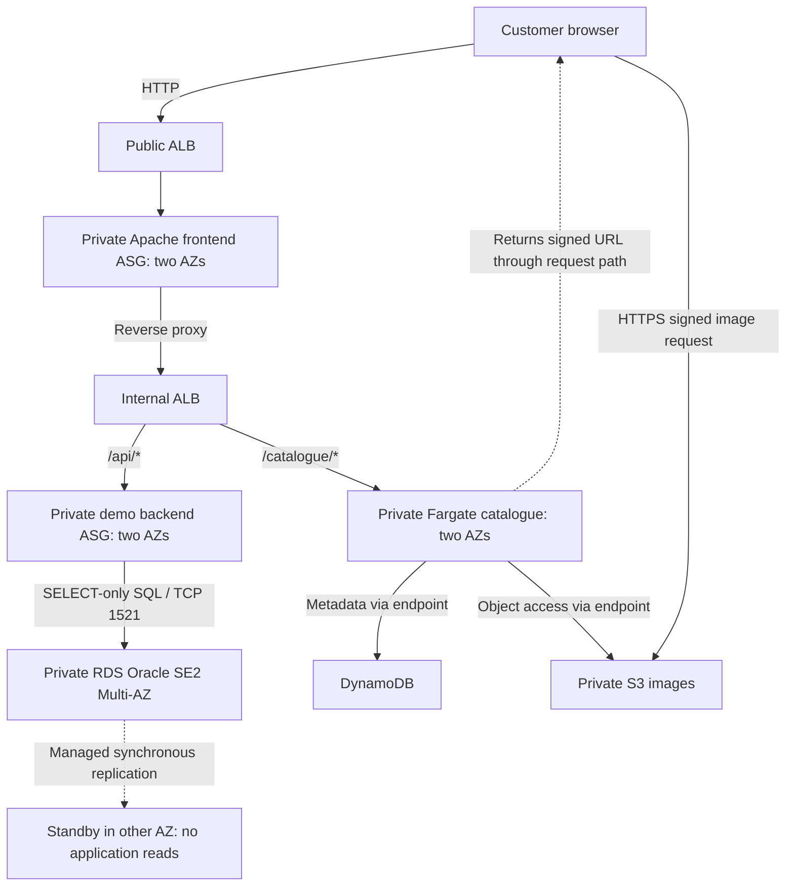

# INFOSYS 735 Group Project 2 — Presentation and Slide Content

This guide helps the group build a client pitch in PowerPoint, Canva or another slide tool. Use [AnyGroupLLC_case_study.md](AnyGroupLLC_case_study.md) for the business context and [instructions.md](instructions.md) for the assessment requirements. Use [IaC_Deployment_and_Usage_Instructions.md](IaC_Deployment_and_Usage_Instructions.md) to deploy and test the implementation.

The pitch covers the whole AWS website proposal and its additional Product Catalogue feature. It targets the highest marking bands through a clear architecture, a working console demonstration and a full assessment of **four Well-Architected Framework pillars**. The possible five bonus marks are discretionary; four pillar names alone do not earn them. Prepare the detailed assessment using [Rubric_and_Assessment_Checklist.md](Rubric_and_Assessment_Checklist.md).

**How to use this guide:** Put the **copy-ready content** on slides. Put the quoted **speaker notes** in presenter notes. The notes use short sentences and are a complete spoken script. Instructions, evidence details and console checks are for preparation. Do not read them aloud. Replace group/member placeholders before submission.

The current prototype has saved evidence in `evidence_new/`: database failover and frontend scaling on 7 October 2026, then application-password rotation and successful smoke checks on 8 October. Section 4 lists the exact results and limits. Show the latest website with its **Legacy system** and **Additional feature** labels. Keep older dummy-database results separate.

## 1. Presentation strategy and timing

### Client recommendation

Recommend an **AWS website for AnyGroupLLC's New Zealand expansion**. The design spreads services across two availability zones, adds capacity during promotions, keeps application servers and data private, and makes operations repeatable. Propose global image delivery for production.

The selected additional business feature is the **Product Catalogue microservice**: a small service that can be deployed separately. Catalogue requests use this service while orders and account requests keep the existing application path. This is the Strangler Fig approach: move one function at a time instead of replacing the whole application at once.

Explain the value to all four stakeholders: the CTO gets a practical way to introduce microservices; the IT manager gets repeatable setup and monitoring; the CISO gets controls to protect access and data; the CFO gets a method to compare production costs. The catalogue does not implement inventory forecasting. ERP, store security systems and personalisation are outside this website demonstration.

Follow this story: **business needs → whole solution and architecture → AWS Console configuration → working website and catalogue → recovery and cost decisions → next step**. Present to the client, with the improvements explained as design decisions. Keep a verified comparison with the original Task 1 design in the submitted assessment appendix; the spoken pitch does not need to tell a GP1-to-GP2 history.

### Four pillars and accurate claims

Use these official pillar names. Follow each name with its plain-English meaning:

| Pillar | Meaning to explain to the client |
|---|---|
| Operational Excellence | Make setup, monitoring and response easier to repeat |
| Reliability | Keep services available and recover when something fails |
| Security | Control access and protect data |
| Cost Optimisation | Understand spending and match capacity to business needs |

Cost Optimisation is useful because the CFO asks about production spending and operating costs versus equipment investment. Use normal demand, promotional demand and a comparable co-location option. The lab balance and teardown are not a production cost argument. Performance Efficiency could be a fifth pillar if supported by a full assessment and suitable tests; adding a label alone is not enough.

Keep three types of statement clear:

| Type | Simple wording | Example |
|---|---|---|
| Production recommendation | “For production, we propose…” | CloudFront, WAF and HTTPS at the public entry |
| Implemented configuration | “In the prototype, we configured…” | Two AZs and private Multi-AZ Oracle RDS |
| Measured result | “In our test, we observed…” | Frontend capacity increased from two to four |

The prototype uses synthetic data and a Python backend to represent the retained .NET application. It has not proved real application migration, production capacity, payment compliance or financial savings. Place important limits beside the relevant claim; keep longer evidence details in preparation notes or the appendix.

**Required demo order:** Show configuration in the **AWS Management Console first**. Slides 5–8 cover basic and additional components. Slide 9 then shows the working account, orders and catalogue. Slide 10 explains completed recovery/scaling tests. Console views are the main demo; saved results support them.

### Make the architecture the centre of the pitch

Give **Slide 3 two minutes**. Use the Task 1 architecture slide as the starting point and update it to include the catalogue and design changes. Keep the diagram large. Trace the customer request, the existing application and the catalogue branch. Point to the components supporting each of the four pillars. Explain the problem addressed by each change.

Slide 4 shows the actual prototype before the console opens. On Slides 5–11, briefly highlight the relevant part of the same diagram. Keep labels, colours and arrows consistent. Clearly label production proposals and prototype components. The appendix gives the full principle assessment; the recorded pitch must still explain the diagram and the four pillars.

### Main deck timing and speaking allocation

Target **14:00**, with **1:00 left inside the 15-minute limit**. Each allocation includes speech, pointing, console navigation and handoffs. The plan assumes four members; replace Member 1–4 with names. If the roster differs, share the existing portions so everyone speaks without adding time.

| Slide | Title | Duration including demo | Recording interval | Speaker |
|---|---|---:|---|---|
| 1 | Our AWS website proposal | 0:20 | 0:00–0:20 | Member 1 |
| 2 | What your business needs | 0:40 | 0:20–1:00 | Member 1 |
| 3 | How the whole solution works | 2:00 | 1:00–3:00 | Member 1 |
| 4 | What we built in AWS | 0:30 | 3:00–3:30 | Member 2 |
| 5 | Operations your team can repeat | 1:00 | 3:30–4:30 | Member 2 |
| 6 | Private servers across two AZs | 2:10 | 4:30–6:40 | Member 2 |
| 7 | How we protect access and data | 1:10 | 6:40–7:50 | Member 3 |
| 8 | Database and catalogue setup | 1:40 | 7:50–9:30 | Member 3 |
| 9 | Working orders, account and catalogue | 1:20 | 9:30–10:50 | Member 3 |
| 10 | Recovery and scaling test results | 1:30 | 10:50–12:20 | Member 3 |
| 11 | Planning production costs | 1:00 | 12:20–13:20 | Member 4 |
| 12 | Our recommended next step | 0:40 | 13:20–14:00 | Member 4 |
| **Total** | **Speech, diagrams, demo and handoffs** | **14:00** | **0:00–14:00** | **All four** |

Member 1: 3:00 (Slides 1–3); Member 2: 3:40 (Slides 4–6); Member 3: 5:40 (Slides 7–10); Member 4: 1:40 (Slides 11–12). Architecture gets **2:30** across Slides 3–4. Console configuration, website demonstration and test evidence get **8:50** across Slides 5–10. Keep the console visible for most of this block.

### Speaking in clear English

- Use the quoted script once. The cue tables tell the operator what to show during that speech; they are not another script.
- Say one short sentence, pause, then point to the matching component or field. Start speaking after the view is visible.
- Say “load balancer” instead of repeating “ALB”. Define “availability zone” once, then say “A-Z”. Keep exact AWS names visible on screen.
- Say large numbers naturally: “half a million visits”, “two thousand four hundred requests”, and “two to four servers”. Do not read resource IDs, image digests, timestamps or every console field.
- Use the prepared handoff sentence. The next member starts on the next slide; a separate introduction would use extra time.
- If a sentence is difficult to say, replace it with an equally accurate shorter sentence. Keep its client benefit and important limit.

Use **90 words per minute as a planning assumption**, allowing space for technical terms. This is not a measured speaking rate. Section 5.7 lists script word counts and estimated speaking time. A full rehearsal with the actual speakers and console is the timing check. Do not speed up to fit extra content.

**Rehearsal gates:** configuration finished by **9:30**; website finished by **10:50**; reliability finished by **12:20**; closing finished by **14:00**. If a console view takes more than ten seconds, switch to its dated screenshot. If behind, omit optional direct SQL and repeated metadata. Keep the main diagram, required configuration, working feature and four pillars. Start the closing by 14:00 at the latest and finish before 15:00. Do not run another experiment in the spare minute.

## 2. Slide-by-slide authoring content

### Slide 1 — Our AWS website proposal

**Speaker / duration:** Member 1, 0:20. **Purpose:** Give the client the proposal immediately.

**Copy-ready content**

> **An AWS website for New Zealand growth**
>
> Reliable access · Protected data · An independent product catalogue
>
> AnyGroupLLC · [GROUP NAME] · [MEMBER NAMES]

**Visual:** A simple customer/website image or the solution outline. Keep the catalogue colour consistent across the deck.

**Speaker notes**

> We propose an AWS website for your New Zealand expansion, with reliable access, protected data and an independent product catalogue. Let us start with your needs.

### Slide 2 — What your business needs

**Speaker / duration:** Member 1, 0:40. **Purpose:** Connect the proposal to stakeholder needs.

**Copy-ready content**

| Stakeholder | Business need | Our response |
|---|---|---|
| IT manager | Less routine work | Automated setup and monitoring |
| CTO | Handle growth and promotions | Add capacity; release catalogue separately |
| CISO | Protect the website and data | Private servers and controlled access |
| CFO | Understand production spending | Compare costs and assign owners |

Footer: **Growing traffic and image storage need a plan.**

**Visual:** Four readable rows. Show the image-capacity problem with a small icon if space allows. Save detailed figures for notes rather than a crowded footer.

**Speaker notes**

> You expect half a million visits each day, with more during promotions. Your image server is nearly full. You also need stronger protection and less routine work for your IT team. Our website and catalogue plan addresses these needs. We will compare production costs before asking you to invest.

**Preparation:** The case says about 500,000 visits/day, a nearly full 5 TB image server and a 15-person IT team. These are business inputs, not capacity proved by the prototype. Source: [case study](AnyGroupLLC_case_study.md).

### Slide 3 — How the whole solution works

**Speaker / duration:** Member 1, 2:00. **Purpose:** Explain the main architecture, the integrated feature, four pillars and design changes.

**Copy-ready content — diagram labels and four callouts**

- **Operational Excellence:** repeatable setup and monitoring.
- **Reliability:** two zones, health checks and extra capacity.
- **Security:** protected entry, private servers and controlled access.
- **Cost Optimisation:** capacity follows demand; spending has an owner.

Footer: **Production proposal. The next slide shows the implemented prototype.**

**Visual:** Use the production diagram in Section 3.1. Let it fill most of the slide. Add the four short callouts beside the relevant components. Trace the request with a pointer or highlights. Do not shrink the diagram to fit paragraphs. Label production proposals clearly.

**Diagram walkthrough — two minutes**

| Time within Slide 3 | Point to | Explain |
|---|---|---|
| 0:00–0:20 | Customer, CloudFront, protected entry and public load balancer | Entry, global delivery and proposed attack filtering |
| 0:20–0:45 | Two AZs, private website/application servers and Oracle | Main request path and recovery design |
| 0:45–1:10 | Catalogue branch, Fargate, catalogue data and S3 | Separate releases and more room for product images |
| 1:10–1:50 | Four pillar callouts and operations tools | Design choice, business problem and benefit for each pillar |
| 1:50–2:00 | Production/prototype legend | Identify proposals and hand over |

**Speaker notes — speak each paragraph during its matching cue**

**0:00–0:20 — entry**

> Start at the customer. CloudFront delivers content globally. We propose attack filtering at the entry. A load balancer directs website requests to private servers.

**0:20–0:45 — existing application**

> Servers use two availability zones, or A-Zs: separate data-centre locations in one region. The internal load balancer sends orders and account requests to the existing application and Oracle.

**0:45–1:10 — additional feature**

> Catalogue requests use a separate Fargate service. It can be released separately. S3 stores images without the fixed limit of your current image server. We propose CloudFront for global image delivery.

**1:10–1:50 — four pillars and changes**

> Our four pillars explain the choices. Operational Excellence uses repeatable setup and monitoring to reduce manual work. Reliability uses two zones and extra capacity to support availability. Security uses private servers and access controls to protect data. Cost Optimisation matches capacity to demand and gives spending an owner.

**1:50–2:00 — handoff**

> Some controls are production proposals. Member 2 will show our implemented prototype.

**Presenter preparation — design changes to explain with the pointer**

| Pillar | Business problem | Diagram choice and benefit |
|---|---|---|
| Operational Excellence | Routine setup and difficult releases | Templates, monitoring and a separate catalogue release make work repeatable and changes smaller |
| Reliability | Failure and promotional demand | Two AZs, health checks, scaling and a database standby support recovery and capacity |
| Security | Previous attacks and valuable data | Proposed edge filtering, private tiers, access controls, TLS and audit reduce exposure |
| Cost Optimisation | Paying for peak capacity and unclear spending | Demand-based capacity and cost ownership support a fair production cost comparison |

Verify the original Task 1 design before calling a choice a new improvement. Show retained alignment and confirmed changes in the submitted appendix. During the pitch, explain the affected component and business benefit. The prototype tests do not establish production recovery targets or promotional capacity.

### Slide 4 — What we built in AWS

**Speaker / duration:** Member 2, 0:30. **Purpose:** Show the actual implementation before the console.

**Copy-ready content**

- Two AZs; private website and backend servers.
- Two load balancers; a NAT gateway in each AZ.
- Private Multi-AZ Oracle RDS.
- Separate catalogue service, product data and images.

Footer: **Prototype: Python represents .NET; data is synthetic. Production security and migration work remain.**

**Visual:** Use Section 3.2's prototype diagram. Label the Python backend, real Oracle queries, Fargate catalogue, DynamoDB and S3. Show the actual shared app subnets. Mark HTTP/shared LabRole limits and proposed production protections in the diagram legend or notes.

**Speaker notes**

> We built these website and catalogue paths across two zones. Oracle stores test records. Python represents the existing .NET application. This is a prototype; production security and migration still need work. First, our operations setup.

**Preparation:** Baseline is four EC2 instances, two frontend and two backend; two Fargate tasks; two NAT gateways; six subnets in one VPC. RDS has a synchronous standby, which does not serve application reads. The prototype uses HTTP and shared LabRole; private SQL has no added transport encryption. Do not claim production readiness, migration or payment compliance.

### Slide 5 — Operations your team can repeat

**Speaker / duration:** Member 2, 1:00 including console. **Purpose:** Explain Operational Excellence through configuration and operations.

**Copy-ready content**

> **Operational Excellence**
>
> - Set up services from CloudFormation templates.
> - Use monitoring and alerts with a named responder.
> - Plan small changes and a way to undo them.
> - Test failures and improve the shared runbook.

Footer: **Managed services reduce server maintenance. The team still owns the application and security.**

**Visual:** Briefly highlight operations tools on the diagram, then keep the console visible.

**Timed console cues — 1:00 total**

| Offset | Show | Point to / explain |
|---|---|---|
| 0:00–0:15 | CloudFormation project stacks | Four successful stacks: network, website/database, monitoring and catalogue |
| 0:15–0:30 | Prepared core Outputs and catalogue Parameters | One shared value, such as the image bucket; the pinned image version |
| 0:30–0:45 | CloudWatch alarms and catalogue logs | Service health, capacity and errors; proposed response owner |
| 0:45–0:55 | SNS operations topic and subscription | Confirmed subscription; distinguish confirmation from delivery |
| 0:55–1:00 | Return to diagram / next view | Move to network configuration |

**Speaker notes — one paragraph per cue**

> These four stacks make setup repeatable. This reduces routine work for your team.
>
> They share configuration values. The catalogue image has a fixed version, so we can identify what runs.
>
> CloudWatch shows health and errors. We propose the IT manager as the response owner.
>
> SNS has a confirmed subscription. We have not verified email delivery.
>
> Next, the network.

**Preparation:** Show the 8 October statuses: network CREATE_COMPLETE; core, observability and catalogue UPDATE_COMPLETE. Point to the image digest without reading it. Logs record service activity. An operations runbook describes setup, checks and responses. Managed services reduce host maintenance. The full appendix covers ownership, monitoring, operations as code, small reversible changes, procedure improvement, anticipated failure, learning and managed services.

**Demo limit:** Do not deploy or publish during recording. The saved files do not prove a changed-code release and reversal, automatic rollback or delivered email. Planned small changes and recovery procedures are design choices; completed failover and scaling tests appear on Slide 10.

### Slide 6 — Private servers across two AZs

**Speaker / duration:** Member 2, 2:10 including console. **Purpose:** Show basic networking, servers, load balancers and scaling.

**Copy-ready content**

| Area | What we configured |
|---|---|
| Network | Six subnets across two AZs |
| Website entry | Public load balancer; private website servers |
| Request routing | Internal load balancer selects backend or catalogue |
| Capacity | Frontend: 2–4 servers; backend: 2 |
| Outbound access | NAT gateway in each AZ; S3/DynamoDB endpoints |

Footer: **Four EC2 servers at baseline; six during the saved scaling test.**

**Visual:** Highlight the prototype's network boundaries and request path. Website, backend and catalogue use the shared private app subnets.

**Timed console cues — 2:10 total**

| Offset | Prepared view | Visible checks — point, do not read every value |
|---|---|---|
| 0:00–0:25 | VPC resource map / Subnets | `10.0.0.0/16`, six subnet names and both AZs |
| 0:25–0:55 | Route tables / NAT gateways | Public route to Internet gateway; app route to same-AZ NAT; both NATs available; endpoint routes; no Internet default route for DB subnets |
| 0:55–1:15 | EC2 project instances | Frontend/backend names, both AZs, running state and private IPs; actual current count |
| 1:15–1:45 | Load balancers / target groups / internal listener | Public/internal schemes; healthy targets; priority 50 `/catalogue/*`, priority 100 `/api/*` |
| 1:45–2:05 | Frontend Auto Scaling group / policy | Min 2, max 4, current desired count, both AZs; request-count target 50 |
| 2:05–2:10 | Diagram / handoff | Next member takes security |

**Speaker notes — one paragraph per cue**

> This network has six subnets across two zones. Website and backend servers stay private.
>
> Each app subnet uses a NAT gateway in its own zone for outgoing Internet access. Database subnets have no direct Internet route. Endpoints connect to S3 and DynamoDB.
>
> These are our running website and backend servers. Both groups use two zones.
>
> The public load balancer serves the website. The internal one sends orders and account requests to the backend, and product requests to the catalogue.
>
> The frontend can grow from two to four servers when request demand rises. The backend stays at two.
>
> Member 3 will explain security.

**Preparation:** Filter by `Project=INFOSYS735-GP2`. Check subnet/route associations and same-AZ NAT placement. State the actual server count; it may be six after load. Point to policy target 50 requests per target per minute; it is not 50 total requests or a CPU percentage. Slide 10 shows that automatic instance creation occurred.

**Demo limit:** Do not edit routes or capacity. Security rules follow on Slide 7, database/catalogue setup on Slide 8.

### Slide 7 — How we protect access and data

**Speaker / duration:** Member 3, 1:10 including console. **Purpose:** Explain Security, deployed controls and remaining production work.

**Copy-ready content**

> **Security**
>
> - Keep application servers and the database private.
> - Allow traffic between approved service groups.
> - Encrypt storage; use private images and managed passwords.
> - Add production HTTPS, edge filtering and audit controls.

Footer: **SQL user can read application data only. Lab identity and transport controls have limits.**

**Visual:** Highlight the allowed tier paths. Label CloudFront/WAF, production TLS and audit as proposals. Do not label frontend-to-DB blocking as a completed negative test.

**Timed console cues — 1:10 total**

| Offset | Show | Point to / explain |
|---|---|---|
| 0:00–0:30 | Prepared security-group inbound rules | Public ALB to frontend TCP 80; internal ALB to backend TCP 8080; backend SG to Oracle TCP 1521; no public DB rule |
| 0:30–0:42 | NACL rules / associations | Subnet rules are broad; security groups provide specific tier restrictions |
| 0:42–1:00 | S3 Permissions / Properties / Objects | Public-access blocking, encryption, deny-insecure-transport policy, three images; saved unsigned-request 403 |
| 1:00–1:10 | Production controls on diagram | HTTP/shared LabRole/private SQL transport limits; proposed HTTPS, edge filtering and audit |

**Speaker notes — one paragraph per cue**

> Your past attacks make controlled access important. These security groups allow specific service paths. The database accepts the backend group, which the rotation function also uses. The application user can read data only.
>
> Subnet rules are broad. Security groups provide the specific restrictions.
>
> Storage is encrypted. Images are private. A temporary signed link lets the browser display an image; it does not identify the customer.
>
> Production still needs separate identities, HTTPS, attack filtering and audit.

**Preparation:** Explain how these choices address the client's previous attacks. The frontend-to-DB denied path is configured but not directly tested. Shared LabRole, public HTTP and private Oracle TCP without added transport encryption remain limits. The full appendix covers identity, audit/traceability, layered controls, security as code, data protection, reduced direct access and incident preparation. Include incident-response procedures and exercises in the production plan. Do not claim PCI compliance.

**Demo limit:** Do not show passwords, full signed URL queries or personal email addresses. Encrypted storage does not prove encrypted traffic. Password-rotation settings follow on Slide 8.

### Slide 8 — Database and catalogue setup

**Speaker / duration:** Member 3, 1:40 including console. **Purpose:** Show additional components before using the feature.

**Copy-ready content**

| Component | Why we use it |
|---|---|
| RDS Oracle + Secrets Manager | Store legacy data; manage standby and passwords |
| ECR + ECS/Fargate | Run and release the catalogue separately |
| DynamoDB | Store catalogue product details |
| Private S3 | Store product images |

Footer: **CloudFormation sets up these services. Product Catalogue is our selected additional business feature.**

**Visual:** Highlight backend-to-Oracle and catalogue-to-DynamoDB/S3. Show ECR as the image source, separate from the customer request path.

**Timed console cues — 1:40 total**

| Offset | Show | Visible checks — prepare these fields in advance |
|---|---|---|
| 0:00–0:30 | RDS database details | Oracle SE2; License Included; `db.t3.small`; 20 GiB encrypted gp2; Multi-AZ Yes; different primary/secondary AZs; publicly accessible No; subnet group; one-day backups |
| 0:30–0:40 | Secrets Manager app Rotation view | `anygroup-gp2/backend-db`: enabled 30-day schedule, linked Lambda, last successful rotation on 8 October; show metadata only |
| 0:40–0:50 | ECR repository | Current `v2` tag/digest; the exact image is pinned; do not read the digest |
| 0:50–1:15 | ECS service / tasks / task definition | Two running tasks across two AZs; private placement; completed rollout; X86_64; pinned image; healthy serving targets |
| 1:15–1:35 | DynamoDB Explore items | `product_id`, P1001–P1003; `image_key` values match S3 images |
| 1:35–1:40 | Listener / diagram | Configuration complete; move to website |

**Speaker notes — one paragraph per cue**

> RDS keeps Oracle and a standby in another zone. The standby helps recovery but cannot serve reads. Backups are enabled. Failover briefly interrupts database access.
>
> Rotation is scheduled every thirty days. Our manual test passed.
>
> This fixed image version identifies the catalogue software.
>
> Fargate runs two catalogue tasks across two zones. We can release this service separately from the backend.
>
> DynamoDB holds product details and image references. The images are in S3. This gives the CTO a practical first microservice.
>
> Now, the working website.

**Preparation:** For the rotation cue, explain the enabled schedule as configuration; only the initial/manual rotations have been observed. Show last successful rotation and the dated PASS summary, not a password. The test reported preserved orders/account data and a later smoke PASS; it did not probe availability throughout rotation. There is also a separate RDS-managed master secret. Check the linked rotation Lambda's LabRole and private networking before recording; leave those details in the evidence appendix if needed.

RDS's primary AZ may have changed after another failover; show its current value. The standby uses synchronous replication. Oracle licensing, real data migration, data ownership/synchronisation and production sizing remain decisions to validate. The 8 October ECR repository has different v1/v2 digests; this is not a tested changed-code release and reversal. Use target health to check service availability; container health may say UNKNOWN when no container health check is configured.

**Demo limit:** No live reboot, restore, rotation, password retrieval, image build or data edits. Oracle cannot use the Aurora console query editor. Optional direct SQL comes after all configuration on Slide 9. [AWS query editor scope](https://docs.aws.amazon.com/AmazonRDS/latest/AuroraUserGuide/query-editor.html).

### Slide 9 — Working orders, account and catalogue

**Speaker / duration:** Member 3, 1:20 including demo. **Purpose:** Demonstrate the integrated website after configuration.

**Copy-ready content**

- **Legacy system:** orders and account from Oracle.
- **Additional feature:** products, images and search.
- Both services work through one website.
- SQL, catalogue and image checks passed.

Footer: **Test data. Cart is a browser counter; checkout and payments are outside this prototype.**

**Visual:** Make the actual website the main view. Both section labels must be readable.

**Timed functional demo — 1:20 total**

| Offset | Show / action | Observation |
|---|---|---|
| 0:00–0:20 | Legacy system; click Refresh account & orders | Two orders: Processing and Ready; Demo Customer Active |
| 0:20–0:40 | Catalogue; search `Apples`, then clear | Three products/images; search shows Fresh Apples |
| 0:40–0:50 | Prepared `/api/db` and `/catalogue/products/P1001` | Database/seed response and product response show both paths |
| 0:50–1:10 | Prepared backend Session Manager query, optional | SELECT statements and actual Oracle order/customer rows |
| 1:10–1:20 | Prepared smoke result / transition | 8 October post-rotation PASS; current catalogue v2 |

**Speaker notes — one paragraph per cue**

> The legacy section reads orders and account data from Oracle. These orders are Processing and Ready. The demo account is Active.
>
> The catalogue shows products and images. Searching for apples narrows the list. Both services are part of one website.
>
> These responses confirm the database and product paths.
>
> Here are the stored Oracle rows. They are test data. Checkout is outside this prototype.
>
> Our checks passed. I will now explain recovery and scaling.

**Optional SQL:** Prepare the read-only command in Section 5.3. If the terminal is slow or time is short, omit that 20-second cue and its paragraph. Keep the working orders/account responses and the RDS view already shown. The slide then takes up to 1:00 and creates spare time; do not add a new demonstration.

**Demo limit:** Do not install clients, retrieve passwords, edit data, query the standby or claim real .NET migration. Do not show full signed URL queries. The cart is only a browser counter.

### Slide 10 — Recovery and scaling test results

**Speaker / duration:** Member 3, 1:30 including console and dated evidence. **Purpose:** Explain Reliability with observed results and limits.

**Copy-ready content**

> **Reliability: recovery and capacity were tested**

| Test on 7 October | Result |
|---|---|
| Database failover | Orders kept; 45 failed requests; about 61 seconds of observed interruption |
| Automatic scaling | Frontend grew from 2 to 4; both new servers healthy |
| Small HTML load test | All 2,400 requests succeeded over about 8 minutes |

Footer: **Prototype results. Production peak capacity, scale-in and backup restore still need testing.**

**Visual:** Show RDS Events/before-and-after AZs beside a simple interruption timeline, then ASG Activity/healthy targets. Keep a date on captured results.

**Timed evidence demo — 1:30 total**

| Offset | Show | Point to / explain |
|---|---|---|
| 0:00–0:30 | RDS Events, saved AZ comparison and summary | Primary b to a; same endpoint; preserved orders; temporary failed requests |
| 0:30–1:00 | ASG Activity, saved capacity and target health | Alarm at 04:49:29 UTC changed desired 2 to 4; two successful launches; four healthy frontend targets |
| 1:00–1:15 | Saved `load.json` / scaling view | 2,400 HTTP 200 over about eight minutes; HTML only |
| 1:15–1:25 | Saved 5xx alarm / SNS action | Alarm detected failover errors; email delivery not captured |
| 1:25–1:30 | Handoff | Member 4 takes production costs |

**Speaker notes — one paragraph per cue**

> RDS switched to its standby in the other zone. The endpoint stayed the same, and orders were preserved. We observed about sixty-one seconds of interruption and forty-five failed requests.
>
> The scaling alarm increased frontend capacity from two to four. Both new servers became healthy. This was an automatic response to demand.
>
> All two thousand four hundred HTML requests passed. This small test does not prove production capacity.
>
> Monitoring detected the database errors. Backup restore and full recovery still need testing.
>
> Member 4 will explain production costs.

**Preparation:** Reliability choices include two AZs, local outbound paths, health checks, automatic capacity, managed database standby and changes controlled through templates. Agree recovery targets, run realistic promotion tests, and test scale-in, restore and complete application recovery before launch. Put the full principle assessment in the appendix.

About 61 seconds measures the first failed response to the first successful response in the probe. It is not the whole reboot, a guaranteed recovery time or an SLA. The test confirmed completion about 183 seconds after the trigger. The 2,400 requests took 479.81 seconds at about five requests/second and fetched small HTML pages. [AWS failover behaviour](https://docs.aws.amazon.com/AmazonRDS/latest/UserGuide/Concepts.MultiAZ.Failover.html).

The separate frontend recovery probe had 283/292 successes, seven 502s and two connection errors. No saved post-test replacement/restored-capacity view establishes complete EC2 recovery. Keep that result in the evidence appendix, with its limit. A confirmed SNS subscription is not proof of delivered email.

**Demo limit:** Do not run load, reboot RDS, terminate EC2 or wait for scale-in in the recording. Show the completed tests and current configuration.

### Slide 11 — Planning production costs

**Speaker / duration:** Member 4, 1:00. **Purpose:** Explain Cost Optimisation for the CFO's business decision.

**Copy-ready content**

> **Cost Optimisation**
>
> - Assign a cost owner, budget and review date.
> - Add capacity for promotions; plan scale-in afterwards.
> - Track cost per successful catalogue request.
> - Include maintenance and training when comparing services.
> - Allocate costs by service and environment.

Footer: **Compare normal demand, promotions and co-location at the same availability and security level.**

**Visual:** Use three columns: Co-location / Cloud normal demand / Cloud promotions. If the production cost model is unfinished, show cost categories and label it **Estimate pending**. Only show financial totals supported by a dated model. Leave detailed assumptions in notes or the appendix. Do not use the lab balance as the main visual.

**Speaker notes**

> For Finance, we propose a production cost comparison: normal demand, promotions and co-location with the same availability and security. Include baseline services, extra usage, maintenance, migration and training. Give spending an owner, set budgets and review costs by service. Track cost per successful catalogue request. Plan to reduce extra capacity after promotions. Our test showed capacity increasing; it did not prove scale-in or financial savings.

**Presenter preparation — all five cost principles**

| Principle area | Plain-English explanation / design choice |
|---|---|
| Cloud financial management | A workload owner works with Finance on budgets, alerts and regular reviews |
| Consumption model | Buy usage as needed; keep minimum capacity for availability and add capacity for demand |
| Overall efficiency | Compare cost per successful request with response times/errors, so worse service does not look cheaper |
| Less server-management work | Compare managed services with self-managed servers, including maintenance, training and responsibility |
| Spending analysis and allocation | Tag services/environments; allocate shared networking, storage and monitoring costs |

Show the production scenarios or method, name the missing inputs, and explain baseline versus demand-related cost. Budget alerts notify an owner; they do not cap charges. Managed services and operating expenditure (OPEX) do not automatically mean lower total cost.

**Production cost model — preparation or appendix**

| Input | What to specify |
|---|---|
| Demand | Case forecast of 500,000 visits/day; requests per visit, images/bytes, caching, promotion peaks and growth assumptions |
| Region and prices | Proposed production region/currency, service availability, dated official prices and Oracle licence assumptions; the lab region is not a production decision |
| Minimum capacity | Two-AZ capacity, normal/peak server and task hours, database baseline, backups and tested scaling limits |
| AWS charges | Load balancers, NAT/public IPv4, EC2/EBS, Fargate, RDS, S3, CloudFront, requests/data transfer, security, logs, backups and support |
| Co-location costs | Comparable servers/storage, network, redundancy, facilities, hardware replacement, licences, staffing, backups and security |
| Change and operations | Migration, parallel running, training, licensing/version limits and ongoing maintenance |
| Ownership | Proposed client role, agreed budget, alerts/review, tags and shared-cost allocation |
| Business measure | Catalogue cost per successful request in the same reporting period, alongside response times and errors |

**Method:** Use prices and expected usage over the same period. Add operating and transition costs. Separate equipment spending (CAPEX) from operating costs and depreciation. Show a range where demand is uncertain. Leave missing figures unknown; do not invent savings. Evaluate caching/storage retention and later usage commitments against actual needs. Preserve the availability/security baseline in every comparison.

**Prototype support:** Frontend scale-out, on-demand DynamoDB, endpoints, managed services and the resource inventory illustrate the approach. They do not prove cost efficiency or scale-in. `data/cost_model_inputs.json` contains prototype inputs, not a finished production forecast. Teardown controls temporary lab resources; production customer services still need to remain available.

**Source:** [AWS Cost Optimisation design principles](https://docs.aws.amazon.com/wellarchitected/latest/framework/cost-dp.html). Include the full assessment and references in the submitted appendix.

### Slide 12 — Our recommended next step

**Speaker / duration:** Member 4, 0:40. **Purpose:** Ask the client for a decision and state what must happen before launch.

**Copy-ready content**

> **Approve the AWS direction and a staged rollout**
>
> - Agree service targets, owners and a production budget.
> - Validate migration, capacity, recovery and security.
> - Launch when acceptance checks pass; review results.

**Visual:** A simple rollout: Prototype integration → Production checks → Customer launch and review. Keep the client decision visible.

**Speaker notes**

> We recommend this AWS website and a staged catalogue rollout. The prototype shows working integration, database recovery and automatic frontend growth. Please approve the next stage, with agreed owners and a production budget. Before launch, we must validate migration, capacity, recovery, security and costs. Thank you.

**Preparation:** Agreement on the proposal is not approval to launch immediately. Include restore testing, compliance where applicable and Finance's cost comparison in the acceptance checks. Expand microservices only when another service has a clear business benefit.

## 3. How to build the architecture diagrams

Build diagrams with editable, readable labels, request arrows and clear subnet/AZ boundaries. If exporting an image, keep it sharp at full-screen size. Show where requests go and which parts are public or private. AWS icons are optional. Use a short legend: **existing application**, **separate catalogue**, **production proposal**, **prototype**. Keep coursework version labels off the client diagram. The following details help the slide author draw it correctly; they are not extra spoken notes.

### 3.1 Production diagram for Slide 3

- Start with customers and Route 53 DNS leading to CloudFront. Put WAF and Shield Standard at the edge and label them as production recommendations.
- Dynamic path: CloudFront → HTTPS public ALB → Apache frontend ASG across AZ A/B → private internal ALB.
- Split the internal route into two branches: existing .NET backend ASG → proposed RDS Oracle Multi-AZ; highlighted catalogue ECS/Fargate → catalogue data and S3 image references. DynamoDB is the prototype database. Check production query and data-consistency needs before selecting it for production.
- Image delivery: private S3 → CloudFront → customer. Use Origin Access Control (OAC) for the S3 connection. It does not protect the load balancer connection; specify that access control separately.
- Draw two AZ columns, public subnets for ALB/AZ-local NAT support, private app subnets and private database subnets. The RDS standby helps recovery; it does not serve application reads.
- Add an operations panel: CloudFormation, CloudWatch/SNS, Systems Manager, proposed CloudTrail/Config, Secrets Manager and KMS.
- Mark work still needed for production: HTTPS/TLS certificates, separate roles, audit records, recovery testing, regional service availability, Oracle licensing/version and the catalogue database choice. Do not label a proposed connection as tested.
- Add short labels linking choices to client needs: two AZs for availability, extra capacity for promotions, S3 for image growth, a separate catalogue for independent releases, and templates for repeatable setup. Use the original GP1 comparison in the submitted assessment appendix after verifying it.

### 3.2 Prototype diagram for Slide 4

| Position | Actual component to draw | Boundary / arrow |
|---|---|---|
| Top | Customer/browser | HTTP → public ALB |
| Public subnets A/B | Public ALB and one NAT gateway/EIP per AZ | Public route to IGW; each app subnet uses its local NAT |
| Private app A/B | Apache frontend A/B | Public ALB → frontend TCP 80 |
| Between app groups | Internal ALB across two app subnets | Frontend reverse proxy → internal ALB TCP 80 |
| Private app A/B, legacy branch | Backend demo API A/B | `/api/*`, priority 100 → backend TCP 8080 |
| Private app A/B, new branch | Catalogue Fargate A/B | `/catalogue/*`, priority 50 → catalogue TCP 8080 |
| Private DB A/B | RDS Oracle SE2 Multi-AZ primary and managed synchronous standby | Backend TCP 1521 to stable primary endpoint; standby is not queried |
| Outside VPC as managed regional services | DynamoDB and private S3 | Catalogue reads metadata/objects via gateway endpoints; HTTPS signed S3 image URL returned to browser |
| Side operations panel | Four stacks, CloudWatch/logs/alarms, SNS, ECR and rotation Lambda | Provisioning/telemetry/image delivery; Lambda → Oracle/application secret, distinguished from customer request arrows |

Use this connection map to check the finished diagram:



The signed link returns through the normal load-balancer/website path. The dotted line shows the returned information; it does not mean the task is public. Add actual AZ/subnet boundaries in the finished slide graphic. CloudFront and WAF remain production recommendations. RDS Oracle and synchronous standby replication are configured by the current templates; the 7 October run demonstrated a primary-AZ switch with preserved data and measured interruption.

### 3.3 Connect the diagram to the console demonstration

Briefly highlight the relevant component on the same diagram before its console view. Say where it is, what it does and why the client needs it. Keep enough of the diagram visible to show how it connects. This explanation is already included in the slide time; do not add another architecture walkthrough.

| Slide | Diagram area to highlight | Console / explanation connection |
|---|---|---|
| 5 — Operational Excellence | Provisioning, monitoring and release controls | CloudFormation dependencies, CloudWatch actions and SNS ownership |
| 6 — Basic infrastructure | AZ/subnet boundaries and the main request path | VPC routes, NAT, EC2 tiers, ALBs and ASG configuration |
| 7 — Security | Entry point, tier access boundaries and image storage | SGs, NACLs and S3 controls; production edge/identity/TLS remain labelled proposals |
| 8 — Additional services | Backend → Oracle and catalogue → metadata/images | RDS/secret metadata, ECS/ECR, DynamoDB and listener integration |
| 9 — Feature | Customer → legacy/Oracle and catalogue/image branches | Account/orders and catalogue/search; optional read-only SQL proof |
| 10 — Reliability | Oracle primary/standby and frontend scaling | Primary-AZ switch, interruption/data preservation, alarm-driven 2→4 growth and healthy targets |
| 11 — Cost Optimisation | Baseline capacity, elastic capacity and managed services | Explain fixed/variable production costs and accountable ownership; separate cost assumptions from observed usage |

## 4. Evidence to use in slides and narration

The managed-service implementation has been tested in Learners Lab. The user confirmed current functionality on **8 October 2026 (New Zealand date)**. That confirmation supports the latest code; measured claims below come from the **7–8 October files in `evidence_new/`**. Label results with their recorded date. Saved JSON times are UTC.

| Pitch claim | Recorded support | File under `evidence_new/` | Boundary / slide |
|---|---|---|---|
| Website/catalogue integration works | Three smoke PASS runs: SQL orders/customer, products/images and unsigned HTTP 403 | `20261007T042706Z/smoke.json`, `20261007T043249Z/smoke.json`, `20261007T044215Z/smoke.json` | Latest UI is user-confirmed; show it in recording — Slide 9 |
| Network/tier/data controls deployed | Four private EC2 baseline; two local NATs; private encrypted Multi-AZ Oracle; six SGs; S3 controls | Baseline `configuration/` captures | Configuration does not prove every denied path or compliance — Slides 6–8 |
| Database recovered after failover | Primary b→a, endpoint stable, orders preserved; 98/143 successes and 45 failures | `rds-failover-20261007T043910Z/` | About 61 s sampled interruption; about 183 s trigger-to-test-confirmation; no whole-AZ/SLA claim — Slide 10 |
| Frontend scaling created capacity | Alarm-driven 2→4; two successful launches; four healthy targets | `scaling-20261007T044349Z/configuration/frontend_activity.json`, `autoscaling.json`, `frontend_targets.json` | No later scale-in capture — Slide 10 |
| Load completed successfully | 2,400/2,400 HTTP 200, 479.81 s, 5 requests/s, p95 9.6 ms | `scaling-20261007T044349Z/load.json` | Small HTML workload, not production capacity — Slide 10 |
| Operations detected DB errors | 5xx alarm activated after failover; subscription confirmed; later alarm OK | Post-failover/scaling `configuration/alarms.json`; `sns_subscriptions.json` | Delivered email absent — Slides 5/10 |
| Automated backup exists | Backup start/completion Events, retention and LatestRestorableTime | Baseline `configuration/rds.json`, `rds_events.json` | Restore not tested — Slide 8 |
| Application credential rotation works | Initial rotation and manual ROTATE_AND_VERIFY PASS; requested version promoted; prior version previous; orders/account preserved by harness; subsequent smoke PASS | `20261008T024000Z/rotation/summary.json`, `rotation-20261008T025207Z/{before_metadata,trigger,after_metadata,summary,smoke}.json` | 30-day schedule configured; no full-window availability probe, future recurrence or measured rotation cost — Slide 8 |
| Frontend probe observed interruption | 283/292 successes; seven 502s, two connection errors; final success | `frontend-recovery/requests.jsonl`, `requests.summary.json` | No replacement/restored-capacity proof — notes/appendix |

The 8 October manual rotation completed at 02:52:14.120 UTC. Its requested version is AWSCURRENT, and the prior version is AWSPREVIOUS; AWSPENDING appears on that same current version, not on an unfinished separate version. The harness compared API responses before/after and reported preservation; only post-change rows are archived in its summary, so there is no separately saved before-row snapshot. The two October 8 smoke runs both passed with two healthy targets per service. These files establish completed rotation and post-change functionality, not uninterrupted availability throughout rotation. General code confirmation does not prove scale-in, complete EC2 recovery, email delivery, restore, changed-code release/reversal, the forbidden frontend-to-DB path, teardown/orphan cleanup, production capacity or savings. Treat these as acceptance work, or add specific evidence before changing the wording. The initial catalogue alarm was caused by missing startup datapoints and cleared later; do not call it an established catalogue outage.

The older `evidence/` and `data/lab_evidence_review.json` describe the NAT-instance/dummy-DB version. Do not mix its same-digest release/reversal or cleanup claims into this run. Raw evidence is excluded from the deployment ZIP; prepare evidence views separately for the recording.

## 5. Demo preparation and recording guide

### 5.1 Before recording

1. Assign named speakers/operators. Handoffs occur after Slides 3, 6 and 10. Narration continues while the operator selects the preloaded next view.
2. Use the main guide and `./scripts/lab.sh setup your-email@example.com` to deploy the latest code. Confirm the Legacy system and Additional feature labels, data, images and search; capture the latest page with a date.
3. Complete experiments before recording: load is about eight minutes, standard probe about five, failover tool allows up to ten. Keep experiments separate. Use existing verified results if repetition is unnecessary.
4. Run `./scripts/lab.sh test` on the deployment being filmed. Resolve failures before recording. For scale-in/EC2 recovery claims, collect later Activity and restored-capacity/target-health evidence.
5. Preload the views below in `us-east-1`; filter project resources and select the relevant fields. Keep website/API tabs ready. Prepare the optional backend Session Manager query before recording.
6. Prepare dated RDS before/after/interruption, ASG alarm cause/launches/healthy targets, load and smoke result views. Use readable excerpts, not a long JSON scroll.
7. Prepare a dated screenshot fallback for each required console view. Clearly identify captured evidence if used instead of live navigation.
8. Rehearse the entire flow with a stopwatch, console pages and handoffs. Keep configuration and diagrams readable at playback size. Reach the timing gates in Section 1.

### 5.2 Console click sheet and proof to show

This is preparation, not extra recording time. Follow each slide's timed cues. Console labels can vary; locate the underlying settings before rehearsal.

| Slide | Console / view to preload | Required visible proof |
|---|---|---|
| 5 | CloudFormation → project stacks | Four successful statuses, core Outputs, catalogue dependency/image parameters |
| 5 | CloudWatch Alarms/Log groups; SNS operations topic | Health/capacity/error/RDS alarms, catalogue logs, actions and confirmed subscription |
| 6 | VPCs / Subnets / Route tables / NAT gateways | CIDR, six subnets/AZs, IGW, same-AZ NAT associations/state, endpoints, isolated DB routes |
| 6 | EC2 Instances / Load balancers / Target groups / internal listener Rules | Tier/AZ/private IP, public/internal schemes, healthy counts and path priorities |
| 6 | Frontend ASG | Min 2/max 4, actual desired/AZs, request-count policy/target 50; backend remains 2 |
| 7 | Security Groups / Network ACLs | Tier sources/ports, backend-only DB access, NACL rules/associations |
| 7 | S3 image bucket Permissions/Properties/Objects | Public blocking, encryption, secure-transport policy, three image keys |
| 8 | RDS database details | Available, engine/class/licence, Multi-AZ and primary/secondary AZs, private/encrypted, subnet group, retention/restore point |
| 8 | Secrets Manager metadata / app Rotation view | Master/app credential roles, enabled 30-day schedule, linked Lambda and captured last successful rotation; no secret values |
| 8 | ECR / ECS service/tasks/task definition | Immutable tag/digest, two tasks in two AZs, private placement, completed rollout, X86_64 pinned image |
| 8 | DynamoDB → table → Explore items | `product_id`, P1001–P1003 and S3 `image_key` references |
| 9 | Latest website and prepared API views | Legacy account/orders refresh; catalogue images/search; SQL and product response values |
| 9 | Backend EC2 → Connect → Session Manager, optional | Actual SELECT queries and Oracle rows through the existing app user |
| 10 | RDS Events plus saved failover views; ASG Activity plus saved scaling/load views | AZ switch/data preservation/interruption, alarm-driven launches, four healthy targets, 2,400 successes |
| 11 | Production cost slide / assumptions | Normal/promotion/co-location method, fixed/variable costs and ownership; no invented amounts |

Show the specific field, explain why it matters and move on. RDS configuration precedes its recorded recovery behaviour; catalogue configuration precedes live functionality.

### 5.3 Optional Oracle row demonstration through the console

Oracle does not use the Aurora Data API query editor. Use an existing **backend** EC2 instance's Session Manager terminal; it can reach the private database and already has the Python driver/application connection. [Query editor scope](https://docs.aws.amazon.com/AmazonRDS/latest/AuroraUserGuide/query-editor.html), [Session Manager instructions](https://docs.aws.amazon.com/systems-manager/latest/userguide/session-manager-working-with-sessions-start.html).

Before recording, open **EC2 → Instances → backend → Connect → Session Manager → Connect**. Prepare this read-only command. During Slide 9, show its SELECT statements and rows within the optional 20 seconds; credentials stay on the backend and are not printed.

```bash
sudo -i
set -a
source /etc/anygroup-backend.env
set +a

/opt/anygroup-backend-venv/bin/python - <<'PY'
import sys
sys.path.insert(0, "/opt")
from anygroup_backend import OWNER, connect

with connect() as db:
    with db.cursor() as cursor:
        for table in ("demo_orders", "demo_customers"):
            cursor.execute(f"SELECT * FROM {OWNER}.{table}")
            print("Table:", table)
            print([column[0] for column in cursor.description])
            for row in cursor:
                print(row)
PY
```

Expect ORD-1001/ORD-1002 with Processing/Ready, and CUST-1001 / Demo Customer / Active. Do not seed/update, install clients, open network access or display passwords to make the demo work. If the terminal is slow/unavailable, use `/api/orders` and `/api/account` with the already-shown RDS configuration.

### 5.4 Evidence display and fallback

Select RDS Events and ASG Activity for the **recorded test date/time**. A later primary-AZ change or scale-in does not undo the dated result: show current values as current and captured values as recorded. If old Events/Activity have aged out, use labelled saved views rather than restarting the long experiment.

| Problem | Prepared response | Time control |
|---|---|---|
| Slow console view | Dated screenshot of the same configuration | Switch after ten seconds |
| Slow SQL terminal | SQL-backed orders/account API views | Omit optional 20-second SQL segment |
| ASG now at baseline | Show current baseline plus captured 2→4 Activity/targets | Do not manually raise desired capacity |
| Website/API unavailable | Identify the issue and use dated evidence; correct it before the final take | Do not claim live success while showing an error |
| Running behind | Cut repeated metadata, optional SQL and detailed latency statistics | Preserve architecture, required configuration, feature and four pillars |

### 5.5 Slide building and final rehearsal

Use 16:9 slides, readable editable text/tables/diagrams and consistent retained/catalogue/proposed colours. Keep architecture large, with incremental highlighting. Do not put this click sheet or entire speaker notes on slides.

Build submitted principle-assessment appendices from [Rubric_and_Assessment_Checklist.md](Rubric_and_Assessment_Checklist.md), with a references slide and dated detailed evidence where useful. The main pitch still explains architecture, integration, four pillars and design updates. Cost assumptions go in notes/an appendix. Appendices are submitted but **not narrated as extra segments** in the 14-minute recording.

- [ ] Actual names and meaningful speaking portions for every member.
- [ ] Slide 3: updated Task 1 architecture, whole request path, integrated catalogue and four-pillar callouts for two minutes.
- [ ] Slide 4: actual NAT/RDS prototype; edge/TLS/audit proposals distinguished.
- [ ] Slides 5–8: basic/additional configuration before data/feature demonstration.
- [ ] Slide 9: latest legacy data and catalogue labels, refresh, images and search work.
- [ ] Slide 10: real RDS/scale-out results including interruption; no live reboot/load waiting.
- [ ] Slide 11: production normal/peak/co-location method and all five cost principle areas; no savings claim.
- [ ] No unsupported scale-in, EC2 recovery, restore, delivered email, code rollback, PCI, capacity or zero-downtime claim.
- [ ] Readable console; no secrets, signed query strings or personal addresses; dated fallbacks.
- [ ] Each member can say their script clearly; difficult terms are practised, and cue timings include pointing and navigation.
- [ ] Full rehearsal reaches 9:30 / 10:50 / 12:20 / 14:00; final recording under 15:00 including handoffs.

### 5.6 Plain-English terms for rehearsal

This is a learning sheet for the presenters, not another slide to read aloud. Use the short explanation when needed. Keep exact console names on screen.

| Term | Simple explanation / how to say it |
|---|---|
| Availability zone (AZ) | A separate data-centre location within one AWS region. Say “A-Z”. |
| VPC / subnet | The project's AWS network / a section of that network. |
| Frontend / backend | Website servers / application servers behind the website. |
| ALB | A load balancer that sends requests to suitable servers. Say “load balancer”. |
| Auto Scaling group (ASG) | A managed group of EC2 servers that can change capacity. |
| NAT gateway | Gives private app servers outgoing Internet access without making them public. |
| Gateway endpoint | A route to S3 or DynamoDB without using the NAT Internet path. |
| Security group / NACL | Rules for access to resources / rules for traffic at the subnet boundary. |
| CloudFront | Delivers content through AWS edge locations for global users. |
| Well-Architected Framework | AWS design guidance organised into pillars. |
| AWS WAF | A web-request filtering service. This is different from the Well-Architected Framework. |
| CloudFormation / IaC | Templates that define the setup. IaC means infrastructure as code. |
| CloudWatch / SNS | Monitoring and alarms / notifications to a subscribed channel. |
| Microservice / Fargate | A separately deployable service / AWS runs its containers without us managing container hosts. |
| ECR image / digest | The packaged container software / its exact fingerprint. Point to the digest; do not read it. |
| RDS / Multi-AZ standby | A managed database / a second copy used for recovery in another zone. |
| Failover | Switching the database to its standby after a failure or deliberate test. |
| Secrets Manager / rotation | Stores credentials / changes the application password through a configured function. |
| DynamoDB / S3 | Product details in the prototype / product image files. |
| SELECT-only SQL user | The application's database user can read its data but cannot change it. |
| Signed image URL | A temporary link that permits access to a private image. Anyone holding the valid link can use it. |
| Co-location | Renting data-centre space for company-managed equipment. |
| OPEX / CAPEX | Running costs / investment in equipment or other long-lived assets. Say the full meaning first. |

### 5.7 Script lengths and rehearsal checks

These counts cover **only the quoted speaker scripts**, including handoffs and optional SQL wording. Stage directions, slide copy, cue tables and preparation notes are excluded. Speaking time uses the **90 words/minute planning assumption**, rounded up to a second. Remaining time is for pauses, pointing and navigation within the allocation. The one-minute recording buffer is separate. Actual speakers may need more time, especially for names and technical terms.

| Slide | Script words | Estimated speech | Full allocation | Time for pauses/navigation |
|---|---:|---:|---:|---:|
| 1 | 26 | 0:18 | 0:20 | 0:02 |
| 2 | 49 | 0:33 | 0:40 | 0:07 |
| 3 | 143 | 1:36 | 2:00 | 0:24 |
| 4 | 35 | 0:24 | 0:30 | 0:06 |
| 5 | 58 | 0:39 | 1:00 | 0:21 |
| 6 | 102 | 1:08 | 2:10 | 1:02 |
| 7 | 75 | 0:50 | 1:10 | 0:20 |
| 8 | 84 | 0:56 | 1:40 | 0:44 |
| 9 | 73 | 0:49 | 1:20 | 0:31 |
| 10 | 86 | 0:58 | 1:30 | 0:32 |
| 11 | 65 | 0:44 | 1:00 | 0:16 |
| 12 | 46 | 0:31 | 0:40 | 0:09 |
| **Total** | **842** | **9:26** | **14:00** | **4:34** |

Use two rehearsals:

1. **Each member practises their section.** Read the quoted words aloud, with pauses, while pointing to the prepared views. Check every cue; do not carry unused time from a long cue into a short one. Replace “Member 2/3/4” with the actual name and recount if the wording changes. Mark difficult words and practise them separately.
2. **The group records one full practice.** Include the real console clicks and all handoffs. Check the 9:30, 10:50, 12:20 and 14:00 gates. Listen for clear meaning and check that fields/diagrams are readable. If late, cut optional SQL or repeated details. If still late, shorten wording while keeping each design reason and evidence limit; rehearse again.

The word counts are a planning aid, not proof that a recording fits. Do not fill navigation time with new explanations. Submitted assessment appendices give depth without adding narrated segments. Keep the closing within 15 minutes, including any opening or ending added by the recording software.

## 6. What must be submitted

| Requirement | What to submit | Key check |
|---|---|---|
| Presentation slides | Slideshow or PDF | Final diagram, integrated feature, four pillars/design updates, readable assessment/references appendices |
| Recording link | Text file with an accessible recording URL | Within 15 minutes, every member speaks, AWS Console configuration precedes the feature; test access |
| TeamMates | Each member completes the separate assessment | Feedback on all other members; omission incurs the stated 10% penalty |

Use [the separate rubric checklist](Rubric_and_Assessment_Checklist.md) for full assessment and [the main IaC guide](IaC_Deployment_and_Usage_Instructions.md) for deployment, experiments and evidence download.
