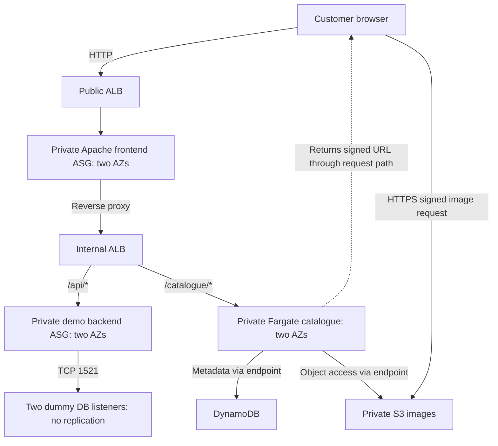

# INFOSYS 735 Group Project 2 — Presentation and Slide Content

This is the group's authoring guide for creating a stakeholder pitch in PowerPoint, Canva or another presentation tool. The business context comes from [AnyGroupLLC_case_study.md](AnyGroupLLC_case_study.md), and the presentation requirements come from [instructions.md](instructions.md). The operational instructions are in [IaC_Deployment_and_Usage_Instructions.md](IaC_Deployment_and_Usage_Instructions.md).

The slides target the highest marking bands in [instructions.md](instructions.md): an integrated additional feature, substantive assessment of **four Well-Architected pillars**, functioning basic and additional infrastructure, and a clear client pitch. The potential five bonus marks are discretionary. A polished deck cannot replace working infrastructure and an accurate AWS Console demonstration.

Use the **copy-ready content** on the slides. Put the **speaker notes** in presenter notes. Use the **visual and console instructions** to create graphics and prepare the recording. Detailed tables belong in appendices; do not paste every paragraph onto the slide. Replace `[MEMBER NAME]`, `[SOURCE/DATE]` and other placeholders with real information before submission. Use the supplied lab observations unless a later run provides stronger evidence.

## 1. Presentation strategy and timing

### Client recommendation

Recommend an **AWS website platform for AnyGroupLLC's New Zealand expansion**, with availability across AZs, demand-based capacity, private application/data tiers, global product-image delivery and repeatable operations. Include a **Product Catalogue microservice** as the selected additional feature: use the Strangler Fig pattern to give catalogue requests an independent service while retaining the Apache/.NET/Oracle application path. Introduce this through a staged rollout, with production readiness checked before customer launch.

Pitch the whole website solution and explain why the catalogue feature belongs in it. The CTO receives a practical microservices adoption approach, the IT manager receives repeatable operations, the CISO receives layered protection, and the CFO receives a production expenditure model. ERP, inventory forecasting, store security systems and personalisation are outside the demonstrated website scope. Do not imply that the catalogue prototype solves the CFO's stock-expiry forecasting request.

The client story is: **business goals → complete cloud proposal and integrated catalogue feature → architecture and rationale → AWS Console configuration → working customer journey → reliability and cost decisions → recommended rollout**.

### Audience and evidence framing

Address the CTO, CFO, CISO and IT manager as decision-makers trying to improve their business. Lead with availability during promotions, protection of customer data, global image access, manageable operations and accountable spending. Explain each service through the problem it addresses; avoid a catalogue of AWS product names without a reason for choosing them.

Keep the main narration about AnyGroupLLC's needs and the proposed solution. The assessment still requires existing-design alignment, areas for improvement and design updates: explain these as business/design decisions, such as replacing image-server capacity dependence with object storage or making releases reproducible. Include the verified GP1 comparison and complete principle assessment in submitted appendix slides prepared from [Rubric_and_Assessment_Checklist.md](Rubric_and_Assessment_Checklist.md). The spoken story does not need a “GP1 to GP2” frame.

Distinguish **production recommendation**, **implemented prototype** and **measured observation**. The prototype supports selected design decisions; it does not demonstrate the forecast production capacity, a real Oracle migration or payment compliance. Give material limitations beside the relevant claim without turning the presentation into a test-report walkthrough.

Use four pillars: **Operational Excellence, Reliability, Security and Cost Optimisation**. Cost Optimisation directly addresses the CFO's production concerns. Performance Efficiency is a credible alternative or fifth pillar if the group adds a full assessment and meaningful service-selection/performance evidence. Sustainability is a lower priority for this pitch because the case provides less direct support for sustainability goals or impact measures. Extra pillar labels alone do not strengthen the assessment.

For assessment requirements and the complete four-pillar check, use [Rubric_and_Assessment_Checklist.md](Rubric_and_Assessment_Checklist.md).

**Required order:** Show basic and additional component configuration in the AWS Management Console **before** demonstrating the additional services. Slides 5–8 show configuration: CloudFormation, CloudWatch/SNS, VPC/network/compute/load balancing/scaling, SGs/NACLs/S3 and ECR/ECS/DynamoDB. Slide 9 demonstrates the working catalogue feature. Slide 10 revisits monitoring and scaling to explain reliability behaviour. CloudShell results and screenshots support the console demonstration. They do not replace it.

### Architecture diagram as the presentation's anchor

Show the final solution diagram prominently on **Slide 3 for two minutes**. Walk through the customer request path, the retained application, the integrated catalogue feature and the design decisions supporting all four pillars. Explain the areas being improved and the corresponding updates while pointing to the affected components. The diagram and its WAF explanation belong in the main recorded presentation; the appendix provides the detailed assessment.

Use the Task 1 architecture slide as the basis for this final diagram, updating it to match the proposal and clearly identifying production recommendations. Show the actual prototype diagram on Slide 4 before opening the console. Reuse the same diagram or a readable cropped view on Slides 5–11 to orient viewers to the component being demonstrated and the pillar it supports. Keep component names, colours and request arrows consistent across slides and console narration.

### Main deck timing and speaking allocation

These are allocated times, not verified rehearsal timings. Target **14 minutes 15 seconds**, leaving 45 seconds inside the 15-minute limit. All four members must speak. Change the member labels to real names.

| Slide | Title | Total time including console | Speaker | Rubric / pillar focus |
|---|---|---:|---|---|
| 1 | AWS website proposal for New Zealand growth | 0:20 | Member 1 | Whole solution and client recommendation |
| 2 | Business priorities and the proposed response | 0:50 | Member 1 | Case study, value proposition, four pillars |
| 3 | Website architecture with an independent catalogue | 2:00 | Member 1 | Main diagram walkthrough, additional feature, four-pillar alignment and design updates |
| 4 | Implemented website prototype | 0:40 | Member 2 | Actual architecture and scope |
| 5 | Repeatable operations for the IT team | 1:20 | Member 2 | Operational Excellence, CloudFormation |
| 6 | Two AZs separate public entry from private tiers | 2:00 | Member 2 | Basic infrastructure configuration |
| 7 | Layered protection for the website and its data | 1:20 | Member 3 | Security, SGs/NACLs/S3 |
| 8 | Catalogue service configuration and integration | 1:00 | Member 3 | Additional services and technical rationale |
| 9 | Customer browsing through the integrated catalogue | 1:20 | Member 3 | Additional-feature demonstration |
| 10 | Availability and capacity for launch and promotions | 1:30 | Member 4 | Reliability, monitoring, scaling evidence |
| 11 | Control production expenditure as demand changes | 1:10 | Member 4 | Cost Optimisation and investment comparison |
| 12 | Approve the cloud direction and staged rollout | 0:45 | Member 4 | Stakeholder decision and production readiness |
| **Total** | **Slides and demonstrations** | **14:15** | **All four** | |

Member 1: 0:00–3:10. Member 2: 3:10–7:10. Member 3: 7:10–10:50. Member 4: 10:50–14:15. Slides 3–4 allocate 2:40 to the production/prototype architecture diagrams; Slides 5–10 allocate 8:30 to configuration, function and operational evidence. Narrate while showing the relevant console; use brief diagram highlights to connect the configuration to the proposal.

## 2. Slide-by-slide authoring content

### Slide 1 — AWS website proposal for New Zealand growth

**Speaker / duration:** Member 1, 0:20. **Purpose:** State the recommendation and client outcome immediately.

**Copy-ready content**

> **AWS website proposal for New Zealand growth**
>
> AnyGroupLLC New Zealand cloud proposal
>
> A scalable website platform with layered protection, global image delivery and repeatable operations.
>
> An independent Product Catalogue service introduces microservices through a staged rollout.
>
> INFOSYS 735 Group Project 2 · [GROUP NAME] · [MEMBER NAMES]

**Visual:** A simple website/customer image with a short solution line: Website platform + Independent catalogue. Keep the title slide minimal and use the same distinct colour for the catalogue throughout the deck.

**Speaker notes**

> We recommend an AWS website platform for your New Zealand expansion, with resilient capacity, protected data and manageable operations. An independent catalogue introduces microservices. We will explain the architecture, demonstrate the prototype and recommend a staged rollout.

**Transition:** “The proposal responds to four stakeholder needs.”

### Slide 2 — Business priorities and the proposed response

**Speaker / duration:** Member 1, 0:50. **Purpose:** Establish the business problem and link the whole proposal to the four stakeholders.

**Copy-ready content**

| Stakeholder need | Proposed response | Pillar |
|---|---|---|
| IT manager: reduce firefighting for a 15-person team | Automated provisioning, observable services and reversible releases | Operational Excellence |
| CTO: support launch and promotional demand | AZ-distributed services, health-based recovery and demand-based capacity | Reliability |
| CISO: withstand attacks and protect valuable data | Edge protection, private tiers, controlled access and security response | Security |
| CFO: manage uncertain demand and OPEX versus CAPEX | Usage-based capacity, cost ownership and comparable production cost scenarios | Cost Optimisation |

Footer: **Additional feature: independent Product Catalogue service. Image storage: replace dependence on a nearly full 5 TB server with S3 and proposed global delivery.**

**Visual:** A flat four-row stakeholder table with readable text. Highlight the catalogue feature and image-capacity problem in the footer; avoid a coursework timeline.

**Speaker notes**

> You expect about 500,000 visits per day, with higher demand during promotions. Your website needs to remain accessible, your data needs protection after previous attacks, and your 15-person team needs less routine infrastructure work. Your image server is also approaching its 5 TB capacity. Our proposal addresses these needs together: a resilient website platform, object storage with global delivery, controlled operations and accountable expenditure. The catalogue service gives the CTO a concrete way to adopt microservices.

**Business facts:** The case forecasts around 500,000 visits/day with higher demand during promotions. Treat that as a sizing requirement for later production testing, not throughput demonstrated by the lab. Source: [case study](AnyGroupLLC_case_study.md).

### Slide 3 — Website architecture with an independent catalogue

**Speaker / duration:** Member 1, 2:00. **Purpose:** Use the main architecture diagram to explain the whole proposal, the integrated catalogue feature, four-pillar alignment and the areas improved by the design updates.

**Copy-ready content**

- CloudFront and proposed edge protection provide global delivery and a protected entry point.
- Load balancers and private Apache/.NET tiers distribute traffic across two AZs; propose managed Oracle availability.
- `/catalogue/*` routes to an independently deployed Fargate service; other application requests retain their existing path.
- Private S3 stores images; CloudFormation, monitoring and role-based administration support operations.

Footer: **Production recommendation. Components beyond the lab are proposed, not deployed by the lab templates.**

**Visual specification:** Make the production diagram in Section 3.1 the dominant content of the slide, using most of the canvas. Use the copy-ready bullets as short labels or presenter notes rather than a large text block beside a small diagram. Trace the customer request through edge delivery, public entry, private website/app tiers and the database. Highlight the catalogue branch and private S3 image delivery. Label production recommendations separately from demonstrated components. Use four concise pillar callouts attached to the relevant components; retain the full diagram as context when highlighting an area.

**Diagram walkthrough, two minutes**

| Time within Slide 3 | What to point to | What to explain |
|---|---|---|
| 0:00–0:20 | Customer → CloudFront/edge → public ALB | Website entry, global delivery and protection against the attacks described in the case |
| 0:20–0:45 | Two AZs, private web/app tiers and proposed Oracle availability | The whole website request path, tier separation and the continuity design |
| 0:45–1:10 | Catalogue route, Fargate, data boundary and S3 image delivery | How the additional feature integrates; independent releases and replacement of fixed image-server capacity dependence |
| 1:10–1:50 | Four pillar callouts and operational plane | Specific alignment and improvements using the table below; relate each decision to a stakeholder benefit |
| 1:50–2:00 | Production/prototype legend | What is proposed versus demonstrated; hand over to the actual prototype diagram |

**Pillar callouts and design updates to explain on the diagram**

| Pillar | Point to | Area addressed and design response |
|---|---|---|
| Operational Excellence | CloudFormation, monitoring and catalogue release boundary | Address manual operating effort and release coupling with reproducible configuration, observable services, owned procedures and small reversible changes |
| Reliability | Two AZs, load balancers, scaling and proposed database availability | Address failure exposure and changing demand with distributed capacity, health-based recovery, tested scaling and database recovery objectives |
| Security | Edge protection, private tiers, controlled roles and encrypted data paths | Address previous attacks and valuable-data exposure with layered access controls, TLS, auditing and an incident-response plan |
| Cost Optimisation | Elastic compute, managed storage/services and cost ownership | Address peak-capacity purchasing and opaque expenditure with demand-based capacity and attributed production costs, while preserving the resilience/security baseline |

These are areas the proposal addresses, not automatically proven omissions in the original GP1 design. Identify retained alignment and confirmed updates from the Task 1 assessment, and verify any historical comparison before labelling it an improvement over the original proposal.

**Speaker notes**

> Follow the customer request from CloudFront and the protected entry point to the public load balancer. Traffic reaches private web and application tiers across two AZs, with managed Oracle availability proposed for the retained application. The highlighted catalogue route reaches a separate Fargate service. It supplies product metadata and image references while other application requests retain their existing path. S3 replaces dependence on the nearly full image server, with CloudFront proposed for global delivery.
>
> The diagram also explains our four design priorities. For Operational Excellence, CloudFormation and monitoring make configuration reproducible and service behaviour visible, while the catalogue has an independent release boundary. For Reliability, AZ distribution, health checks and demand-based capacity support continuity; recovery and promotional capacity still require testing. For Security, edge protection, private tiers and controlled encrypted access address attack and data-exposure risks. For Cost Optimisation, capacity follows demand and costs have an owner, preserving the availability and security baseline.
>
> These decisions address image capacity, operational effort, continuity and expenditure together. The production controls shown are recommendations; next we will show which parts the prototype implements and demonstrate them in the console.

**Narration rule:** Explain the request path, feature integration and four pillar callouts during the recording. Detailed principle tables and verified original-design comparisons support this explanation in the submitted appendix. Do not leave the architecture rationale or improvement explanation only for questions or appendix reading.

**Transition:** “We have implemented a prototype of the website tiers and catalogue integration; we will now show its configuration.”

### Slide 4 — Implemented website prototype

**Speaker / duration:** Member 2, 0:40. **Purpose:** Make the actual implemented scope clear before opening the console.

**Copy-ready content**

- `us-east-1`: one VPC, six subnets and two AZs.
- Seven EC2 at baseline: one NAT, two frontend, two backend and two dummy DB nodes.
- Public ALB → private Apache frontend → internal ALB → legacy API or catalogue.
- Two Fargate tasks; DynamoDB metadata; private S3 product images.

Footer: **Dummy DB connectivity is simulated. Lab HTTP, shared LabRole and one NAT are explicit limitations.**

**Visual specification:** Use the actual lab diagram in Section 3. Label backend as “Python demo API representing legacy app tier” and DB nodes as “dummy TCP listeners; no replication”. Frontend/backend/catalogue share the private app subnets in each AZ; do not invent dedicated subnets for each tier.

**Speaker notes**

> The prototype implements the website routing and tier boundaries using seven EC2 instances, two load balancers and two catalogue tasks across two AZs. The catalogue reads synthetic metadata and private images. A demo backend and dummy database listeners represent the retained application. This lets us demonstrate integration and selected controls before production migration; Oracle failover, payment compliance and forecast customer capacity remain separate validation work.

**Transition:** “We first show how that infrastructure is provisioned and operated.”

### Slide 5 — Repeatable operations for the IT team

**Speaker / duration:** Member 2, 1:20 including console. **Purpose:** Give Operational Excellence substantive coverage and demonstrate CloudFormation as additional infrastructure.

**Copy-ready content**

> **Operational Excellence**
>
> - Reduce manual configuration with four connected CloudFormation stacks and startup checks.
> - Identify releases with immutable image tags, pinned digests and versioned responses.
> - Monitor service health; assign alert owners and use a shared response runbook.
> - Make small, reversible changes; test procedures and review incidents to improve them.
> - Managed catalogue services reduce host administration; staff retain application and security responsibilities.

Evidence strip: **Four successful stack snapshots; v1 → v2 → v1 smoke PASS. Both tags used the same image content in this run.**

**Console sequence, about 0:50**

1. CloudFormation: show the four stack names and successful statuses in the current deployment.
2. Show Resources/Outputs on core and the dependent microservice stack. Identify one imported value, such as the internal listener or image bucket.
3. Briefly show completed configuration-update evidence. Reserve ECS image/task details for Slide 8 and the working feature for Slide 9.
4. CloudWatch: show the configured health/capacity alarms, catalogue log group and alarm action linked to SNS. Explain which owner responds.
5. SNS: show the topic and confirmed subscription. Configuration is shown here before the catalogue demonstration; delivered-alert and scaling observations are revisited on Slide 10.

**Preparation:** Capture bootstrap success Events if available. Otherwise state that signal policies are configured without claiming an Event capture. Keep console tabs ready so configuration navigation fits the allocated time.

**Speaker notes, about 0:30 alongside the console**

> For your IT team, the aim is a platform that can be provisioned consistently and changed with a clear recovery path. These four CloudFormation stacks connect the website, network, monitoring and catalogue. Startup checks expose bootstrap failures, while image digests identify what ECS runs. Our saved run verified a deployment-version update and explicit reversal using the same image content. CloudWatch and a maintained response runbook support day-to-day operations; changed-code releases and automatic rollback still need separate tests.

**Design improvements beyond the shown console:** Assign an owner for alerts and deployment, maintain the main guide, test failures, record lessons and use managed services to reduce host administration. Use the eight principle areas in [the rubric checklist](Rubric_and_Assessment_Checklist.md#appendix-a--full-four-pillar-assessment-for-submitted-slides) to build any submitted appendix slides.

**Value:** Reproducible provisioning and a controlled release/reversal process for the small IT team. Assign [OPERATIONS OWNER] and [ALERT OWNER], review procedures and operational metrics, and include training effort in the rollout. Time or productivity savings remain unmeasured.

### Slide 6 — Two AZs separate public entry from private tiers

**Speaker / duration:** Member 2, 2:00 including console. **Purpose:** Demonstrate all basic network/compute/routing configuration before the feature.

**Copy-ready content**

| Layer | Implemented configuration |
|---|---|
| Network | VPC `10.0.0.0/16`; public/app/DB subnets in two AZs |
| Entry and routing | Public ALB to private frontend; internal ALB to backend or catalogue |
| Compute | Frontend ASG 2–4; backend ASG fixed at 2; two dummy DB nodes |
| Outbound support | One NAT EC2; S3/DynamoDB gateway endpoints |

Footer: **Prototype baseline: 7 EC2. Configured frontend maximum allows 9 total; the saved load run did not demonstrate scale-out.**

**Console sequence, about 1:35**

1. VPC → select project VPC → resource map/subnets: identify both AZs and all six subnets.
2. Route tables: show public route to IGW, private app route to NAT, and gateway endpoint routes. DB subnets have no NAT default route.
3. EC2: show NAT, two web/frontend instances, two backend instances and two dummy DB instances. Show private addresses and the NAT's disabled source/destination check.
4. Load balancers/target groups: show public versus internal scheme, frontend/backend healthy counts and the internal `/api/*` and `/catalogue/*` listener rules.
5. Frontend ASG: show minimum/desired 2, maximum 4, both AZs and the request-count target-tracking policy. Backend ASG remains fixed at 2.

**Speaker notes, about 0:25 alongside the console**

> Customer traffic enters through the public load balancer, reaches private Apache instances and follows the internal load balancer to application services. Web and app instances span two AZs. The frontend scaling policy is configured, but scale-out remains unverified. Production needs resilient outbound paths because this prototype has one NAT instance.

**Required continuation:** SG/NACL and S3 configuration is shown on Slide 7. CloudWatch/SNS configuration was shown on Slide 5; Slide 10 returns to their operational behaviour. All basic and additional configuration must be shown before the feature on Slide 9.

### Slide 7 — Layered protection for the website and its data

**Speaker / duration:** Member 3, 1:20 including console. **Purpose:** Address the CISO's attack and data-protection concerns through production design and demonstrated controls.

**Copy-ready content**

> **Security**
>
> - Protect the entry point: proposed CloudFront, AWS WAF and Shield Standard with restricted origin access.
> - Isolate tiers: private compute and source-based rules; no public SSH/RDP or database access.
> - Protect data: private encrypted storage, controlled image delivery and production TLS.
> - Control and trace access: separate least-privilege roles, audited administration and security controls as code.
> - Prepare for attacks: owned alerts, investigation procedures and incident-response exercises.

Evidence footer: **Prototype signed image GET succeeds; unsigned GET returns 403. Shared LabRole and HTTP app path remain limitations; production edge/audit controls are proposed. PCI compliance is not established.**

**Visual:** A short allowed-flow diagram: Public ALB → frontend → internal ALB → backend → dummy DB, plus internal ALB → catalogue → DynamoDB/S3. Mark frontend → DB as a forbidden path requiring the negative test. Distinguish verified image denial from the outstanding network test.

**Console sequence, about 0:50**

1. Security Groups: show frontend ingress only from public ALB, backend ingress only from internal ALB, and DB TCP 1521 only from backend.
2. NACLs: show associations and effective rules. Explain that these NACLs are broad and SGs enforce the fine-grained tier boundaries.
3. S3: show all public-access-block settings, encryption and the deny-insecure-transport policy.
4. Show the smoke result for signed image access and unsigned HTTP 403. Show frontend-to-DB failed connectivity only if recorded; otherwise label it pending.

**Speaker notes, about 0:30**

> Your previous attacks call for layered protection: edge filtering, restricted origins, private tiers, controlled identities and audited administration. Here, we show security groups and private encrypted storage. Tests verified signed image access and rejected unsigned access; these links are not user authentication. Production TLS, role separation, audit and incident exercises remain required before sensitive customer or payment use.

**Value:** Reduce exposure and give the CISO a defined protection and response plan. Keep staff access through controlled administration rather than routine direct data access. Encryption and private networking alone do not establish compliance.

### Slide 8 — Catalogue service configuration and integration

**Speaker / duration:** Member 3, 1:00 including console. **Purpose:** Show more than one additional component, integration and rationale before the feature demonstration.

**Copy-ready content**

| Component | Role in the prototype | Business / technical rationale |
|---|---|---|
| CloudFormation | Provision service/network dependencies | Consistent configuration for the IT team |
| ECR + ECS/Fargate | Identify and run catalogue image | Independent releases; no worker-node management |
| DynamoDB | Service-owned synthetic product metadata | Prototype a separate data boundary; validate production access patterns |
| Private S3 | Product image objects referenced by metadata | Remove image-server capacity dependence; separate storage from compute |

**Visual:** CloudFormation provisioning line above ECR digest → Fargate service → DynamoDB + S3 references. Label the ALB listener route that sends catalogue traffic to the tasks.

**Console sequence, about 0:40**

1. ECR: image tags/digest and immutable tag configuration.
2. ECS: service desired/running 2, completed rollout and task AZs; show X86_64 task definition with digest-pinned image.
3. DynamoDB: table partition key `product_id` and records P1001–P1003.
4. S3: matching image keys; internal ALB: `/catalogue/*` target group/rule. Keep tabs ready.

**Speaker notes, about 0:20**

> This catalogue service answers the CTO's microservices request. Fargate runs it independently, DynamoDB supplies synthetic metadata and S3 stores images. CloudFormation connects the components and ECR identifies the image. Independent releases are the benefit; production data ownership, Oracle synchronisation and datastore suitability still need validation.

**Value:** A separate release boundary for the CTO, scalable image storage and fewer host-management tasks for IT. Explain the trade-off: another service introduces monitoring, data-consistency and operating responsibilities, so start with one catalogue boundary and expand only when justified.

### Slide 9 — Customer browsing through the integrated catalogue

**Speaker / duration:** Member 3, 1:20 including demonstration. **Purpose:** Demonstrate the additional feature after its configuration has been shown.

**Copy-ready content**

- One storefront retrieves catalogue products and images.
- `/api/*` retains the demo legacy path and dummy DB connectivity.
- `/catalogue/*` serves independent product metadata and signed image access.
- Baseline, update and reversal smoke checks pass with two healthy targets per service.

Footer: **Synthetic catalogue; browser cart counter only; no checkout or Oracle migration.**

**Demonstration sequence, about 1:00**

1. Open the public ALB storefront; show the three product cards and images. Briefly use search if it visibly supports catalogue browsing.
2. Open `/api/health` and `/api/db`: identify backend EC2/AZ and both dummy listeners reachable.
3. Open `/catalogue/products/P1001`: show product metadata from the catalogue path.
4. Open `/catalogue/ready`: explain DynamoDB and S3 accessibility. `/catalogue/health` is process liveness; readiness alone does not prove data was seeded.
5. Show a saved smoke PASS and running version. Do not display full presigned query strings in a recording.

**Speaker notes, about 0:20**

> Customers browse one website while the catalogue supplies metadata and images independently. The retained API still responds and reaches the dummy database tier, demonstrating coexistence. Saved smoke runs verified integration and selected access controls. This browsing prototype uses synthetic products and a browser cart counter; checkout and production data migration are outside it.

**Evidence source:** `evidence/baseline/smoke.json`, `evidence/update-v2/smoke.json`, `evidence/reversal-v1/smoke.json`. Use actual current URLs; deleted-stack DNS names are historical.

### Slide 10 — Availability and capacity for launch and promotions

**Speaker / duration:** Member 4, 1:30 including console/evidence. **Purpose:** Explain continuity and capacity for the CTO, then demonstrate CloudWatch/SNS/Auto Scaling configuration and actual observations.

**Copy-ready content**

> **Reliability**
>
> - Distribute website and catalogue capacity across AZs to reduce single-node dependence.
> - Use health checks, managed replacement and owned alerts to detect and respond to failures.
> - Adjust capacity with demand; validate promotional peaks and service quotas before launch.
> - Agree availability and recovery objectives; test database restore and service recovery.
> - Use automated, reviewed changes to keep the intended recovery configuration reproducible.

Evidence footer: **Two-AZ healthy baseline. Probe: 273/280 successes (97.5%). Load: 1,200 HTTP 200 at ~5 requests/s; p95 7.92 ms. Recovery completion, scale-out and alert receipt remain unverified. Prototype measurements are not a production SLA or capacity forecast.**

**Visual:** Highlight the AZ distribution on the prototype diagram, then show a compact dated probe/load evidence strip during console narration. If using a probe timeline, derive it from the actual JSONL samples. Add replacement/scaling events only after capturing them. Keep detailed test statistics in presenter notes or an evidence appendix rather than filling the slide with test output.

**Console/evidence sequence, about 1:00**

1. Show CloudWatch target/capacity/error alarms and catalogue log group. Connect each selected signal to a response in the runbook.
2. Show SNS confirmed subscription; show a delivered matching message only if preserved. Confirmation is currently verified, actual receipt is not.
3. Show actual request failures. If a later run establishes the manual termination trigger and replacement, show the instance identity, ASG Activity and two healthy targets after restoration.
4. Show frontend target-tracking policy and its AWS-managed alarm/metric. If no scale-out occurred, state that result and the diagnostic next step; do not claim that generating load proves scaling.

**Speaker notes, about 0:30**

> For launch and promotions, we propose AZ-distributed capacity, health-based recovery and demand-based scaling with agreed service objectives. The console shows the policy, health checks, alarms and subscription. Our saved probe recorded seven failures; the small load run returned 1,200 successful responses but did not demonstrate new instance creation. Recovery completion, scale-out and delivered alerts still need verification. Production acceptance also requires real database restore tests and capacity tests based on customer behaviour.

**If later evidence is captured:** Replace the pending line with specific observations: trigger time/instance, failed sample count, replacement Activity, restored two-target timestamp, peak ASG count and later scale-in count, matching alarm/email timestamp. Keep the original run labelled if comparing results.

**Production improvement:** Real database recovery/restore tests, AZ-local outbound paths, capacity testing, task/backend demand scaling and agreed recovery objectives. The single lab NAT and dummy DBs do not provide full-platform failover.

**Value:** Protect customer access during failures and promotions through an explicit continuity plan and measurable acceptance criteria. The case's 500,000 visits/day does not equal 500,000 HTTP requests/day: size for requests per visit, images, peak concentration and data-access patterns.

### Slide 11 — Control production expenditure as demand changes

**Speaker / duration:** Member 4, 1:10 including the production cost comparison or method. **Purpose:** Address the CFO's OPEX/CAPEX and uncertain-demand concerns through a defensible production expenditure model.

**Copy-ready content**

> **Cost Optimisation**
>
> - Financial ownership: agree a workload owner, budget, alerts and monthly review with Finance.
> - Consumption model: scale for promotions and scale in afterwards, preserving the availability baseline.
> - Business efficiency: track cost per successful catalogue request alongside latency and errors.
> - Operational effort: compare managed services with self-managed options, including maintenance and training.
> - Attribution: allocate costs by service/environment, including shared networking, storage and monitoring.

Footer: **Compare normal and promotional demand with co-location at equivalent availability and security. Production estimates are assumptions, not measured savings.**

**Visual:** A readable production comparison: Co-location / Cloud normal demand / Cloud promotional demand. Show dated estimates only after inputs are populated. Otherwise show the cost categories and decision method, labelled “estimate pending”. Keep the full assumptions table in notes or a submitted appendix. Avoid making the Learners Lab balance or teardown the main visual.

**Presentation sequence, about 0:25**

1. Show the production scenarios or comparison method, with the proposed region, demand assumptions and price-source date.
2. Explain what varies with demand and what remains a baseline cost. Link scaling, service ownership and tagging to CFO visibility.
3. State the financial decision criterion: meeting customer service/security requirements at a justified total cost. Use prototype configuration as supporting evidence; production budgets and billing controls remain proposals unless actually configured and captured.

**Speaker notes, about 0:45**

> You need to support normal demand and promotions without purchasing permanent capacity for every peak. We propose demand-based scaling, a production cost owner and regular reviews of cost per successful catalogue request. Managed services can reduce routine infrastructure work, but we include maintenance, migration and training in the comparison. Finance should compare normal and peak cloud scenarios with co-location at the same availability and security level. Our prototype supports the service integration; attributable spending and production savings have not yet been established.

**Production cost model for presenter notes or a submitted appendix**

| Input / decision | What the group should specify |
|---|---|
| Workload | 500,000 visits/day from the case; explicit assumptions for requests per visit, images/bytes, cache hit rate, promotion peaks and growth |
| Location and rates | Proposed production region/currency, service availability, dated official rates and applicable licensing assumptions; the lab's `us-east-1` location is not a production decision |
| Baseline and elasticity | Capacity needed for AZ resilience; normal/peak instance/task hours; database baseline and backup requirements; scaling limits based on tested demand |
| Cloud charges | Both load balancers, resilient outbound networking, public IPv4, EC2/EBS, Fargate, database, S3, CloudFront, request/transfer charges, security, logs, backups and support |
| Co-location comparison | Comparable server/storage/network capacity, redundancy, facilities, hardware renewal, licences, staffing, backup and security responsibilities |
| Transition and operations | Migration and parallel-running costs, Oracle licensing/version constraints, staff training and ongoing maintenance effort |
| Governance | Proposed workload owner [CLIENT ROLE], budget [AGREED LIMIT], alerts and regular review; service/environment tags and allocation of shared costs |
| Business output | Attributable catalogue cost per successful request for the same reporting window, with latency/error measures to prevent false efficiency through worse service |

**Method:** Estimate recurring charges from applicable units × rates × usage/time, add operational and transition costs, and compare options over the same stated period. Label forecast inputs as assumptions; distinguish capital cash outlay from depreciation/operating costs in the co-location comparison. Include uncertainty ranges rather than a precise total unsupported by inputs. Populate numbers only from an explicit model; leave missing values unknown.

**Trade-offs to explain:** Keep the availability/security baseline even when it costs more than a single-node setup. Evaluate image caching and storage lifecycle rules against real access and retention needs; neither automatically lowers total cost. Consider usage commitments only after stable demand is measured. Budget alerts notify owners; they do not automatically cap charges or guarantee sufficient capacity. OPEX changes the spending model but does not by itself prove lower total cost.

**Supporting prototype evidence:** Configured frontend scaling, on-demand DynamoDB, gateway endpoint routing, managed catalogue services and resource inventory illustrate parts of the approach. Demand-driven scale-out and cost efficiency are not yet demonstrated. Verified teardown shows control of temporary experiment resources; production customer-serving resources remain available. The Academy balance is not a production cost model. `data/cost_model_inputs.json` is a prototype-cost input record, not a completed production forecast.

**Source for presenter notes:** [AWS Cost Optimisation design principles](https://docs.aws.amazon.com/wellarchitected/latest/framework/cost-dp.html). The five bullets above address all five principle areas; use the separate rubric checklist for the full assessment.

### Slide 12 — Approve the cloud direction and staged rollout

**Speaker / duration:** Member 4, 0:45. **Purpose:** End with a client decision, acceptance criteria and a credible path to production.

**Copy-ready content**

> **Approve the AWS website direction and a staged catalogue rollout**
>
> - CTO: design for launch continuity and promotions; introduce independent catalogue releases.
> - IT manager: use reproducible infrastructure, managed services and owned response procedures.
> - CISO: complete layered protection, controlled identities, audit and security response before sensitive production use.
> - CFO: approve an investment envelope based on comparable production costs and accountable ownership.
>
> **Next decision:** agree service objectives, validate capacity/recovery and security, then approve production migration and customer rollout.

**Visual:** A three-stage rollout: Prototype integration → Production design and acceptance → Customer launch and ongoing review. Put the requested stakeholder decision beside the timeline; avoid a list of coursework deliverables.

**Speaker notes**

> We recommend AWS as the direction for your New Zealand website, with an independent catalogue introduced through a staged rollout. The prototype demonstrates website and catalogue integration, repeatable configuration and selected access controls. We ask you to endorse that direction and agree owners and a budget for production design and validation. Before customer launch, we will need agreed service objectives, capacity and recovery evidence, production security and data migration plans, and a cost comparison acceptable to Finance. Wider service extraction follows only when the business benefit justifies it.

**Closing rule:** Ask stakeholders to endorse the whole website direction and the next funded rollout stage. Make production launch conditional on acceptance criteria; the prototype has not established production readiness.

## 3. Architecture diagram construction specifications

Create editable diagrams with readable service labels, arrows and subnet/AZ boundaries. Export at sufficient resolution if using a separate diagram tool. The diagram must explain routing and trust boundaries; AWS icons are optional. Use a small legend: **retained application path**, **independent catalogue**, **production recommendation**, **prototype simulation**. Keep coursework version labels off the main client diagram.

### 3.1 Production diagram for Slide 3

- Start with customers and Route 53 DNS leading to CloudFront. Put WAF and Shield Standard at the edge and label them as production recommendations.
- Dynamic path: CloudFront → HTTPS public ALB → Apache frontend ASG across AZ A/B → private internal ALB.
- Split the internal route into retained .NET backend ASG → proposed RDS for Oracle Multi-AZ, and highlighted catalogue ECS/Fargate → agreed catalogue data boundary plus S3 image references. Show DynamoDB as the prototype datastore and a production candidate subject to access-pattern and consistency validation.
- Image delivery: private S3 → CloudFront using Origin Access Control → customer. OAC belongs to the S3 origin; it does not establish protection of the ALB origin. Specify origin restrictions separately.
- Draw two AZ columns, public subnets for ALB/AZ-local NAT support, private app subnets and private database subnets. RDS standby is an availability mechanism, not a demonstrated read-scaling solution.
- Add an operational plane: CloudFormation, CloudWatch/SNS, Systems Manager, proposed CloudTrail/Config, Secrets Manager and KMS.
- Label production TLS/certificates, role separation, audit, data recovery, service availability in the intended region, Oracle licensing/version and final catalogue datastore as design/validation work. Do not draw all production arrows as tested connections.
- Annotate the decisions that address client problems: AZ distribution for continuity, elastic capacity for promotions, S3 for image capacity, the catalogue boundary for independent releases and IaC for consistent operations. Use the original GP1 comparison in the submitted assessment appendix after verifying it.

### 3.2 Prototype diagram for Slide 4

| Position | Actual component to draw | Boundary / arrow |
|---|---|---|
| Top | Customer/browser | HTTP → public ALB |
| Public subnets A/B | Public ALB across two AZs; NAT EC2 only in A | Public default route to IGW; NAT supports private app outbound |
| Private app A/B | Apache frontend A/B | Public ALB → frontend TCP 80 |
| Between app groups | Internal ALB across two app subnets | Frontend reverse proxy → internal ALB TCP 80 |
| Private app A/B, legacy branch | Backend demo API A/B | `/api/*`, priority 100 → backend TCP 8080 |
| Private app A/B, new branch | Catalogue Fargate A/B | `/catalogue/*`, priority 50 → catalogue TCP 8080 |
| Private DB A/B | Dummy primary/standby | Backend TCP 1521; no replication arrow |
| Outside VPC as managed regional services | DynamoDB and private S3 | Catalogue reads metadata/objects via gateway endpoints; HTTPS signed S3 image URL returned to browser |
| Side operations panel | Four stacks, CloudWatch/logs/alarms, SNS, ECR | Provisioning/telemetry/image delivery, distinguished from customer request arrows |

Use this simplified connection blueprint to check the final graphic:

The signed URL response travels back through the normal ALB/frontend request path; the dotted line represents a logical response, not direct Internet exposure of a task. Add actual AZ/subnet boundaries in the finished slide graphic. Lab CloudFront, WAF, managed Oracle and database replication must not appear as deployed components.

### 3.3 Connect the diagram to the console demonstration

Use brief highlights of the same architecture before showing each relevant console view. Say where the component sits, what it does and which client need it supports, then show its actual configuration. A cropped view must preserve enough context to locate the component in the whole solution. This orientation is included in each slide's allocated time; it is not another full architecture lecture.

| Slide | Diagram area to highlight | Console / explanation connection |
|---|---|---|
| 5 — Operational Excellence | Provisioning, monitoring and release controls | CloudFormation dependencies, CloudWatch actions and SNS ownership |
| 6 — Basic infrastructure | AZ/subnet boundaries and the main request path | VPC routes, NAT, EC2 tiers, ALBs and ASG configuration |
| 7 — Security | Entry point, tier access boundaries and image storage | SGs, NACLs and S3 controls; production edge/identity/TLS remain labelled proposals |
| 8 — Additional services | Catalogue route → Fargate → metadata/images | ECS/ECR, DynamoDB, S3 references and listener integration |
| 9 — Feature | Customer → website → catalogue → image delivery | Trace one browsing request through the implemented components |
| 10 — Reliability | Two AZs, health checks and demand-based capacity | Target health, metrics, replacement/scaling observations and unresolved validation |
| 11 — Cost Optimisation | Baseline capacity, elastic capacity and managed services | Explain fixed/variable production costs and accountable ownership; separate cost assumptions from observed usage |

## 4. Evidence the group can use now

The following observations are from the supplied 6 October 2026 run. Label later runs separately and preserve unsuccessful outcomes. Saved evidence remains under `evidence/`; operational steps are in the main IaC guide, Section 4.

| Observation | Supported wording | Source | Boundary |
|---|---|---|---|
| Functional baseline | Three seeded products/images and legacy paths pass smoke | baseline/smoke.json | Synthetic pilot, dummy DBs |
| Healthy redundancy | Two healthy frontend, backend and catalogue targets; tasks/ASG members in two AZs | baseline/configuration target/task/autoscaling JSON | Snapshot, not an outage test |
| Catalogue update/reversal | v1 → v2 → v1 smoke PASS; ECS update replaces tasks | update-v2 and reversal-v1 smoke; ECS service snapshot | Same image digest: configuration release, not changed-code proof |
| Image access | Signed image GET succeeds; unsigned GET returns 403 | smoke.json | Bearer access, not user authentication |
| SNS configuration | Email subscription confirmed at update | update-v2/configuration/sns_subscriptions.json | No preserved delivered alert |
| Functional probe | 273/280 successes; two 502 and five connection/timeout errors | frontend-failure/requests.jsonl and summary | No saved post-failure replacement/capacity proof |
| Load | 1,200 HTTP 200; 239.81 seconds; 5 requests/s; p95 7.92 ms | scaling/load.json | Scale-out not observed/reliably demonstrated |
| Cleanup | All matching project resource counts zero; no collection errors | after-teardown/summary.json | Defined tags/names/prefixes; not an account-wide billing result |

**Preparation still needed:** distinct-code image release if claimed; manual failure trigger and replacement/restored-target evidence; successful demand-driven scale-out/scale-in or an accurate unresolved diagnosis; delivered SNS alert; frontend-to-DB denied connection; owners and incident review; a dated production cost scenario comparison with explicit assumptions; final console recording and graphical slides. Prototype cost/budget captures support temporary-resource management but do not replace the production comparison.

Do not hide these gaps in footnotes while claiming they passed in the narration. Use the main guide to capture them before the final recording. If unresolved, describe the design, actual outcome and next validation step explicitly.

## 5. Console recording and slide-building instructions

### Before recording

1. Fill member names and assign one console operator per segment; rehearse speaker handoffs.
2. Follow the main IaC guide to deploy the current architecture and run the intended tests. The supplied run was torn down; its screenshots/JSON are historical evidence, not current live resources.
3. Complete long recovery, scaling and cleanup experiments beforehand. Save dated evidence and clear screenshots. Do not wait for replacement or deploy stacks while the 15-minute recording runs.
4. Open console tabs in presentation order: CloudFormation; CloudWatch/SNS configuration; VPC/subnets/routes; EC2/ASGs; ALBs/target groups; SGs/NACLs; S3; ECR; ECS; DynamoDB; storefront/API; CloudWatch/SNS/ASG behaviour. Keep the production cost slide ready after the operational evidence.
5. Place each screenshot/graph beside the claim it proves and label run/date. Show genuine saved evidence if a live navigation issue occurs; explain that it is captured evidence.
6. Confirm URLs and local files are accessible. Avoid displaying AWS credentials, complete signed URL query strings or personal subscription addresses.
7. Run a timed rehearsal including switching applications and loading console pages. Cut repeated narration first. Keep architecture diagrams and required component configuration visible and readable.

Before rehearsing, prepare the final Task 1 solution diagram and the actual prototype diagram. Check that their labels and routing match the proposal and implementation, that the catalogue is visibly integrated, and that a viewer can read the diagram at the recording's playback size. Rehearse pointing to components while explaining their role and four-pillar rationale; simply displaying an unexplained diagram does not communicate the design.

### Slide layout guidance

Use 16:9 slides, one main point per title and a consistent service/colour legend. Use readable body text and limit on-slide prose to the copy-ready content. Speaker notes contain the explanation, caveats and transitions. Large architecture diagrams can use incremental highlighting; do not force a full diagram plus a long table onto one slide. Use native/editable text and tables where possible so the group can revise details.

Show four dedicated pillar headings, with the **client need → design alignment or improvement → technical rationale → configuration/observed evidence → business value and material limitation** chain visible across their slides. Explain the whole website solution, with the catalogue highlighted as its additional feature. The Cost Optimisation slide addresses production workload economics; lab cleanup is supporting material.

Prepare readable submitted appendix slides from the full principle assessment in the separate rubric checklist, including the verified original-design comparison. Apply the production decisions in this guide, especially Slide 11's five Cost Optimisation areas, when expanding that assessment; retain prototype observations as implementation evidence. Keep the main pitch about stakeholder decisions and the proposed solution. Four labels alone are not substantive coverage. Place case-study and AWS principle references in the relevant presenter notes and include a references appendix.

### Recording requirements to preserve

- Finish within 15 minutes, including console navigation and speaker handoffs; every member presents a meaningful portion.
- Show and narrate the whole solution architecture prominently on Slide 3, using the final Task 1 architecture slide. Trace the integrated additional feature and explain four-pillar alignment, areas for improvement and design updates on the diagram. Show the actual prototype architecture on Slide 4 and connect later demonstrations to it.
- Demonstrate functioning infrastructure through the AWS Management Console. Show basic and additional configuration first, then demonstrate the catalogue service and its website integration.
- Explain why each selected service fits the workload and how it contributes to stakeholder outcomes. Keep recommendations, implementation and measured results distinguishable.
- Close with a clear value proposition and a stakeholder decision about rollout, responsibilities and investment.

### What must be submitted

| Requirement | What to submit | Key check |
|---|---|---|
| Presentation slides | Slideshow or PDF | Whole solution architecture, integrated additional feature, four-pillar alignment and design improvements; include the assessment appendix |
| Presentation recording link | Text file containing an accessible recording URL | Within 15 minutes; every member speaks; AWS Console configuration is shown before the feature demonstration |
| TeamMates assessment | Each member completes the separate TeamMates assessment | Provide feedback on all other group members; omission incurs the brief's 10% penalty |

Use [Rubric_and_Assessment_Checklist.md](Rubric_and_Assessment_Checklist.md) for the detailed checks before submission.
