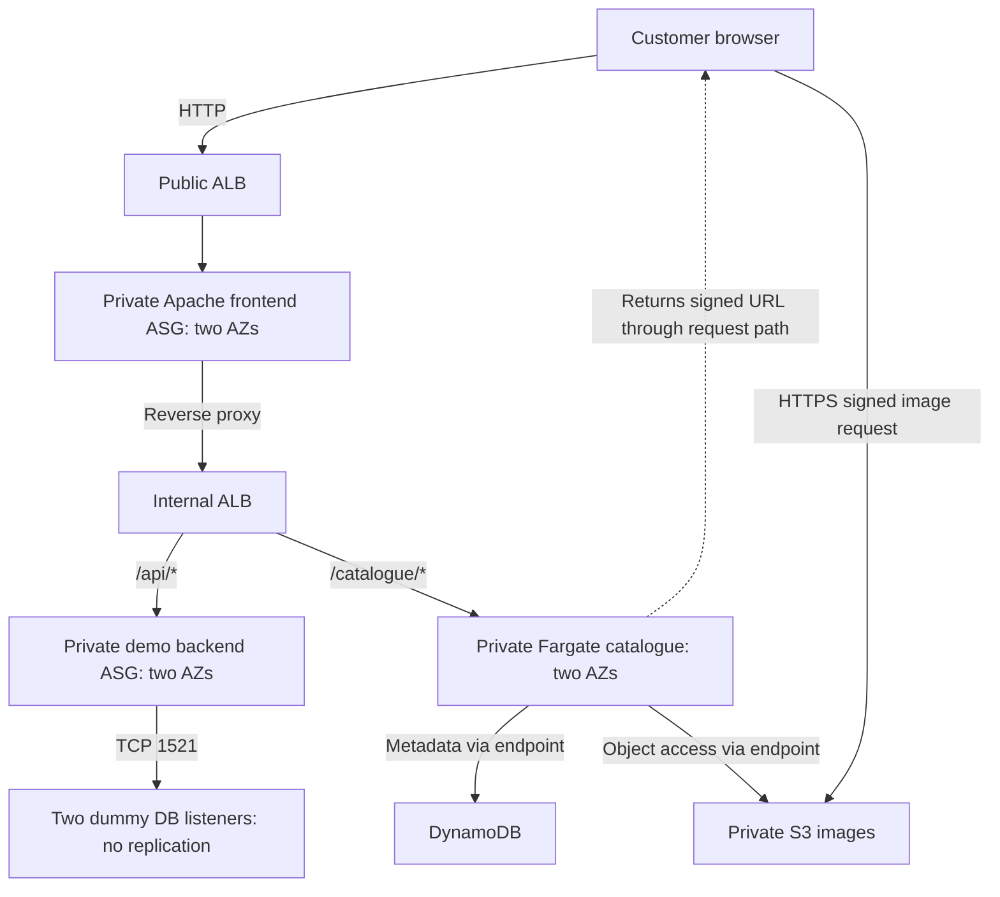

# INFOSYS 735 Group Project 2 — Presentation and Slide Content

This is the group's authoring guide for creating the slides in PowerPoint, Canva or another presentation tool. It extracts and expands the presentation material from README.md. The operational instructions are in [IaC_Deployment_and_Usage_Instructions.md](IaC_Deployment_and_Usage_Instructions.md).

The slides target the highest marking bands in [instructions.md](instructions.md): an integrated additional feature, substantive assessment of **four Well-Architected pillars**, functioning basic and additional infrastructure, and a clear client pitch. The potential five bonus marks are discretionary. A polished deck cannot replace working infrastructure and an accurate AWS Console demonstration.

Use the **copy-ready content** on the slides. Put the **speaker notes** in presenter notes. Use the **visual and console instructions** to create graphics and prepare the recording. Detailed tables belong in appendices; do not paste every paragraph onto the slide. Replace `[MEMBER NAME]`, `[SOURCE/DATE]` and other placeholders with real information before submission. Use the supplied lab observations unless a later run provides stronger evidence.

## 1. Presentation strategy and timing

### Client recommendation

Recommend a bounded **Product Catalogue microservice pilot** using the Strangler Fig pattern. Retain the existing application path, route the catalogue path to an independently deployed service, and assess the result before extracting another function. This answers the CTO's additional microservices question. CloudFormation and managed services also address the IT manager's operational burden; they support the selected feature. Demand forecasting and personalisation are future opportunities, not implemented additional features.

The client story is: **business need → architecture change → four-pillar improvements → configuration proof → working feature → measured observations → investment decision**.

For assessment requirements and the complete four-pillar check, use [Rubric_and_Assessment_Checklist.md](Rubric_and_Assessment_Checklist.md).

**Required order:** Show the basic infrastructure and additional-service configuration in the AWS Management Console **before** demonstrating the additional feature. Slides 5–8 are configuration; Slide 9 is the working feature. CloudShell results and screenshots support the console demonstration. They do not replace it.

### Main deck timing and speaking allocation

These are allocated times, not verified rehearsal timings. Target **14 minutes 15 seconds**, leaving 45 seconds inside the 15-minute limit. All four members must speak. Change the member labels to real names.

| Slide | Title | Total time including console | Speaker | Rubric / pillar focus |
|---|---|---:|---|---|
| 1 | Modernise the catalogue in a controlled pilot | 0:30 | Member 1 | Client recommendation |
| 2 | Four improvements address four stakeholder needs | 1:00 | Member 1 | Business value, four pillars |
| 3 | Extract one service while retaining the core platform | 1:10 | Member 1 | Updated production architecture |
| 4 | The lab proves a bounded implementation | 0:40 | Member 2 | Actual lab architecture and limits |
| 5 | Infrastructure and releases are defined as code | 1:20 | Member 2 | Operational Excellence, CloudFormation |
| 6 | Two AZs separate public entry from private tiers | 2:00 | Member 2 | Basic infrastructure configuration |
| 7 | Private tiers and image controls enforce selected boundaries | 1:20 | Member 3 | Security, SGs/NACLs/S3 |
| 8 | The catalogue components form one integrated service | 1:00 | Member 3 | Additional-service configuration |
| 9 | Catalogue and legacy routes work together | 1:30 | Member 3 | Feature and functional demonstration |
| 10 | Recovery and scaling claims depend on observed behaviour | 1:40 | Member 4 | Reliability, monitoring, scaling |
| 11 | Resource lifecycle controls bound pilot expenditure | 1:10 | Member 4 | Cost Optimisation |
| 12 | Approve the pilot and validate the next decision | 0:55 | Member 4 | Stakeholder close, production gaps |
| **Total** | **Slides and demonstrations** | **14:15** | **All four** | |

Member 1: 0:00–2:40. Member 2: 2:40–6:40. Member 3: 6:40–10:30. Member 4: 10:30–14:15. Slides 5–10 allocate 8:50 to configuration, function and operational evidence. Narrate while showing the relevant console; do not give a full lecture and then repeat it during navigation.

## 2. Slide-by-slide authoring content

### Slide 1 — Modernise the catalogue in a controlled pilot

**Speaker / duration:** Member 1, 0:30. **Purpose:** State the recommendation and client outcome immediately.

**Copy-ready content**

> **Modernise the catalogue in a controlled pilot**
>
> AnyGroupLLC New Zealand cloud proposal
>
> Retain the existing application path. Extract the Product Catalogue as one independently deployed service.
>
> Evaluate operations, reliability, security and cost before expanding the migration.
>
> INFOSYS 735 Group Project 2 · [GROUP NAME] · [MEMBER NAMES]

**Visual:** A simple three-step line: Existing platform → Catalogue pilot → Evidence-based expansion. Use the same distinct colour for the catalogue service throughout the deck.

**Speaker notes**

> We recommend starting AnyGroupLLC's modernisation with the Product Catalogue. The pilot keeps the existing application path available while introducing an independently deployed service for product metadata and images. We will show the architecture, its AWS implementation and the evidence supporting four Well-Architected pillars, then explain what remains before production expansion.

**Transition:** “The proposal responds to four stakeholder needs.”

### Slide 2 — Four improvements address four stakeholder needs

**Speaker / duration:** Member 1, 1:00. **Purpose:** Connect the feature and the four pillars to the client's priorities, including the GP1 improvement argument.

**Copy-ready content**

| Stakeholder need | Design improvement | Pillar |
|---|---|---|
| IT manager: reduce manual operations and firefighting | Repeatable infrastructure, identifiable releases and a shared runbook | Operational Excellence |
| CTO: maintain availability and accommodate demand | AZ-distributed services, health-based replacement and measured scaling | Reliability |
| CISO: protect the platform and high-value data | Private tiers, controlled image access and explicit production security improvements | Security |
| CFO: manage operating expenditure | Bounded capacity, attribution inputs and verified teardown | Cost Optimisation |

Footer: **Selected additional feature: CTO's microservices request — Product Catalogue pilot.**

**Visual:** Four equally weighted rows/cards. Use short labels and one concrete improvement per pillar. Include a small “GP1 design → GP2 implementation and assessment” arrow; confirm the GP1 claims against the original submission.

**Speaker notes**

> The CTO wants availability and scalability for the New Zealand launch. The CISO needs protection after the company's experience of DDoS attacks. The CFO needs visibility into operating expenditure, and the 15-person IT team needs repeatable operations. Our four-pillar assessment addresses these together. We retain the earlier platform's intended tier separation and improve release control, verification of service behaviour, inspectable security boundaries and resource lifecycle management. The one selected additional feature is catalogue extraction. We are not presenting demand forecasting or personalisation as implemented features.

**Business facts:** The case forecasts around 500,000 visits/day with higher demand during promotions. Treat that as a sizing requirement for later production testing, not throughput demonstrated by the lab. Source: [case study](AnyGroupLLC_case_study.md).

### Slide 3 — Extract one service while retaining the core platform

**Speaker / duration:** Member 1, 1:10. **Purpose:** Show a readable updated production architecture and explain integration and design improvement.

**Copy-ready content**

- Preserve the Apache/.NET/Oracle platform boundary from the proposed baseline.
- Route `/catalogue/*` to an independent catalogue service; retain the legacy application path.
- Give the service its own release identity and agreed data ownership.
- Use private S3 images with controlled delivery; plan production edge, identity and recovery controls.

Footer: **Production recommendation. Components beyond the lab are proposed, not deployed by the lab templates.**

**Visual specification:** Build the production diagram described in Section 3 below. Draw the catalogue extraction in the highlight colour. Label the path-selection point, retained backend, catalogue data boundary and S3 image delivery. Show AZ separation and the operational plane. A smaller “GP1 retained / GP2 added” legend makes the improvement visible.

**Speaker notes**

> The change is a bounded extraction, rather than a migration of every application function at once. Requests for the catalogue enter a service that can be deployed separately, while other application requests retain their existing path. S3 removes the image-capacity dependence on the central server. The production recommendation adds validated HTTPS, edge protection, private service tiers, managed database availability and audited administration. The final production catalogue datastore and migration consistency model still require discovery. Our lab uses synthetic DynamoDB records to prove the service integration; it does not migrate the Oracle database.

**GP1 preparation:** Insert the actual original GP1 architecture as a comparison thumbnail or appendix. Verify which components were already proposed. Do not invent a missing baseline document or describe a proposed component as a previously deployed system.

**Transition:** “The lab implements the request and service boundaries we need to test.”

### Slide 4 — The lab proves a bounded implementation

**Speaker / duration:** Member 2, 0:40. **Purpose:** Make the actual implemented scope clear before opening the console.

**Copy-ready content**

- `us-east-1`: one VPC, six subnets and two AZs.
- Seven EC2 at baseline: one NAT, two frontend, two backend and two dummy DB nodes.
- Public ALB → private Apache frontend → internal ALB → legacy API or catalogue.
- Two Fargate tasks; DynamoDB metadata; private S3 product images.

Footer: **Dummy DB connectivity is simulated. Lab HTTP, shared LabRole and one NAT are explicit limitations.**

**Visual specification:** Use the actual lab diagram in Section 3. Label backend as “Python demo API representing legacy app tier” and DB nodes as “dummy TCP listeners; no replication”. Frontend/backend/catalogue share the private app subnets in each AZ; do not invent dedicated subnets for each tier.

**Speaker notes**

> The lab implements the routing and tier boundaries using seven EC2 instances, two load balancers and two catalogue tasks across two AZs. It uses a demo backend and dummy database listeners, which the assignment allows. The lab proves selected infrastructure and feature behaviour. It does not establish production Oracle failover, PCI compliance or the forecast customer capacity.

**Transition:** “We first show how that infrastructure is provisioned and operated.”

### Slide 5 — Infrastructure and releases are defined as code

**Speaker / duration:** Member 2, 1:20 including console. **Purpose:** Give Operational Excellence substantive coverage and demonstrate CloudFormation as additional infrastructure.

**Copy-ready content**

> **Operational Excellence**
>
> - GP1 gap to address: manual provisioning and limited release/recovery evidence.
> - GP2: four dependent stacks, bootstrap signals and repeatable deployment procedures.
> - Release control: immutable image tags, pinned digests, versioned responses and explicit reversal.
> - Ownership: [OPERATIONS OWNER]; review the runbook after each experiment.

Evidence strip: **Four successful stack snapshots; v1 → v2 → v1 smoke PASS. Both tags used the same image content in this run.**

**Console sequence, about 0:50**

1. CloudFormation: show the four stack names and successful statuses in the current deployment.
2. Show Resources/Outputs on core and the dependent microservice stack. Identify one imported value, such as the internal listener or image bucket.
3. Show completed catalogue update evidence and the running task-definition digest/version. If a later run has distinct application image content, show both digests and the actual change.
4. If available, show bootstrap success Events. Otherwise state that the signal policies are configured and do not claim a captured Event that is absent.

**Speaker notes, about 0:30 alongside the console**

> CloudFormation defines the network, core platform, monitoring and catalogue service. Stack outputs connect those components without manual duplicate infrastructure. Startup signals make bootstrap failure visible, and image digests identify the application delivered to ECS. The saved run passed baseline, deployment-version update and explicit reversal checks. Both image tags resolved to the same content, so our completed demonstration is a configuration release. A changed-code release and triggered automatic rollback require separate tests.

**Design improvements beyond the shown console:** Assign an owner for alerts and deployment, maintain the main guide, test failures, record lessons and use managed services to reduce host administration. Use the eight principle areas in [the rubric checklist](Rubric_and_Assessment_Checklist.md#appendix-a--full-four-pillar-assessment-for-submitted-slides) to build any submitted appendix slides.

**Value:** Reproducible provisioning and a controlled release/reversal process for the small IT team. Time or productivity savings remain unmeasured.

### Slide 6 — Two AZs separate public entry from private tiers

**Speaker / duration:** Member 2, 2:00 including console. **Purpose:** Demonstrate all basic network/compute/routing configuration before the feature.

**Copy-ready content**

| Layer | Implemented configuration |
|---|---|
| Network | VPC `10.0.0.0/16`; public/app/DB subnets in two AZs |
| Entry and routing | Public ALB to private frontend; internal ALB to backend or catalogue |
| Compute | Frontend ASG 2–4; backend ASG fixed at 2; two dummy DB nodes |
| Outbound support | One NAT EC2; S3/DynamoDB gateway endpoints |

Footer: **Baseline 7 EC2; frontend scale-out peak 9. No simultaneous scaling, update and failure injection.**

**Console sequence, about 1:35**

1. VPC → select project VPC → resource map/subnets: identify both AZs and all six subnets.
2. Route tables: show public route to IGW, private app route to NAT, and gateway endpoint routes. DB subnets have no NAT default route.
3. EC2: show NAT, two web/frontend instances, two backend instances and two dummy DB instances. Show private addresses and the NAT's disabled source/destination check.
4. Load balancers/target groups: show public versus internal scheme, frontend/backend healthy counts and the internal `/api/*` and `/catalogue/*` listener rules.
5. Frontend ASG: show minimum/desired 2, maximum 4, both AZs and the request-count target-tracking policy. Backend ASG remains fixed at 2.

**Speaker notes, about 0:25 alongside the console**

> Public traffic enters the public load balancer, while application compute stays private. Apache forwards API and catalogue requests to the internal load balancer. Separate database subnets and source-based security groups limit tier access. The two ASGs distribute web and app instances across AZs. The single NAT keeps the lab bounded but is a failure point; production uses the resilience design shown earlier.

**Required continuation:** SG/NACL configuration is shown on Slide 7; S3, CloudWatch and SNS are shown on Slides 7–10. Do not silently omit these basic components.

### Slide 7 — Private tiers and image controls enforce selected boundaries

**Speaker / duration:** Member 3, 1:20 including console. **Purpose:** Demonstrate Security improvements, their evidence and the production gap.

**Copy-ready content**

> **Security**
>
> - GP1 gap to address: conceptual protection needs effective configuration and denied-access proof.
> - Private web/app/tasks; source-based tier rules; no public SSH/RDP or DB access.
> - Private S3, AES256 encryption and HTTPS-only object access.
> - Signed image request succeeds; unsigned image request returns **403**.
> - Production improvements: least-privilege roles, validated TLS, edge-origin protection, audit and incident response.

Footer: **Shared LabRole and HTTP application traffic remain lab limits. No PCI or deployed WAF claim.**

**Visual:** A short allowed-flow diagram: Public ALB → frontend → internal ALB → backend → dummy DB, plus internal ALB → catalogue → DynamoDB/S3. Mark frontend → DB as a forbidden path requiring the negative test. Distinguish verified image denial from the outstanding network test.

**Console sequence, about 0:50**

1. Security Groups: show frontend ingress only from public ALB, backend ingress only from internal ALB, and DB TCP 1521 only from backend.
2. NACLs: show associations and effective rules. Explain that these NACLs are broad and SGs enforce the fine-grained tier boundaries.
3. S3: show all public-access-block settings, encryption and the deny-insecure-transport policy.
4. Show the smoke result for signed image access and unsigned HTTP 403. Show frontend-to-DB failed connectivity only if recorded; otherwise label it pending.

**Speaker notes, about 0:30**

> We made selected security controls inspectable. Private compute, tier-based security groups and private image storage reduce exposure. The smoke test verified that a signed image request works and unsigned access is denied. Signed URLs grant temporary bearer access; they are not user authentication. The lab uses a shared role and HTTP app path. Production therefore requires stronger role separation, TLS, edge-origin restrictions, audit logging and an exercised incident response process.

**Value:** Give the CISO concrete control evidence and an explicit path to the remaining production security requirements. Encryption and private networking alone do not establish compliance.

### Slide 8 — The catalogue components form one integrated service

**Speaker / duration:** Member 3, 1:00 including console. **Purpose:** Show more than one additional component, integration and rationale before the feature demonstration.

**Copy-ready content**

| Component | Role in the pilot | Rationale |
|---|---|---|
| CloudFormation | Provision service/network dependencies | Repeatable configuration |
| ECR + ECS/Fargate | Identify and run catalogue image | Separate service releases; no worker-node management |
| DynamoDB | Service-owned synthetic product metadata | Independent prototype data access |
| Private S3 | Product image objects referenced by metadata | Separate images from compute |

**Visual:** CloudFormation provisioning line above ECR digest → Fargate service → DynamoDB + S3 references. Label the ALB listener route that sends catalogue traffic to the tasks.

**Console sequence, about 0:40**

1. ECR: image tags/digest and immutable tag configuration.
2. ECS: service desired/running 2, completed rollout and task AZs; show X86_64 task definition with digest-pinned image.
3. DynamoDB: table partition key `product_id` and records P1001–P1003.
4. S3: matching image keys; internal ALB: `/catalogue/*` target group/rule. Keep tabs ready.

**Speaker notes, about 0:20**

> These components implement one feature rather than a list of unrelated services. ECS runs the catalogue separately from the retained backend, DynamoDB supplies prototype metadata, and private S3 supplies the images. ECR and CloudFormation make its delivery and configuration identifiable. Production data ownership and Oracle migration still need a dedicated design decision.

**Value:** A bounded release boundary for the CTO and fewer host-management tasks for IT. Additional-service marks depend on demonstrating integration and explaining the benefit.

### Slide 9 — Catalogue and legacy routes work together

**Speaker / duration:** Member 3, 1:30 including demonstration. **Purpose:** Demonstrate the additional feature after its configuration has been shown.

**Copy-ready content**

- One storefront retrieves catalogue products and images.
- `/api/*` retains the demo legacy path and dummy DB connectivity.
- `/catalogue/*` serves independent product metadata and signed image access.
- Baseline, update and reversal smoke checks pass with two healthy targets per service.

Footer: **Synthetic catalogue; browser cart counter only; no checkout or Oracle migration.**

**Demonstration sequence, about 1:05**

1. Open the public ALB storefront; show the three product cards and images. Briefly use search if it visibly supports catalogue browsing.
2. Open `/api/health` and `/api/db`: identify backend EC2/AZ and both dummy listeners reachable.
3. Open `/catalogue/products/P1001`: show product metadata from the catalogue path.
4. Open `/catalogue/ready`: explain DynamoDB and S3 accessibility. `/catalogue/health` is process liveness; readiness alone does not prove data was seeded.
5. Show a saved smoke PASS and running version. Do not display full presigned query strings in a recording.

**Speaker notes, about 0:25**

> The customer-facing catalogue reads product metadata and private images through the new service boundary. The retained API path continues to respond and reaches both dummy database nodes. That demonstrates coexistence for our bounded pilot. The three smoke runs also check products, images, missing resources, private-image rejection, task AZs and target health. The page's cart is a browser counter; checkout and production data migration are outside this implementation.

**Evidence source:** `evidence/baseline/smoke.json`, `evidence/update-v2/smoke.json`, `evidence/reversal-v1/smoke.json`. Use actual current URLs; deleted-stack DNS names are historical.

### Slide 10 — Recovery and scaling claims depend on observed behaviour

**Speaker / duration:** Member 4, 1:40 including console/evidence. **Purpose:** Give Reliability substantive coverage and demonstrate CloudWatch/SNS/Auto Scaling without overstating results.

**Copy-ready content for the supplied run**

> **Reliability**
>
> - GP1 gap to address: multi-AZ design needs recovery and capacity evidence.
> - Baseline: two healthy frontend/backend/catalogue targets across two AZs.
> - Functional probe: **273/280 successes (97.5%)**; two HTTP 502 and five connection/timeout errors.
> - Load: **1,200/1,200 HTTP 200**, about 5 requests/s; p95 successful latency **7.92 ms**.
> - Replacement, full restored capacity, demand-driven scale-out and alert receipt still need supporting captures.

Footer: **Request-success percentage, not a production SLA. User reports no new instances during the saved load test.**

**Visual:** Two clearly labelled panels. Panel 1 is the five-minute functional probe timeline with successes/failures, derived from actual JSONL samples. Panel 2 is the load summary. Add the replacement/scaling timeline only after capturing it. Do not use a smooth invented availability or scaling chart.

**Console/evidence sequence, about 1:10**

1. Show CloudWatch target/capacity/error alarms and catalogue log group. Connect each selected signal to a response in the runbook.
2. Show SNS confirmed subscription; show a delivered matching message only if preserved. Confirmation is currently verified, actual receipt is not.
3. Show actual request failures. If a later run establishes the manual termination trigger and replacement, show the instance identity, ASG Activity and two healthy targets after restoration.
4. Show frontend target-tracking policy and its AWS-managed alarm/metric. If no scale-out occurred, state that result and the diagnostic next step; do not claim that generating load proves scaling.

**Speaker notes, about 0:30**

> Reliability means verifying behaviour as well as drawing redundancy. We captured the two-AZ baseline and measured functional responses. The probe recorded seven failures, so this is not a zero-downtime claim. The load run returned 1,200 successful responses, but did not establish demand-driven scale-out. We still need the replacement timeline, restored healthy capacity and a delivered alert. Those observations determine the next improvements and keep a small lab experiment separate from a production SLA.

**If later evidence is captured:** Replace the pending line with specific observations: trigger time/instance, failed sample count, replacement Activity, restored two-target timestamp, peak ASG count and later scale-in count, matching alarm/email timestamp. Keep the original run labelled if comparing results.

**Production improvement:** Real database recovery/restore tests, AZ-local outbound paths, capacity testing, task/backend demand scaling and agreed recovery objectives. The single lab NAT and dummy DBs do not provide full-platform failover.

### Slide 11 — Resource lifecycle controls bound pilot expenditure

**Speaker / duration:** Member 4, 1:10 including evidence. **Purpose:** Make Cost Optimisation a substantive pillar with ownership, attribution, trade-offs and measured lifecycle evidence.

**Copy-ready content**

> **Cost Optimisation**
>
> - GP1 gap to address: elasticity/OPEX claims need ownership and attribution.
> - Cost owner: [MEMBER NAME]; current prices and measured usage: [SOURCE/DATE].
> - Baseline: 7 EC2, 2 ALBs, 2 Fargate tasks; frontend scaling peak 9 EC2, deployment peak 4 tasks.
> - Short log retention, bounded image retention, capped capacity and explicit teardown.
> - Teardown verified: zero matching project resources. Actual spend and savings remain unmeasured.

**Visual:** A compact resource breakdown and evidence stamp for cleanup. If the team completes the model, add a labelled estimate table with region/date/rates/hours. Do not make a cost chart from unknown inputs.

**Evidence sequence, about 0:35**

1. Show the cost model with dated sources and measured hours/usage, or explicitly identify the fields still unknown.
2. Show the final teardown/orphan-check result, its timestamp and scope.
3. Show genuine starting/final budget captures if available. Explain that the Academy balance is delayed and not precise workload attribution.

**Speaker notes, about 0:35**

> We bound the pilot with capped capacity and an explicit lifecycle. Cleanup is evidenced: the matching project resources were removed. We have not yet established attributable spend or a savings percentage. A complete estimate includes both load balancers, NAT, public IPv4, EC2/EBS, Fargate, storage, requests, logs and transfer. Fargate reduces host management, but savings depend on usage and operational effort. Production alternatives must be compared at equivalent resilience and security.

**Cost method to put in notes/appendix:** Sum resource quantity × applicable rate × measured usage/time, including variable charges. Calculate cost per successful functional request only when attributable cost and the request count cover the same measurement window. Populate `data/cost_model_inputs.json`; retain unknowns as null.

### Slide 12 — Approve the pilot and validate the next decision

**Speaker / duration:** Member 4, 0:55. **Purpose:** End with a client decision, acceptance criteria and a credible path to production.

**Copy-ready content**

> **Approve the catalogue pilot and its validation gates**
>
> - CTO: separate catalogue releases while retaining the existing application path.
> - IT manager: reproduce the platform, identify releases and use one operations guide.
> - CISO: retain verified controls; complete production identity, TLS, audit and incident work.
> - CFO: attribute expenditure and compare alternatives before wider migration.
>
> **Next gate:** complete recovery/scaling/security/cost evidence, then decide whether another function should be extracted.

**Visual:** A decision line with three gates: Working pilot → Verified operations/security/cost → Production readiness and further extraction. Below it, show completed versus outstanding observations in two concise rows.

**Speaker notes**

> Our recommendation is a staged catalogue pilot with measurable acceptance criteria. We have demonstrated the integrated baseline, configuration release reversal, selected access controls and cleanup. The next decision requires stronger recovery and scaling evidence, a completed cost model and the production security and data design. This gives the CTO a controlled modernisation boundary, IT a repeatable workflow, the CISO explicit control gaps and the CFO an attributable investment decision. Expand the migration when those gates are met.

**Closing rule:** Ask the client to approve the bounded pilot and validation work. Do not ask them to approve production readiness that the lab has not established.

## 3. Architecture diagram construction specifications

Create editable diagrams with readable service labels, arrows and subnet/AZ boundaries. Export at sufficient resolution if using a separate diagram tool. The diagram must explain routing and trust boundaries; AWS icons are optional. Use a small legend: **retained baseline**, **new catalogue feature**, **production proposal**, **lab simulation**.

### 3.1 Production diagram for Slide 3

- Start with customers and Route 53 DNS leading to CloudFront. Put WAF and Shield Standard at the edge and label them as production recommendations.
- Dynamic path: CloudFront → HTTPS public ALB → Apache frontend ASG across AZ A/B → private internal ALB.
- Split the internal route into retained .NET backend ASG → RDS for Oracle Multi-AZ, and highlighted catalogue ECS/Fargate → agreed catalogue data boundary plus S3 image references.
- Image delivery: private S3 → CloudFront using Origin Access Control → customer. OAC belongs to the S3 origin; it does not establish protection of the ALB origin. Specify origin restrictions separately.
- Draw two AZ columns, public subnets for ALB/AZ-local NAT support, private app subnets and private database subnets. RDS standby is an availability mechanism, not a demonstrated read-scaling solution.
- Add an operational plane: CloudFormation, CloudWatch/SNS, Systems Manager, proposed CloudTrail/Config, Secrets Manager and KMS.
- Label production TLS/certificates, role separation, audit, data recovery, service availability in the intended region, Oracle licensing/version and final catalogue datastore as design/validation work. Do not draw all production arrows as tested connections.
- Compare retained components against the actual GP1 submission before applying “already proposed” labels.

### 3.2 Lab diagram for Slide 4

| Position | Actual component to draw | Boundary / arrow |
|---|---|---|
| Top | Customer/browser | HTTP → public ALB |
| Public subnets A/B | Public ALB across two AZs; NAT EC2 only in A | Public default route to IGW; NAT supports private app outbound |
| Private app A/B | Apache frontend A/B | Public ALB → frontend TCP 80 |
| Between app groups | Internal ALB across two app subnets | Frontend reverse proxy → internal ALB TCP 80 |
| Private app A/B, legacy branch | Backend demo API A/B | `/api/*`, priority 100 → backend TCP 8080 |
| Private app A/B, new branch | Catalogue Fargate A/B | `/catalogue/*`, priority 50 → catalogue TCP 8080 |
| Private DB A/B | Dummy primary/standby | Backend TCP 1521; no replication arrow |
| Outside VPC as managed regional services | DynamoDB and private S3 | Catalogue reads metadata/objects via gateway endpoints; HTTPS signed S3 image URL returned to browser |
| Side operations panel | Four stacks, CloudWatch/logs/alarms, SNS, ECR | Provisioning/telemetry/image delivery, distinguished from customer request arrows |

Use this simplified connection blueprint to check the final graphic:

The signed URL response travels back through the normal ALB/frontend request path; the dotted line represents a logical response, not direct Internet exposure of a task. Add actual AZ/subnet boundaries in the finished slide graphic. Lab CloudFront, WAF, managed Oracle and database replication must not appear as deployed components.

## 4. Evidence the group can use now

The following observations are from the supplied 6 October 2026 run. Label later runs separately and preserve unsuccessful outcomes. Saved evidence remains under `evidence/`; operational steps are in the main IaC guide, Section 4.

| Observation | Supported wording | Source | Boundary |
|---|---|---|---|
| Functional baseline | Three seeded products/images and legacy paths pass smoke | baseline/smoke.json | Synthetic pilot, dummy DBs |
| Healthy redundancy | Two healthy frontend, backend and catalogue targets; tasks/ASG members in two AZs | baseline/configuration target/task/autoscaling JSON | Snapshot, not an outage test |
| Catalogue update/reversal | v1 → v2 → v1 smoke PASS; ECS update replaces tasks | update-v2 and reversal-v1 smoke; ECS service snapshot | Same image digest: configuration release, not changed-code proof |
| Image access | Signed image GET succeeds; unsigned GET returns 403 | smoke.json | Bearer access, not user authentication |
| SNS configuration | Email subscription confirmed at update | update-v2/configuration/sns_subscriptions.json | No preserved delivered alert |
| Functional probe | 273/280 successes; two 502 and five connection/timeout errors | frontend-failure/requests.jsonl and summary | No saved post-failure replacement/capacity proof |
| Load | 1,200 HTTP 200; 239.81 seconds; 5 requests/s; p95 7.92 ms | scaling/load.json | Scale-out not observed/reliably demonstrated |
| Cleanup | All matching project resource counts zero; no collection errors | after-teardown/summary.json | Defined tags/names/prefixes; not an account-wide billing result |

**Still needed for the strongest presentation:** distinct-code image release if claimed; manual failure trigger and replacement/restored-target evidence; successful demand-driven scale-out/scale-in or an accurate unresolved diagnosis; delivered SNS alert; frontend-to-DB denied connection; owners and incident review; dated cost model/budget captures; final console recording and graphical slides.

Do not hide these gaps in footnotes while claiming they passed in the narration. Use the main guide to capture them before the final recording. If unresolved, describe the design, actual outcome and next validation step explicitly.

## 5. Console recording and slide-building instructions

### Before recording

1. Fill member names and assign one console operator per segment; rehearse speaker handoffs.
2. Follow the main IaC guide to deploy the current architecture and run the intended tests. The supplied run was torn down; its screenshots/JSON are historical evidence, not current live resources.
3. Complete long recovery, scaling and cleanup experiments beforehand. Save dated evidence and clear screenshots. Do not wait for replacement or deploy stacks while the 15-minute recording runs.
4. Open console tabs in presentation order: CloudFormation; VPC/subnets/routes; EC2/ASGs; ALBs/target groups; SGs/NACLs; S3; ECR; ECS; DynamoDB; CloudWatch; SNS; storefront/API.
5. Place each screenshot/graph beside the claim it proves and label run/date. Show genuine saved evidence if a live navigation issue occurs; explain that it is captured evidence.
6. Confirm URLs and local files are accessible. Avoid displaying AWS credentials, complete signed URL query strings or personal subscription addresses.
7. Run a timed rehearsal including switching applications and loading console pages. Cut repeated narration first. Keep architecture diagrams and required component configuration visible and readable.

### Slide layout guidance

Use 16:9 slides, one main point per title and a consistent service/colour legend. Use readable body text and limit on-slide prose to the copy-ready content. Speaker notes contain the explanation, caveats and transitions. Large architecture diagrams can use incremental highlighting; do not force a full diagram plus a long table onto one slide. Use native/editable text and tables where possible so the group can revise details.

Show four dedicated pillar headings, with the **baseline alignment/gap → design change → observed/configured evidence → business value → limitation** chain visible across their slides. Use the separate rubric checklist for the full principle assessment and to prepare submitted appendix slides. Four labels alone are not substantive coverage.

### What must be submitted

| Requirement | What to submit | Key check |
|---|---|---|
| Presentation slides | Slideshow or PDF | Updated architecture with the additional feature and explanations of the selected four pillars |
| Presentation recording link | Text file containing an accessible recording URL | Within 15 minutes; every member speaks; AWS Console configuration is shown before the feature demonstration |
| TeamMates assessment | Each member completes the separate TeamMates assessment | Provide feedback on all other group members; omission incurs the brief's 10% penalty |

Use [Rubric_and_Assessment_Checklist.md](Rubric_and_Assessment_Checklist.md) for the detailed checks before submission.
