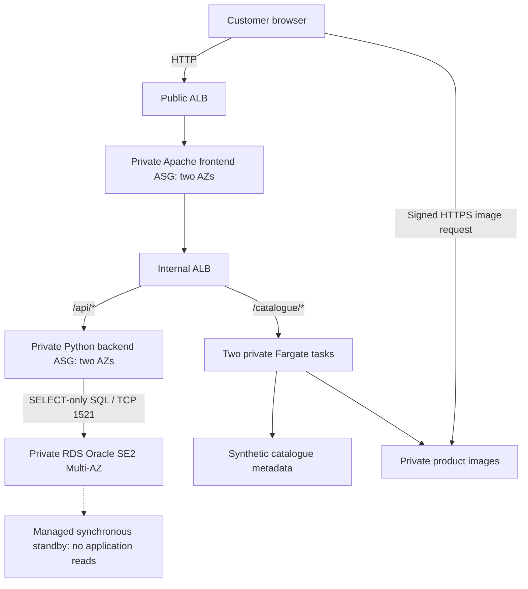

# AnyGroupLLC New Zealand Website — INFOSYS 735 Group Project 2

An AWS website proposal for AnyGroupLLC's New Zealand expansion, with an independently deployed Product Catalogue service as the selected additional feature. The prototype implements the website tiers, real Oracle data access, catalogue integration, security boundaries and operational controls using CloudFormation.

Start with [IaC_Deployment_and_Usage_Instructions.md](IaC_Deployment_and_Usage_Instructions.md), the main setup/test/teardown guide. Create the stakeholder pitch using [Presentation_and_Slide_Content.md](Presentation_and_Slide_Content.md); check requirements and four-pillar coverage using [Rubric_and_Assessment_Checklist.md](Rubric_and_Assessment_Checklist.md).

## Current implementation

The current version uses **two AZ-local NAT gateways** and **private RDS Oracle SE2 Multi-AZ**, replacing the earlier NAT instance and two dummy DB EC2 listeners. The Python backend queries real synthetic order/customer data using a SELECT-only database user. RDS manages the master password in Secrets Manager; a separate generated secret supplies the application user.

**Status:** the managed-service implementation has been deployed and tested in Learners Lab. The 7 October 2026 results in `evidence_new/` verify real SQL queries, catalogue integration, RDS failover and frontend scale-out. On 8 October 2026, the user also confirmed that the current code works. That confirmation supports the current functional status; specific recovery, cleanup, release and financial claims still require their own evidence. The 8 October evidence also verifies initial and deliberately triggered application-secret rotation, followed by successful smoke checks.

| Implemented improvement | Behaviour and business purpose |
|---|---|
| Two managed NAT gateways | Each private application subnet uses the gateway in its own AZ, reducing dependence on one outbound instance |
| Real private Oracle RDS Multi-AZ | Persisted synthetic orders/customer data, a synchronous standby in the other AZ, encrypted storage and automated backups |
| Managed database credentials | RDS-managed master rotation; separate SELECT-only application user with a 30-day Lambda rotation schedule activated after seeding; passwords are retrieved at runtime |
| Visible legacy services | **Legacy system → Your account & orders** displays API-backed data and provides refresh/error states |
| Integrated additional feature | **Additional feature → Product catalogue** displays three products/images with search through a separate Fargate service |
| Demand-based frontend capacity | Recorded target tracking increased frontend capacity from two to four, with all four targets healthy |
| One-command lab lifecycle | Setup handles provisioning, publishing, data/images, activation, smoke checks and evidence; separate commands run experiments and cleanup |

The storefront uses synthetic data. Its cart is a browser counter; checkout, payment processing and migration of the real .NET application are outside the prototype.

Routine CloudShell setup is one command after extracting the current ZIP:

```bash
./scripts/lab.sh setup your-email@example.com
```

It validates/deploys all four stacks, builds/pushes an image if absent, uploads images, seeds DynamoDB and Oracle, activates the catalogue, runs smoke checks and captures configuration evidence. Confirm the SNS subscription yourself. Requirements, permissions, Oracle orderable-class checks and diagnostics are in the main guide.

```bash
./scripts/lab.sh test
./scripts/lab.sh load
./scripts/lab.sh failover
./scripts/lab.sh rotate
./scripts/lab.sh update v2
./scripts/lab.sh teardown
```

These are separate optional operations, not a sequence required after every setup. `failover` deliberately requests a DB failover; `rotate` deliberately changes the application password and checks preserved API data; `teardown` deletes synthetic data. Do not run recovery/load/update/rotation experiments concurrently.

## Business proposal

The [case study](AnyGroupLLC_case_study.md) describes uncertain New Zealand demand, about 500,000 website visits/day with promotional peaks, previous DDoS attacks, a 15-person IT team occupied with maintenance and an image server nearing its 5 TB capacity. The CFO wants IT cost management and an OPEX/CAPEX comparison; the CTO also asks how to apply microservices.

Recommend a website platform with AZ-distributed capacity, demand-based scaling, private application/data tiers, global image delivery, managed relational availability and repeatable operations. Introduce the catalogue through a staged rollout while retaining the application's existing request path. Production acceptance depends on capacity/recovery testing, security/compliance work, data migration and a defensible financial comparison.

| Stakeholder | Proposed value | Design response |
|---|---|---|
| CTO | Customer access during launch/promotions; independent catalogue releases | Multi-AZ services, health-based recovery, demand-based capacity and catalogue service boundary |
| IT manager | More consistent operations and less host administration | CloudFormation, observable services, response procedures and managed platforms |
| CISO | Reduced exposure and a defined attack/data-protection response | Edge protection, private tiers, scoped identities, encryption, audit and incident procedures |
| CFO | Accountable operating expenditure and investment choices | Workload ownership, attribution, normal/peak production scenarios and comparable co-location costs |

The selected additional feature is **microservices adoption through Product Catalogue extraction** using the Strangler Fig pattern. CloudFormation, ECS/Fargate, ECR and DynamoDB support that coherent feature. Stock-expiry forecasting, personalisation, ERP and store security systems are not implemented. No saving percentage, time reduction, production capacity or PCI compliance is claimed from a small prototype.

## Production architecture

The presentation must prominently show and explain the whole solution diagram. Use the final Task 1 architecture as its basis and follow the diagram specification in the presentation guide.

- Customer → Route 53 → CloudFront with proposed AWS WAF/Shield protection → HTTPS public ALB.
- Public ALB → private Apache frontend across two AZs → internal ALB.
- Retained application path → private .NET backend → proposed RDS for Oracle Multi-AZ, subject to licensing/version, sizing and migration validation.
- Catalogue path → independently deployed Fargate service → service-owned metadata boundary and private S3 images; DynamoDB is a production candidate to validate against access patterns/consistency.
- Image delivery → private S3 through CloudFront Origin Access Control. Restrict the ALB origin separately so edge filtering cannot be bypassed.
- Operations → CloudFormation, CloudWatch/SNS, controlled administration and proposed audit, secrets and key-management services.
- Private application outbound → same-AZ NAT gateways where needed; endpoints serve S3/DynamoDB traffic.

The architecture improves image capacity, release independence, continuity, access control and operating accountability together. Verify any GP1 alignment/gap statement against the actual original submission; do not describe an earlier proposal as a deployed system.

## Actual prototype architecture



The RDS box and standby represent one Multi-AZ DB deployment, not independently queried endpoints. Catalogue responses return image URLs through the normal website request path. Two public NAT gateways support private application outbound in their respective AZs; private DB subnets have no Internet default route. Gateway endpoints serve S3/DynamoDB.

| Configuration | Value |
|---|---|
| VPC | `10.0.0.0/16`; six public/app/DB subnets in two AZs |
| Baseline EC2 | Four: frontend 2, backend 2; no NAT or dummy DB EC2 |
| Frontend scaling | Min/desired 2, max 4; target 50 requests/target/min; six total EC2 at configured frontend peak |
| Backend capacity | Fixed at two; real SQL orders/account endpoints |
| RDS | Oracle SE2 License Included, default `db.t3.small`, 20 GiB gp2, encrypted, Multi-AZ, one-day backups, private TCP 1521 |
| Credentials | RDS-managed master rotation; separate SELECT-only application secret with a deployed 30-day schedule; initial and manual rotation verified on 8 October; no passwords in templates/evidence |
| Fargate | Two AMD64 tasks, 0.25 vCPU / 0.5 GiB each; immutable tag/digest; circuit breaker configured |
| Data | Oracle demo orders/customer; DynamoDB P1001–P1003; S3 matching JPEGs |
| Notifications | SNS topic with optional email subscription; confirmation/delivery are separate observations |
| Security groups | Six project SGs; explicit tier ingress/egress; NACLs remain broad |

The retained .NET application is represented by a Python API; this is not a migration of the real .NET/Oracle application. HTTP, shared lab identities and private Oracle traffic without added transport encryption are material limits. Production CloudFront/WAF/audit/TLS controls are proposals, not resources deployed by these templates.

## Four Well-Architected pillars

| Pillar | Production rationale | Current prototype mechanism | Recorded evidence and next check |
|---|---|---|---|
| Operational Excellence | Reproducible operations for the small team; observable and reversible changes | Four stacks, bootstrap checks, monitoring, identifiable catalogue releases and managed database/services | Four successful stacks and identifiable running image; capture a current code release/reversal and delivered alert before claiming those tests |
| Reliability | Continuity during failures and promotions | AZ-distributed app/tasks, two local NAT gateways, health checks, scaling policy and RDS synchronous standby/backups | RDS failover/data preservation and frontend 2→4 scale-out verified; scale-in, EC2 replacement, restore and notification delivery still need evidence |
| Security | Layered protection for attacks and sensitive data | Private tiers, SG boundaries, encrypted storage, controlled images, managed credentials and SELECT-only SQL user | Private/encrypted configuration and signed-image success/unsigned HTTP 403 verified; capture frontend-to-DB denial and retain role/transport/audit limits |
| Cost Optimisation | Control production expenditure as demand changes | Usage-based services/capacity, attributable inventory and explicit temporary-resource lifecycle | Actual scale-out supports the consumption approach; prepare dated normal/peak/co-location costs at comparable service levels; savings are unmeasured |

Use all principle areas in the rubric checklist for the submitted assessment appendix. Four labels alone are not a comprehensive assessment. Performance Efficiency can be an additional pillar with a proper service-selection and performance assessment; Sustainability needs goals and impact measures beyond generic managed-service claims.

## Infrastructure sources and lifecycle

| File | Ownership |
|---|---|
| `cloudformation/01-network-stack.yaml` | VPC/subnets/routes, IGW, NAT gateways/EIPs, NACLs, gateway endpoints |
| `cloudformation/02-core-infrastructure-stack.yaml` | Readable source for ALBs/ASGs/security/S3/RDS/secrets and generated application payloads |
| `frontend/index.html` | Storefront: legacy orders/account panels and additional catalogue feature |
| `cloudformation/02-core-infrastructure-stack.template.json` | Generated equivalent core deployment template below AWS's inline size limit |
| `cloudformation/03-observability-stack.yaml` | SNS, ALB/ASG/RDS alarms, application rotation Lambda/schedule/error alarm |
| `cloudformation/04-microservice-stack.yaml` | ECR, DynamoDB, ECS/Fargate, catalogue route/alarm |
| `rotation-service/app.py` | Four-step Oracle application-password rotation with SELECT checks before secret promotion |
| `backend-service/app.py` | Oracle-backed demo API and explicitly invoked database seeding |
| `catalogue-service/app.py` | Catalogue metadata/image endpoints |
| `scripts/lab.sh` | Main setup/test/load/failover/rotate/update/teardown entry point |

Stack order: network → core → observability → catalogue. The catalogue foundation creates its repository/table before image publication; activation pins a verified digest only after data/images exist. After SQL seeding, setup builds/uploads the Linux rotation ZIP, updates the observability stack using the existing `LabRole`, and waits for initial rotation plus API checks. Default rotation is every 30 days; `BACKEND_ROTATION_DAYS` accepts 7, 30, 60 or 90. No new IAM role, NAT gateway or stack is created. Repeated setup preserves existing rotation parameters during foundation deployment.

Setup checks current Oracle 19 Multi-AZ/gp2 orderable options and does not downgrade to dummy DBs on an error.

Teardown deletes the catalogue, observability, image objects, core/RDS and network. Lab RDS uses `DeletionPolicy: Delete`, `UpdateReplacePolicy: Delete` and automatic-backup removal without a final snapshot, because records are synthetic and repeated tests should not retain billable DB snapshots. Production requires different retention/data-protection rules. The wrapper checks known managed-secret removal and project NAT/EIP/RDS/snapshot/backup resources as well as the other components.

## Verified lab results and presentation boundaries

The reviewed `evidence_new/` contains 244 valid JSON/JSONL files (242 JSON and two JSONL). Its results support the following dated claims; the raw files are stored separately from the source-only deployment ZIP.

| Observation | Verified result | Evidence path under `evidence_new/` |
|---|---|---|
| Functional baseline | Three smoke runs PASS; real SQL orders/account, three catalogue products/images, unsigned image HTTP 403, two healthy targets per service | `20261007T042706Z/smoke.json`, `20261007T043249Z/smoke.json`, `20261007T044215Z/smoke.json` |
| Network/data controls | Four private EC2 at baseline; two NAT gateways/EIPs with matching AZ routes; private encrypted Oracle Multi-AZ and automated backups | Baseline `configuration/` captures |
| Database recovery | Primary `us-east-1b` → `us-east-1a`; same endpoint; preserved orders; 45 failed requests out of 143 samples | `rds-failover-20261007T043910Z/` |
| Database interruption | Approximately 61 seconds from the first failed sample to the first successful sample; the test confirmed completion after about 183 seconds | Failover `requests.jsonl`, `trigger.json` and `summary.json` |
| Demand-based scale-out | Frontend desired capacity 2→4, two successful launches and four healthy targets; six EC2 including the two backend instances | `scaling-20261007T044349Z/configuration/frontend_activity.json`, `autoscaling.json`, `frontend_targets.json` |
| HTTP load | 2,400/2,400 HTTP 200 over 479.81 seconds, about 5 requests/s; successful-response p95 9.6 ms | `scaling-20261007T044349Z/load.json` |
| Application-secret rotation, 8 Oct | Initial rotation PASS; requested new version became AWSCURRENT, previous version became AWSPREVIOUS; harness reported unchanged orders/account; post-rotation smoke PASS | `20261008T024000Z/rotation/`, `rotation-20261008T025207Z/` |
| Frontend probe | 283/292 successes; seven HTTP 502 and two connection errors; final sample successful | `frontend-recovery/requests.jsonl` and `requests.summary.json` |

Rotation metadata confirms `rate(30 days)` with a two-hour window and an active Python 3.12/x86_64 function using `LabRole` and the backend SG/private app subnets. Manual rotation completed at `2026-10-08T02:52:14.120000+00:00`. This verifies a real password change and post-change functionality; a future 30-day recurrence, uninterrupted access during rotation and exact rotation costs are not measured.

The RDS result demonstrates recovery with a measured interruption. Its standby cannot serve reads directly; reboot with failover can interrupt connections. The load result measures the storefront HTML endpoint, not a complete browser journey or production capacity. The frontend probe lacks a post-test replacement/capacity capture and therefore does not establish full recovery.

Still unverified in these saved files: scale-in, frontend instance replacement/restored capacity, delivered SNS email, database restore, teardown/orphan cleanup, current changed-code release/reversal and the frontend-to-DB negative test. Preserve those boundaries even though the user confirmed current code functionality. Capture the latest labelled storefront for the recording.

The 6 October results under `evidence/` and [data/lab_evidence_review.json](data/lab_evidence_review.json) belong to the older NAT-instance/dummy-DB version. Keep them historical; its same-digest version-label update is not current changed-code release evidence.

## Presentation and demo preparation

[Presentation_and_Slide_Content.md](Presentation_and_Slide_Content.md) provides copy-ready slide text, speaker notes, architecture specifications and exact console/demo cues. The proposed **12-slide recording targets 14:00**, with a one-minute margin inside the 15-minute limit and meaningful portions for all four members.

The whole solution architecture is the centre of the pitch. Show basic and additional component configuration in the AWS Console before the website demonstration; then present recorded failover and scaling evidence. Complete the eight-minute load and database failover experiments before recording, and show their dated results instead of waiting for them live. Cost Optimisation addresses production demand, operating effort and OPEX/CAPEX comparison; lab balance changes are not production savings.

Submit the slides/PDF and a text file with an accessible recording URL. Every member must also complete TeamMates feedback. The presentation guide includes the submission table and rehearsal checks.

## Local validation and packaging

Local validation checks template/code consistency and mocked behaviour; it does not substitute for runtime tests. The existing local report records the current mocked regression count and CloudFormation lint. Runtime rotation evidence is recorded separately under `evidence_new/`. Use the following commands after implementation changes:

```bash
python3 -m venv .venv
source .venv/bin/activate
pip install -r requirements-validation.txt
python scripts/part13_validate_iac.py --require-lint --tests --write-report
python scripts/part13_package.py
```

After changing backend/frontend/core source, regenerate the compact template and security references before validation/packaging:

```bash
python scripts/sync_backend_template.py
python scripts/sync_security_reference.py
```

The source-only ZIP excludes raw evidence, credentials and `.venv`. Deployment uses the generated compact core JSON, with compressed storefront HTML to stay inside the direct template-body limit. Edit `frontend/index.html` and regenerate with `scripts/sync_backend_template.py`; keep source and generated templates in sync. Remaining numbered scripts are available for targeted diagnostics; the main guide documents routine and advanced paths.

Requirements: [instructions.md](instructions.md). Business facts: [AnyGroupLLC_case_study.md](AnyGroupLLC_case_study.md). AWS basis: [NAT comparison](https://docs.aws.amazon.com/vpc/latest/userguide/vpc-nat-comparison.html), [RDS Multi-AZ](https://docs.aws.amazon.com/AmazonRDS/latest/UserGuide/Concepts.MultiAZSingleStandby.html), [RDS managed credentials](https://docs.aws.amazon.com/AmazonRDS/latest/UserGuide/rds-secrets-manager.html), [Oracle licensing](https://docs.aws.amazon.com/AmazonRDS/latest/UserGuide/Oracle.Concepts.Licensing.html).
