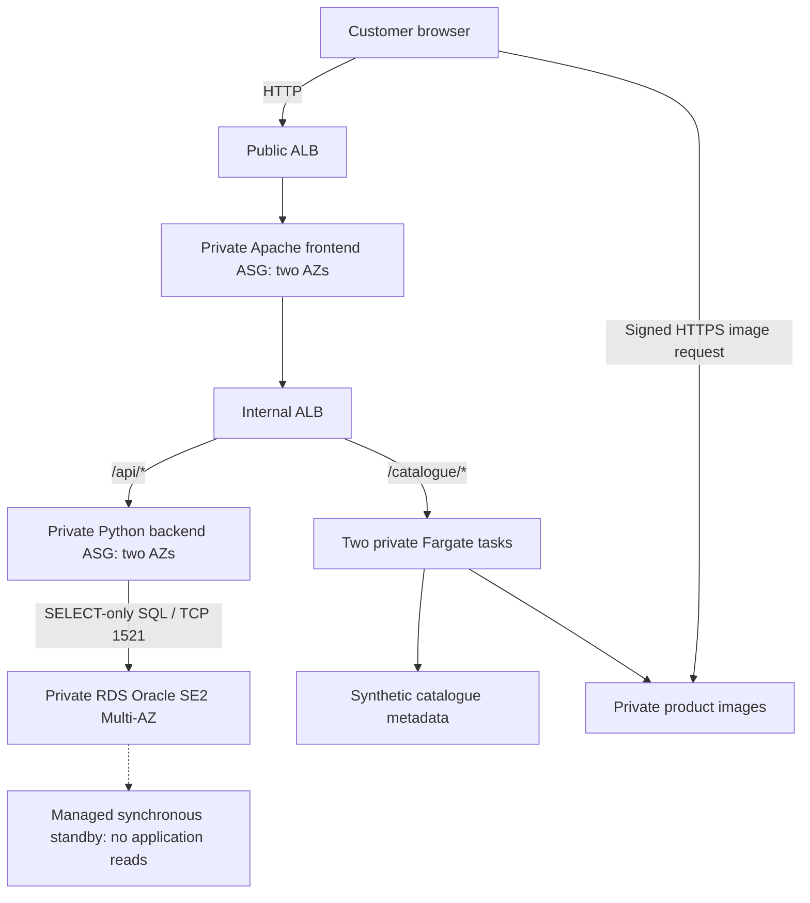

# AnyGroupLLC New Zealand Website — INFOSYS 735 Group Project 2

An AWS website proposal for AnyGroupLLC's New Zealand expansion, with an independently deployed Product Catalogue service as the selected additional feature. The prototype implements the website tiers, real Oracle data access, catalogue integration, security boundaries and operational controls using CloudFormation.

Start with [IaC_Deployment_and_Usage_Instructions.md](IaC_Deployment_and_Usage_Instructions.md), the main setup/test/teardown guide. Create the stakeholder pitch using [Presentation_and_Slide_Content.md](Presentation_and_Slide_Content.md); check requirements and four-pillar coverage using [Rubric_and_Assessment_Checklist.md](Rubric_and_Assessment_Checklist.md).

## Current implementation

The current version uses **two AZ-local NAT gateways** and **private RDS Oracle SE2 Multi-AZ**, replacing the earlier NAT instance and two dummy DB EC2 listeners. The Python backend queries real synthetic order/customer data using a SELECT-only database user. RDS manages the master password in Secrets Manager; a separate generated secret supplies the application user.

**Status:** locally validated implementation, awaiting a new Learners Lab deployment/test. The supplied 6 October 2026 evidence belongs to the previous NAT-instance/dummy-DB version. Preserve it as historical evidence; it does not prove current NAT, SQL, RDS failover or cost behaviour.

Routine CloudShell setup is one command after extracting the current ZIP:

```bash
./scripts/lab.sh setup your-email@example.com
```

It validates/deploys all four stacks, builds/pushes an image if absent, uploads images, seeds DynamoDB and Oracle, activates the catalogue, runs smoke checks and captures configuration evidence. Confirm the SNS subscription yourself. Requirements, permissions, Oracle orderable-class checks and diagnostics are in the main guide.

```bash
./scripts/lab.sh test
./scripts/lab.sh load
./scripts/lab.sh failover
./scripts/lab.sh update v2
./scripts/lab.sh teardown
```

These are separate optional operations, not a sequence required after every setup. `failover` deliberately requests a DB failover; `teardown` deletes synthetic data. Do not run recovery/load/update experiments concurrently.

## Business proposal

The [case study](AnyGroupLLC_case_study.md) describes uncertain New Zealand demand, about 500,000 website visits/day with promotional peaks, previous DDoS attacks, a 15-person IT team occupied with maintenance and an image server nearing its 5 TB capacity. The CFO wants IT cost management and an OPEX/CAPEX comparison; the CTO also asks how to apply microservices.

Recommend a website platform with AZ-distributed capacity, demand-based scaling, private application/data tiers, global image delivery, managed relational availability and repeatable operations. Introduce the catalogue through a staged rollout while retaining the application's existing request path. Production acceptance depends on capacity/recovery testing, security/compliance work, data migration and a defensible financial comparison.

| Stakeholder | Proposed value | Design response |
|---|---|---|
| CTO | Customer access during launch/promotions; independent catalogue releases | Multi-AZ services, health-based recovery, demand-based capacity and catalogue service boundary |
| IT manager | More consistent operations and less host administration | CloudFormation, observable services, response procedures and managed platforms |
| CISO | Reduced exposure and a defined attack/data-protection response | Edge protection, private tiers, scoped identities, encryption, audit and incident procedures |
| CFO | Accountable operating expenditure and investment choices | Workload ownership, attribution, normal/peak production scenarios and comparable co-location costs |

The selected additional feature is **microservices adoption through Product Catalogue extraction** using the Strangler Fig pattern. CloudFormation, ECS/Fargate, ECR and DynamoDB support that coherent feature. Stock-expiry forecasting, personalisation, ERP and store security systems are not implemented. No saving percentage, time reduction, production capacity or PCI compliance is claimed from a small prototype.

## Production architecture

The presentation must prominently show and explain the whole solution diagram. Use the final Task 1 architecture as its basis and follow the diagram specification in the presentation guide.

- Customer → Route 53 → CloudFront with proposed AWS WAF/Shield protection → HTTPS public ALB.
- Public ALB → private Apache frontend across two AZs → internal ALB.
- Retained application path → private .NET backend → proposed RDS for Oracle Multi-AZ, subject to licensing/version, sizing and migration validation.
- Catalogue path → independently deployed Fargate service → service-owned metadata boundary and private S3 images; DynamoDB is a production candidate to validate against access patterns/consistency.
- Image delivery → private S3 through CloudFront Origin Access Control. Restrict the ALB origin separately so edge filtering cannot be bypassed.
- Operations → CloudFormation, CloudWatch/SNS, controlled administration and proposed audit, secrets and key-management services.
- Private application outbound → same-AZ NAT gateways where needed; endpoints serve S3/DynamoDB traffic.

The architecture improves image capacity, release independence, continuity, access control and operating accountability together. Verify any GP1 alignment/gap statement against the actual original submission; do not describe an earlier proposal as a deployed system.

## Actual prototype architecture



The RDS box and standby represent one Multi-AZ DB deployment, not independently queried endpoints. Catalogue responses return image URLs through the normal website request path. Two public NAT gateways support private application outbound in their respective AZs; private DB subnets have no Internet default route. Gateway endpoints serve S3/DynamoDB.

| Configuration | Value |
|---|---|
| VPC | `10.0.0.0/16`; six public/app/DB subnets in two AZs |
| Baseline EC2 | Four: frontend 2, backend 2; no NAT or dummy DB EC2 |
| Frontend scaling | Min/desired 2, max 4; target 50 requests/target/min; six total EC2 at configured frontend peak |
| Backend capacity | Fixed at two; real SQL orders/account endpoints |
| RDS | Oracle SE2 License Included, default `db.t3.small`, 20 GiB gp2, encrypted, Multi-AZ, one-day backups, private TCP 1521 |
| Credentials | RDS-managed master secret and separate SELECT-only application secret; no passwords in templates/evidence |
| Fargate | Two AMD64 tasks, 0.25 vCPU / 0.5 GiB each; immutable tag/digest; circuit breaker configured |
| Data | Oracle demo orders/customer; DynamoDB P1001–P1003; S3 matching JPEGs |
| Notifications | SNS topic with optional email subscription; confirmation/delivery are separate observations |
| Security groups | Six project SGs; explicit tier ingress/egress; NACLs remain broad |

The retained .NET application is represented by a Python API; this is not a migration of the real .NET/Oracle application. HTTP, shared lab identities and private Oracle traffic without added transport encryption are material limits. Production CloudFront/WAF/audit/TLS controls are proposals, not resources deployed by these templates.

## Four Well-Architected pillars

| Pillar | Production rationale | Current prototype mechanism | Evidence to collect |
|---|---|---|---|
| Operational Excellence | Reproducible operations for the small team; observable and reversible changes | Four stacks, bootstrap checks, monitoring, identifiable catalogue releases and managed database/services | Stack Events, update/reversal, owned alert/runbook procedures; measure effort before claiming savings |
| Reliability | Continuity during failures and promotions | AZ-distributed app/tasks, two local NAT gateways, health checks, scaling policy and RDS synchronous standby/backups | Actual instance recovery, demand scale-out/scale-in, RDS failover/data preservation, restore and delivered alerts |
| Security | Layered protection for attacks and sensitive data | Private tiers, SG boundaries, encrypted storage, controlled images, managed credentials and SELECT-only SQL user | Allowed/denied paths, signed/unsigned image checks, role/transport/audit limitations |
| Cost Optimisation | Control production expenditure as demand changes | Usage-based services/capacity, attributable inventory and explicit temporary-resource lifecycle | Dated production normal/peak/co-location assumptions; separate lab usage from savings claims |

Use all principle areas in the rubric checklist for the submitted assessment appendix. Four labels alone are not a comprehensive assessment. Performance Efficiency can be an additional pillar with a proper service-selection and performance assessment; Sustainability needs goals and impact measures beyond generic managed-service claims.

## Infrastructure sources and lifecycle

| File | Ownership |
|---|---|
| `cloudformation/01-network-stack.yaml` | VPC/subnets/routes, IGW, NAT gateways/EIPs, NACLs, gateway endpoints |
| `cloudformation/02-core-infrastructure-stack.yaml` | Readable source for ALBs/ASGs/security/S3/RDS/secrets and generated application payloads |
| `frontend/index.html` | Storefront: legacy orders/account panels and additional catalogue feature |
| `cloudformation/02-core-infrastructure-stack.template.json` | Generated equivalent core deployment template below AWS's inline size limit |
| `cloudformation/03-observability-stack.yaml` | SNS and ALB/ASG/RDS CPU/free-storage alarms |
| `cloudformation/04-microservice-stack.yaml` | ECR, DynamoDB, ECS/Fargate, catalogue route/alarm |
| `backend-service/app.py` | Oracle-backed demo API and explicitly invoked database seeding |
| `catalogue-service/app.py` | Catalogue metadata/image endpoints |
| `scripts/lab.sh` | Main setup/test/load/failover/update/teardown entry point |

Stack order: network → core → observability → catalogue. The catalogue foundation creates its repository/table before image publication; activation pins a verified digest only after data/images exist. Setup checks current Oracle 19 Multi-AZ/gp2 orderable options and does not downgrade to dummy DBs on an error.

Teardown deletes the catalogue, observability, image objects, core/RDS and network. Lab RDS uses `DeletionPolicy: Delete`, `UpdateReplacePolicy: Delete` and automatic-backup removal without a final snapshot, because records are synthetic and repeated tests should not retain billable DB snapshots. Production requires different retention/data-protection rules. The wrapper checks known managed-secret removal and project NAT/EIP/RDS/snapshot/backup resources as well as the other components.

## Evidence and local validation

The current managed-service changes need a new lab run. [data/lab_evidence_review.json](data/lab_evidence_review.json) and `evidence/` retain the previous supplied run. Its baseline/configuration release/reversal/cleanup results are not current implementation verification. Both image tags in that run had identical content; its probe recorded seven failures and its load did not demonstrate new EC2 creation.

Current smoke checks require SQL data and RDS Multi-AZ/private/encrypted/backup settings, catalogue functionality and task/target health. The failover tool explicitly requests a lab DB failover and verifies changed primary AZ, stable endpoint and preserved order rows while retaining request failures. No local test has deployed AWS or established IAM permissions, real failover behaviour or cost.

```bash
python3 -m venv .venv
source .venv/bin/activate
pip install -r requirements-validation.txt
python scripts/part13_validate_iac.py --require-lint --tests --write-report
python scripts/part13_package.py
```

After changing backend/core source, regenerate the compact template and security references before validation/packaging:

```bash
python scripts/sync_backend_template.py
python scripts/sync_security_reference.py
```

The source-only ZIP excludes raw evidence, credentials and `.venv`. Deployment uses the generated compact core JSON, with compressed storefront HTML to stay inside the direct template-body limit. Edit `frontend/index.html` and regenerate with `scripts/sync_backend_template.py`; keep source and generated templates in sync. Remaining numbered scripts are available for targeted diagnostics; the main guide documents routine and advanced paths.

Requirements: [instructions.md](instructions.md). Business facts: [AnyGroupLLC_case_study.md](AnyGroupLLC_case_study.md). AWS basis: [NAT comparison](https://docs.aws.amazon.com/vpc/latest/userguide/vpc-nat-comparison.html), [RDS Multi-AZ](https://docs.aws.amazon.com/AmazonRDS/latest/UserGuide/Concepts.MultiAZSingleStandby.html), [RDS managed credentials](https://docs.aws.amazon.com/AmazonRDS/latest/UserGuide/rds-secrets-manager.html), [Oracle licensing](https://docs.aws.amazon.com/AmazonRDS/latest/UserGuide/Oracle.Concepts.Licensing.html).
